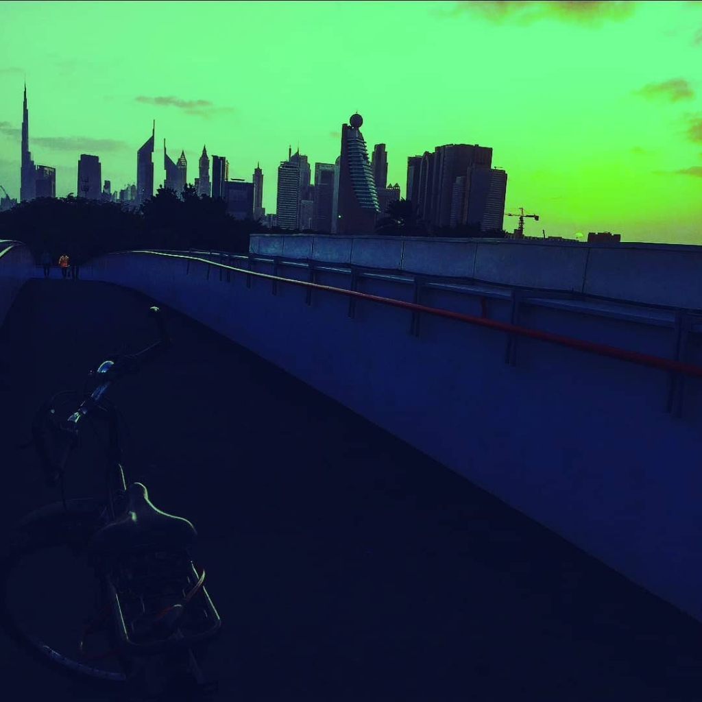
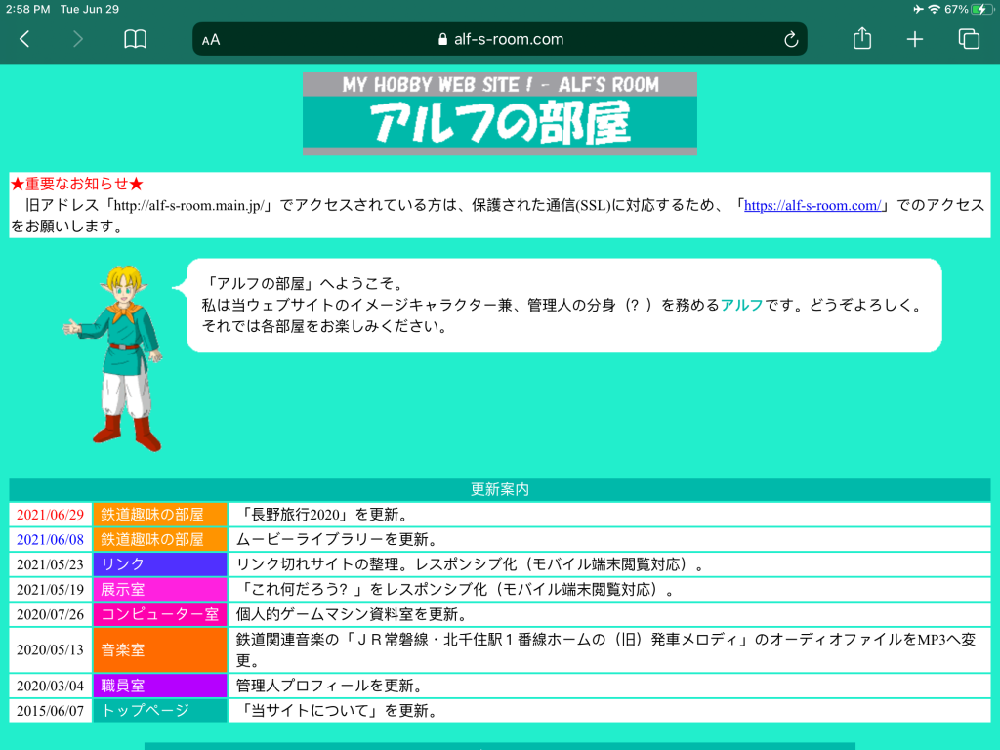

# suobset
###### hello. i'm kush.

This domain will act as my personal website and blog. Everything will be built from scratch. Until the website is done, this space (the README of this <a href="https://github.com/suobset/suobset.github.io">Github Repository</a>) will be used to host all blog posts. 

## Espresso Depresso
##### 30th June, 2021
I have always wanted to tell stories. Well, technically they are a comprehensive evaluation of the present and future through my outlook, and other interesting things in the world: but for the sake of brevity, we will call them stories.

Showcasing creativity without the hindrance of a medium’s learning curve has always been a daunting task for me. So far I have always believed my creativity to lie in music, but as we have gone through numerous schools and professors, that facet of expression seems to have jumbled up beyond repair. Not that I am giving up on it, but it definitely has to take a pause as I am trying to find my place in the world (or in other words, surviving university).

And again, I have always wanted to tell stories. Much like how an essay reads, but interesting; inspired by YouTubers like Nick Robinson, Sabrina (Answer In Progress), Tom Scott, Miyuki (lifeasmiyuki), or Joana Ceddia (notice the range of genres).

<table class="image">
<caption align="bottom">Photography, on the other hand, has always been a medium of expression in which I have felt confident enough to even experiment with. Color corrected via “handwritten” code.</caption>
<tr><td></td></tr>
</table>

Turns out, I am not made for YouTube, big time. For one, I cannot speak in front of a camera. Moreover the editing skills needed to make a video interesting enough to watch is another aforementioned hindrance that I feel like I might end up procrastinating on, leading to yet another failed garage project. Let’s face it: my computers runs Visual Studio Code and a GPT-3 project 25 hours a day. Opening a video editor on top of that might just kill what’s supposed to get me through university.

The inspiration for this project comes from two main places: a need for a personal website (which will be coded by hand), and a feeling of awe from Adachi Yoshinori’s hobby website: Alf’s Room.

<table class="image">
<caption align="bottom">Still reminiscent of the early 90s Internet.</caption>
<tr><td></td></tr>
</table>

Mr. Yoshinori is a 51 year old resident of Japan who has been running Alf’s Room since 1996-ish. The website, which I first saw through a Nick Robinson video, consists of various “rooms” or pages that showcase different interests of Mr. Yoshinori. It ranges from his travel entries to specific interests, and goes beyond to even capturing insignificant details of his everyday life: such as the one time some plants disappeared from a train station. All these topics are presented by the website’s mascot: Alf. Each post has a discussion section and the like, and while witnessing it all (albeit, in Google translated Japanese to English), it struck that this concept is exactly what I needed. Stories, no matter how deep or insignificant, told through a perspective on a medium.

This is the medium, and this is my story. WIP, but getting there.

