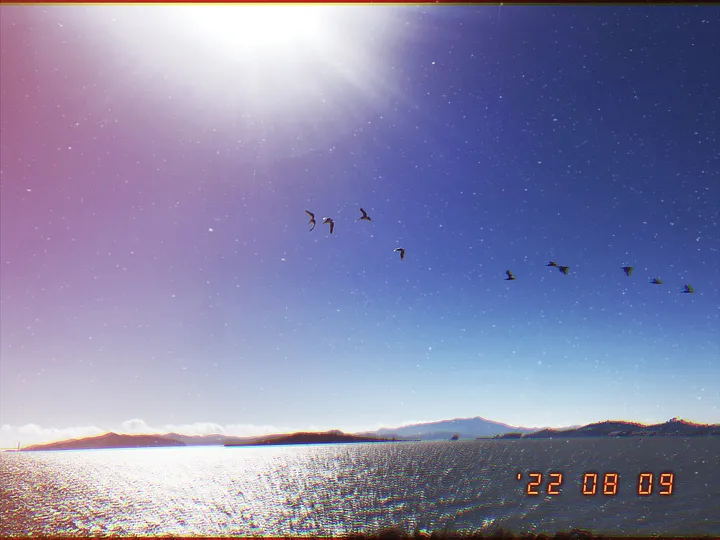

The most difficult part of starting a new journey is taking that first step.

There is an endless amount of fear and joy inside me as I embark on this new journey. For months on end, I have been wanting to streamline my artistic journey, and it finally seems like things are coming together.

<!-- truncate -->

It all started with a love to create; create anything, anywhere, anyhow that I want it to be. I started off with a Guitar in middle school, and the love to create has taken me ever since towards getting classically trained, getting into computer science, and more lately: getting into photography, and into blogging (wherein I use the latter two in a combined fashion).

I cannot wait to tap into my creative ideas as we move forward together. As of now, this space here is going to act as my not-so-personal journal: a space where I just speak about my experiences, ideas, opinions, and everything plus more.

Moreover, as a very personal touch, every picture on this blog will be clicked by me (yes, I’ll be clicking a meaningful picture almost everyday for this project).

A lot of inspiration for this space came from my past experiences in blogging, Casey Neistat, bitbird, and just a sheer desire to create something meaningful everyday. I hope you enjoy your stay here, and I cannot thank you enough if you’re reading this.

Love ❤
