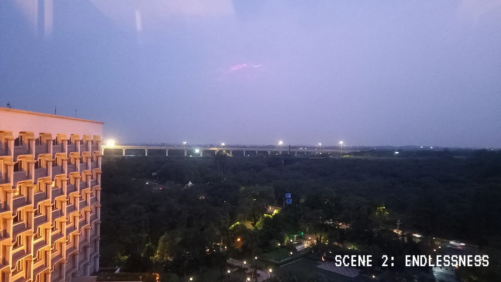
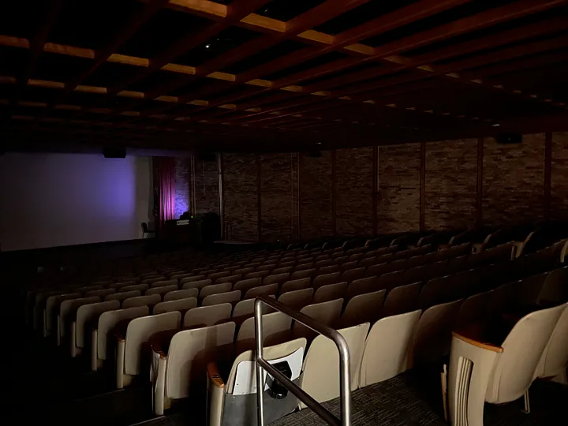
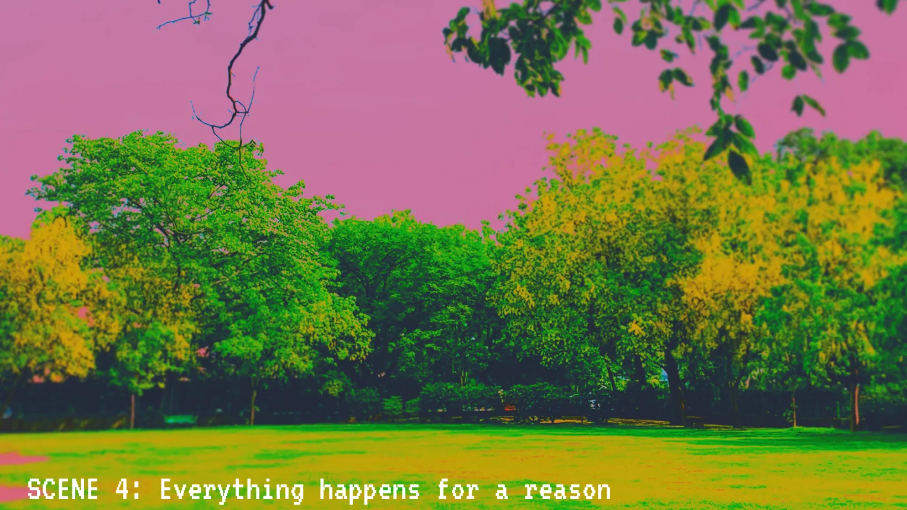
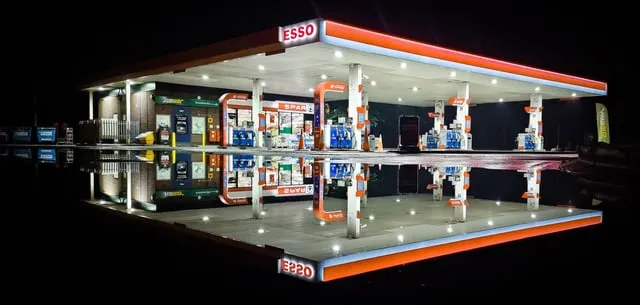
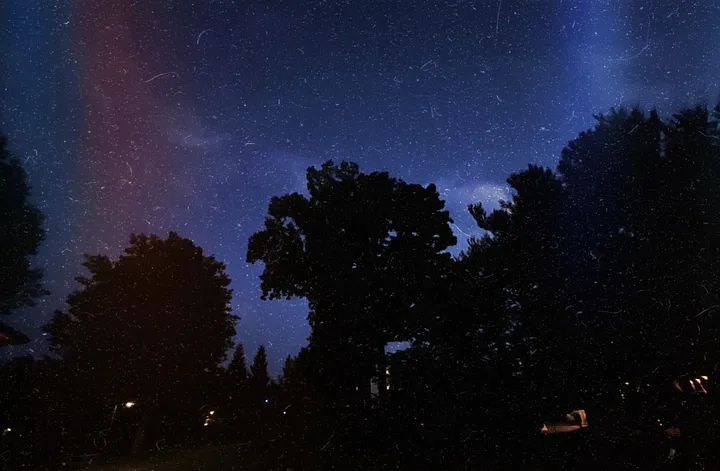
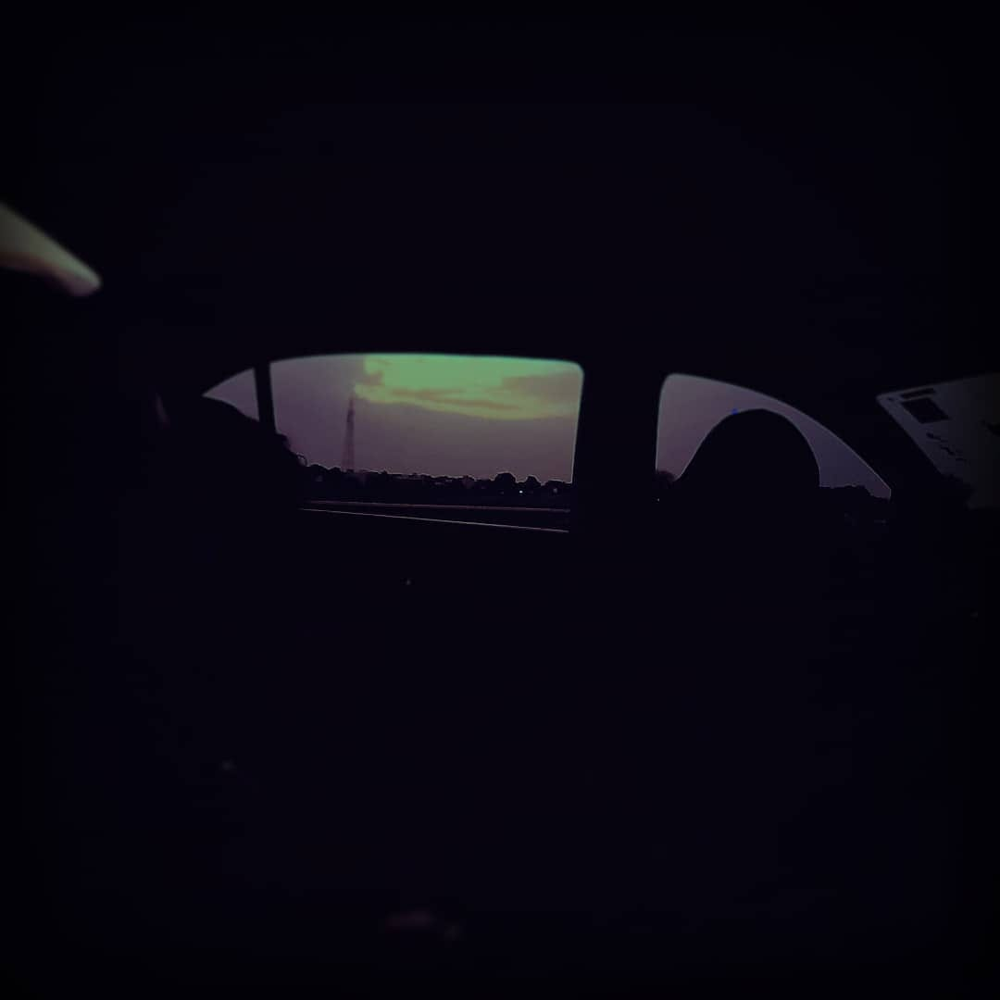

Originally published by me on [Medium](https://medium.com/@skushagra/liminal-spaces-the-art-of-being-in-and-appreciating-the-in-between-4f020bb92103)

This is an attempt at documenting what has been long gone by, and yet seems coming right across the horizon. This is a story of a particular phase of my own life, how it has been influenced by my past, and how it delves into one of my favorite aesthetics of all time.

This will also be an attempt to capture my version of that aesthetic.

<!-- truncate -->

The beginning of what would culminate into a series of developing multiple aspects into what my life would really turn out to be started right around the corner of me transitioning from my High School phase to my University phase; at a time when every single person on the planet was transitioning away from life as they had known into one that was being navigated in the midst of a global pandemic.

See, change is difficult for people to grasp. While an inevitable construct, the human mind still oppposes change as it then has to deal with us fighting for our survival needs, and trying to make the best of whatever situation it is that is presented to us. For me, this was a period of change in three major ways: transitioning from school to university (essentially leaving life as I had known it for over 12 years), transitioning towards navigating a world with a surreal level of precaution, and transitioning to a new country altogether to study further.

I come from a background wherein everything that I have experienced in life has been ephemeral, especially since my family worked a profession which required us getting transferred to multiple places. Hence, while transitioning in itself has not been too difficult for me: the uncertainty of the time, coupled with me having to do this on my own for once, proved me wrong for once.

In between me having to embark on this journey, and staying inside due to the pandemic: I started to introspect more into my own thoughts. I had been busy with life until now: but this was the first time I slowed down, and I looked at places, people, and the surroundings that I had not really thought much about before.

I started creating. I had never created before, even though I always knew I wanted to create. I had programmed stuff before, and I had played the guitar before. But to do something which is your own creation, from the beginning to the end? I was too scared of it. In fact, part of me is still scared of it to a great extent. It is the reason why I am so hesitant to write up anything on the platform you are reading this on.

Nevertheless, I persisted. It started with me realizing my lifelong hobby for the first time in its entirety: I started coding and creating mobile apps which would handhold one learning music; I created multiple aspects of the remote-learning management system for my school; I created a NFC based app to exchange contact details; I started creating. I created new music; I created wonky sounds; I co-created a podcast which never got traction; I created workflows that would break my soul as I realized how much more difficult creating anything could be.

I created anything and everything: crouched up in my room, hunched over my laptop for as long as 18–20 hours a day; that did not matter as I was creating for the very joy of just creating.

I started enjoying my time, living in this weird zone of the in-between. There were no pure proper lockdown measures where I was living yet, but a lot of people were still acknowledging the pandemic, and public places were almost entirely devoid of any human presence. Ranging from my balcony, to roaming around in my old high school devoid of any one, I enjoyed my presence in these spaces where I felt like I did not technically belong.

I was stuck in multiple transitionary phases of my own life: trying to find my own identity, anxious about my own future, and the future of the world. However, there was a weird feeling of solace when I found myself roaming around the hallways of my old school at 8PM, or a supermarket devoid of 98% of the people, or just looking at the highway from my balcony with zero cars at a time which would be considered rush hour.

Human-built places outside of ones that have any personal meaning (such as your home) are built with an immense level of utilitarian mindset and purpose. Think about it: a school hallway gets its life from the people that surround it during the day. It is the period of time when even you exist in it. To see it in the night-time, devoid of any people and any life, filled with an endless repetition of lockers, classroms, and furniture: what set of events happened that led one person to even be here? And why was this terrifying, yet comforting in a way?

And then it hit me. I enjoyed existing in a space which was only transitionary in nature: one that is never paid close attention to, or given the amount of respect it deserves. I paid attention to what went un-noticed by everyone else, and at unconventional times, became completely frozen and devoid of life.

September 2020: I started university as an international student halfway across the world. To manage the time difference, I set my clock to the local time of my university, and then decided to never look outside the window.

This approach, coupled with the already frozen-nature of the pandemic (still at an all-time high) resulted in me solely existing in the in-between. I would be up throughout the night, and sleep during the day.

This would mean no outside world contact, very limited contact with my family that’d be sleeping while I was awake (and vice versa), and existing in a state of pure loneliness except for when I was on a Zoom call. One moment you’re on this call enjoying a 3 hour game night with friends, the next moment said call has ended and now you’re all alone, in utter silence, transitioning to your next call of the night.

It was during this time that I started experimenting with documenting the feeling that I’d get whenever I was existing in these transitional spaces: ranging from empty school hallway, to hotel rooms that I had to stay in during pandemic-related travelling, to even the feeling of dread when I was done with a phone call and had no one to speak to.

It was during this time, that YouTube recommended me to this particular video, which did a great job of conveying what I was trying to capture far better than anything I had done myself (courtesy of YouTuber [MiacDaled](https://youtu.be/KJfew0PXSAk?si=U-KR6g7Pb_ujYWpY)):

<iframe width="560" height="315" src="https://www.youtube.com/embed/KJfew0PXSAk?si=M6kc7U88Hoqf0ZCE" title="YouTube video player" frameborder="0" allow="accelerometer; autoplay; clipboard-write; encrypted-media; gyroscope; picture-in-picture; web-share" allowfullscreen></iframe>

I was unknowingly appreciating [Liminal Spaces](https://aesthetics.fandom.com/wiki/Liminal_Space): an aesthetic that portrays empty spaces which are given meaning only through the existence of people in it. While in technical terms the word “liminal” refers to a transition, thus making “liminal spaces” places that help you transition from one point to another, it is a bit more than that.

Liminal Spaces have this tendency to evoke emotions of nostalgia, yet reside in the uncanny valley for almost everyone, regardless of your specific background. They feel familiar, yet are distorted just enough for one to not feel entirely at home.

By being stripped of its essential context, for example, the auditorium above may evoke a sense of unease. You have never been here before, yet you have memories of being in an auditorium like the one above. You know the feeling of those spring-seats, the texture of the carpet, and the feedback noise of the microphone. You expect to see people, and hear them chattering. Yet, here you’re presented the same space, at a state that you are not expected to have visited it. The question is not why is no one here, the question is why are you here?

The more you roam in this space, stripped of its context, the more you are paying attention to details that went un-noticed at first. You are forced to take in details of the seats, the carpets, the ceiling beams…you cannot focus on anyone, since there is not anyone there. Your fear does not stem from anticipating the presence of anyone else, it stems from anticipating why are you existing in this space.

Yet, despite the uneasiness, they evoke a sense of familiarity and belonging. There are aspects of this room that all of us have experienced: physical and emotional. Distortions, no-context anxiety, yet familiarity of such spaces evoke emotions of nostalgic dread that a lot of us have simply not felt: only because you are forced to really take-into what you had taken for-granted.

There is a reason why this term was coined in 2020: the world was in itself a Liminal Space at the time of the pandemic. It was noticed in a way it was never supposed to be noticed, with lockdown mandates essentially forcing everyone to exist in the transitionary state, waiting for anything to happen. Public spaces that had been given purpose were meaningless, and the deathday looming coupled with the period of not having any medical cures or vaccines led to everyone existing in an emotional liminal space of their own.

As an aesthetic, Liminal Spaces are heavy into using imagery from the 2000s and 1990s, trying to reach out to a time that has long gone by, created by people before us who had experiences that we will never be able to experience ourselves. Yet, in these unreachable experiences, are interlaced our own that we are very familiar with, yet choose to never introspect upon.

In this [video](https://youtu.be/olsXUqKTWgI?si=EIaPEywX853EmMYF), YouTuber Cresendex does a deep analysis of the entire aesthetic, and why it speaks to them. They point out three major aspects of what makes a Liminal Space evoke undiscovered emotions: a transitory nature, a sense of nostalgia, and a dream-like uncanniness. There had not been a time before this pandemic, to experience these three aspects interwoven into daily-lives in a way that was almost forced down upon one, as opposed to them actively seeking out these experiences.

To really try and give a sense of what I am trying to convey, here is my all-time favourite Liminal Space rendition:

Image Credits: [u/Moistwee on](https://www.reddit.com/r/LiminalSpace/comments/oncbrk/petrol_station_after_a_good_downpour/?utm_source=share&utm_medium=ios_app&utm_name=iossmf&utm_content=3&utm_term=22) [r/LiminalSpaces](https://reddit.com/r/LiminalSpaces)

I have memories of coming back from long road trips when I was a child, half-sleepy and tired from the long car ride. I remember stargazing, resting my head on the vibrating window of the car, being slightly hungry and uneasy, up well past my bedtime in the middle of nowhere. A gas station stop, with its smells and subpar food felt almost heavenly after being trapped in a car for 6 hours or such. Trying to look at the time on my digital watch with the help of the passing streetlights, looking at other vehicles momentarily as they pass us…I have recollections of entire memories about this image which is not even taken by me.

I would highly recommend Cresendex’s video above, which dives into more forms of Liminal Spaces which I have not covered here, yet resonate to.

In the context of my own life, liminal spaces have become one of these cherished treasures that I keep going out of my way to experience over and over again. It has become my own medium of exploring my feelings and emotions, and has made me appreciate the powerful nature of being alone.

We have a tendency to get caught up with so many things that happen around us, that even classes and retreats that force us to be alone and meditate are not truly alone in nature. They serve a purpose, and still have people around them.

To truly grasp the value of nothingness is the catalyst to realize the value of yourself. Liminal Spaces are beautiful because they have a purpose, but only during a specific time and context. Outside of them, they have nothing: no activity, no value, and no purpose. We attribute these places to our own nostalgia, since we have all been to places as such, but to see them out of context can lead us to a journey that maybe helps us find our own self worth.

Let us appreciate the value of spaces which are given value because of us, and take a moment to introspect these spaces, and by extension introspect our own selves.

Lastly, I would suggest everyone to play 2:22AM, to experience what I have been trying to say. I promise, you will not regret it. It is not horror. Thank Cresendex for the recommendation.

Until next time.

All pictures have been taken by me, except where mentioned. I still capture the Liminal Spaces I exist in, along with other things and aesthetics as well. Here is my [Photography-based Instagram](https://instagram.com/cosgent).

If you’re just interested in who I am, I look forward to you checking out my Website :)
