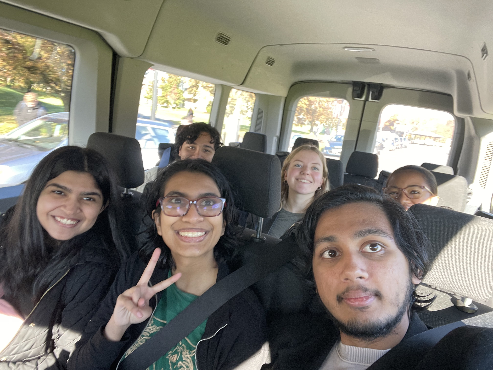
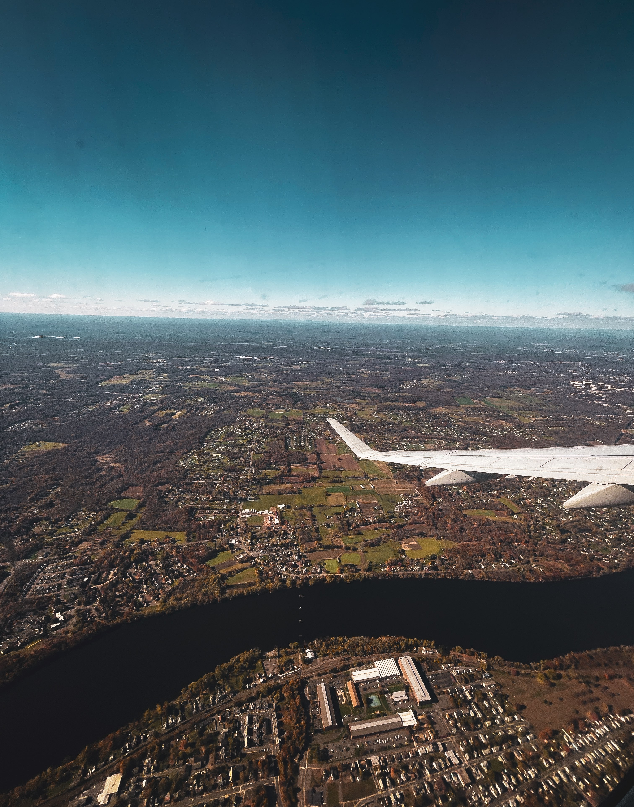
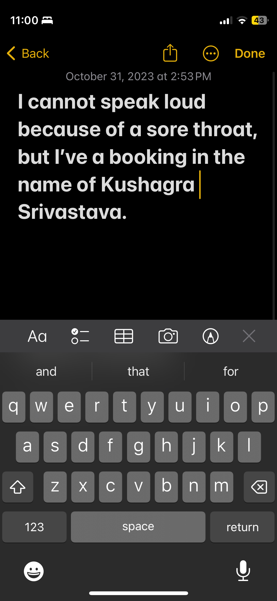
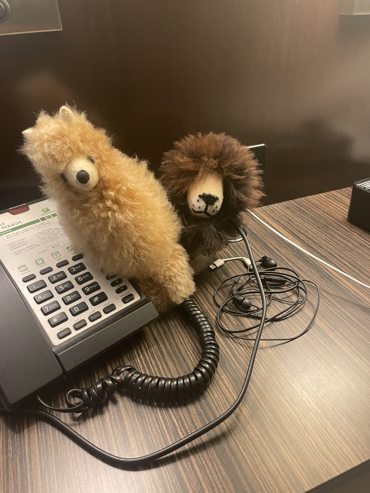
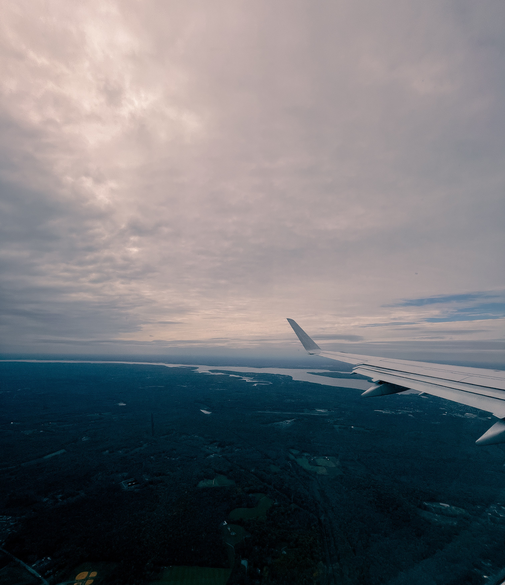

### Disclaimer

While I have gotten this opportunity through an academic source, the contents of this blog do not reflect any of that. This blog is part of my "digital garden": a virtual space to collect raw thoughts as is. This is not a reflection of UMass Amherst, iCons, U.S. Census Dept, The Opportunity Project, and any/every organization mentioned. **This space only exists to collect personal thoughts, and is very informal, and not representative of any ideas, thoughts, or emotions behind anything**. 

Visit the [Research](/docs/category/research) Page to learn more on the academic end of this project. That is where I document the crucial, tangible, proper outcomes of this project. 

<!-- truncate -->

Think of this blog as a personal virtual journal :)

[The Opportunity Project](https://opportunity.census.gov) is a Project of the [U.S. Census Department](https://census.gov), which I have had the honor and privilege of participating in through the [Integrated Concentration in STEM at UMass Amherst](https://icons.cns.umass.edu). This is [my personal iCons Portfolio](/docs/research/iCons). All pictures are copyrighted by Kush S.

### Intro

What happens when a bunch of stuff goes unplanned? Lemonade time!!

I have been personally working with a team of 6 on [The Opportunity Project](https://opportunity.census.gov): a semester-long sprint to conduct data analysis and create a digital tool that helps address a social issue: electricity outage burden in certain communities, in the case of iCons. The project includes STEM majors from iCons, along with Dr. Scott Auerbach of iCons, and tremendous help from The Department of Energy. 

As part of the sprint, one of us were initially invited to speak about it at Justice Week 2023: a week-long event to showcase efforts and successes towards Energy Equity. In true iCons fashion, however, we fought for everyone to be present, since everyone in their domain contributed whatever they could. 

However, long story short: I could not get in, mainly due to me being an International Student trying to access a Federal Building. Since the tickets and my hotel room were already booked, I am still coming along. 

The following will be notes from my first-ever solo trip, unplanned at that. This document will keep updating until Thursday, November 2, at 12:00PM EST. The following are logs.

### October 31, 2023: Prelude

The day begins with pulling an all-nighter to complete a Networking Assignment (bad idea), which was easier than I was thinking. Apparrently, I have a tendency to make things more complicated. Nevertheless, this gave me about an hour of sleep, and I packed my stuff at 6AM and left for the shuttle. Somehow I had insanely bad sore throat in the morning, which may have resulted due to some allergies.

* Reached airport and stuff. Guy in pink unicorn suit at the counter, pretty fun. Somehow, I developed a sore throat last night thanks to allergies, so I bought some cough drops. 
* Got some amazing pics of takeoff and landing. 

* Figured card situation for the train. I am collecting these cards like infinity stones in my Apple Wallet, the most powerful being the ETS "I took the GRE" card!! (/s)
* Got to our hotel, insane tile renovation Manhattan core sounds in the lobby. Here's a fresh note I wrote to communicate with the lady at the reception. The cough drops have been helping like hell. We had slightly overpriced dinner at the hotel which was fun in itself. Bought more cough drops, they have honestly been a godsend.

* Prep'd for the presentation tomorrow, wherein I gave audience notes since I am not presenting.

### End of day 1 notes

The whole reason behind this specific post is that I have never had a solo trip, ever. Let alone, one that was never planned. While I was supposed to plan my trip tonight, I did not do that due to the immense amount of prep work and tiredness. Thus, we are going in blind tomorrow, and I will keep logging my experiences of my first ever solo trip as it unfolds. 

I believe that the main plan is for me to tag along with the team to be in front of DOE building, and get as many pictures there. After that, I am kind of on my own. Let's see how that goes...

Before I go to sleep: some other end-of-day photos:

Obviously, my two travel companions always stick with me. Andi & Leonardo <3

They're made of alpaca fur, and are super amazingly soft.

A little bit more muted than the takeoff due to the cloudy nature. Nevertheless, I like this outcome. 

