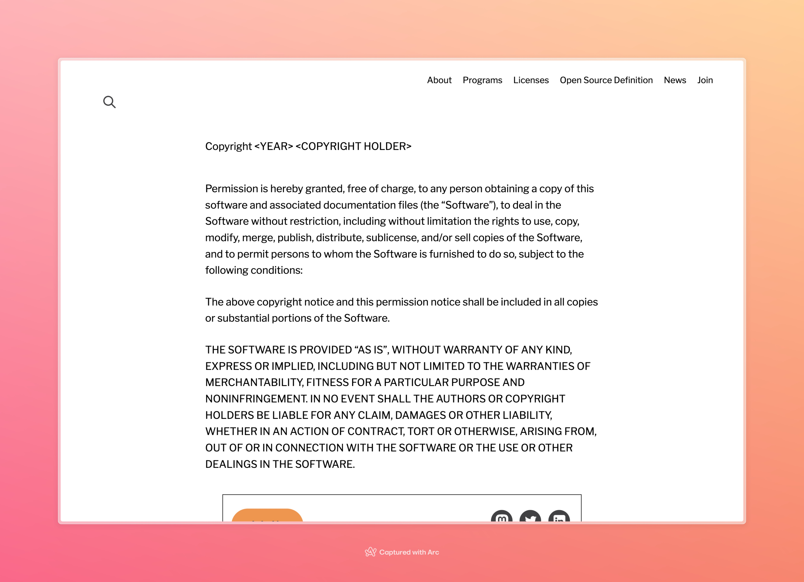
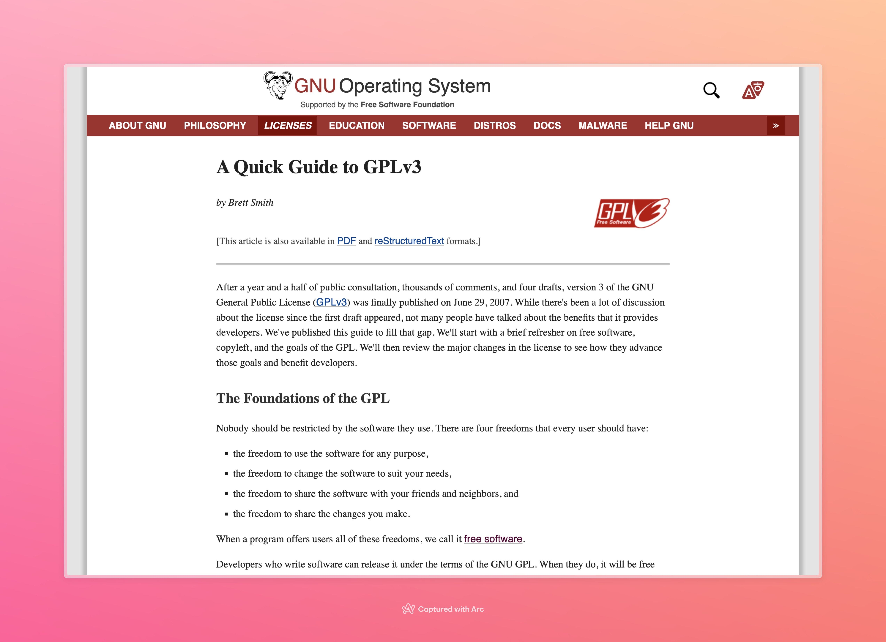
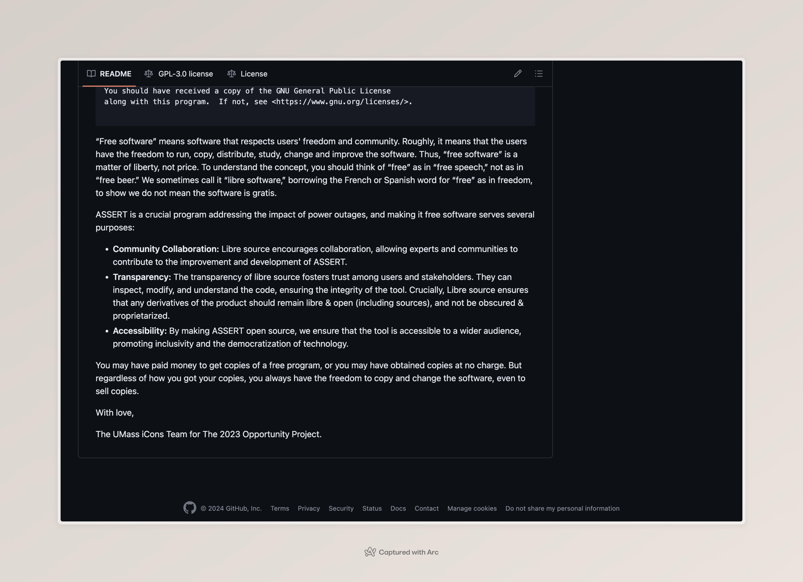
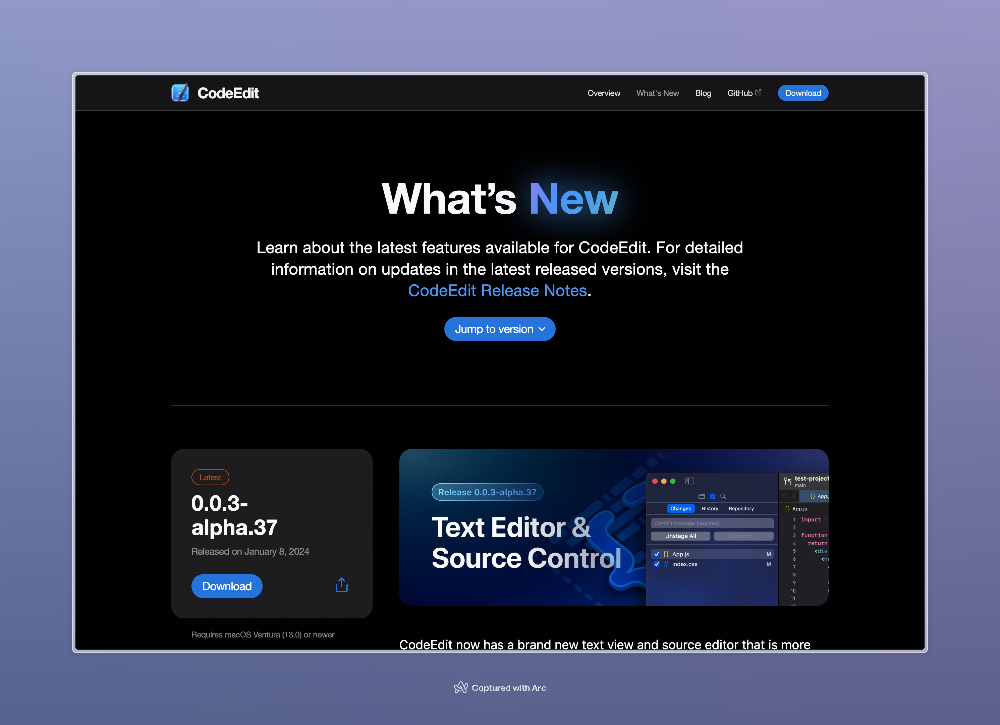
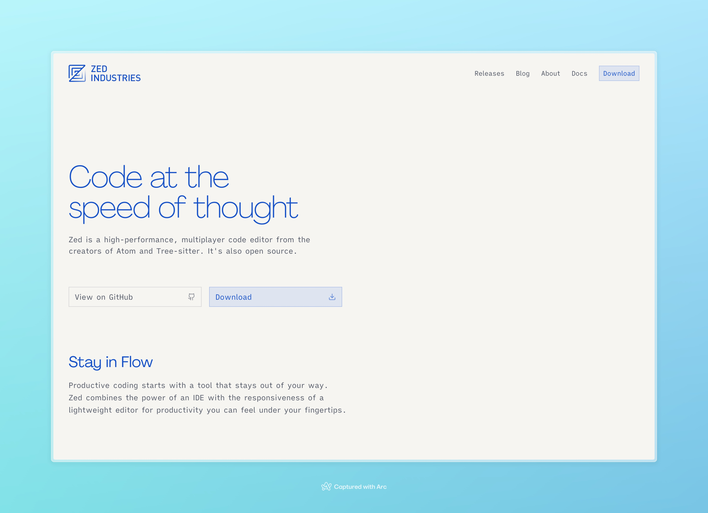
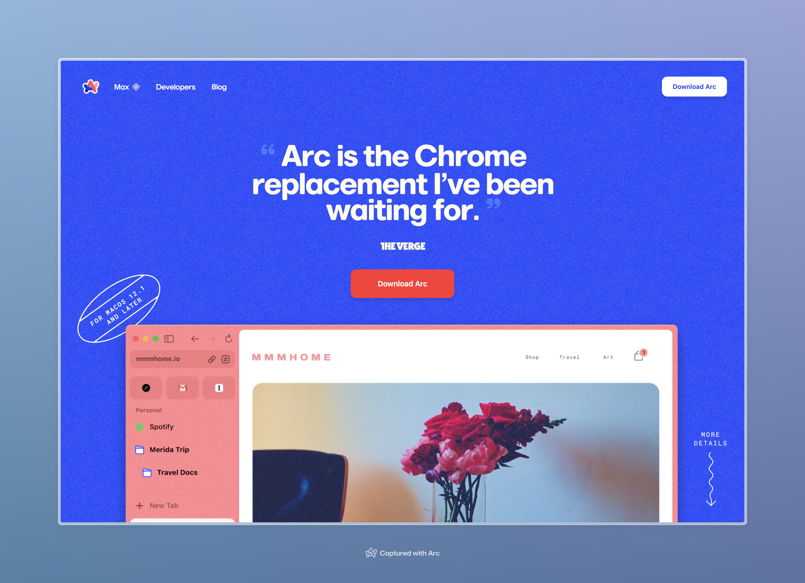

# The Eternal Battle Between Libre Source Ideology, and the Macintosh

Even though I am not exactly there yet, I often like to classify myself as a Libre Source Developer. Let's get into this terminology first.

Libre Source, for the most part, is very much in parallels with Open Source Development: i.e., people can see the source of your code, fork it, compile it, and distribute it. There exist different licenses that lay down the permissions for what most users can do with it. The most popular, in the Open Source world, is the [MIT License](https://opensource.org/license/mit/)

<!-- truncate -->

Essentially, this is a "do whatever you want- including making this closed source- as long as you retain that copyright notice" license.

Which brings to the crucial difference between Open vs. Libre: the [GPL License](https://www.gnu.org/licenses/quick-guide-gplv3.html) (along with the many others, like the MPL or Apache 2.0)

Without diving too much into the text, it essentially says that any derivative works have to remain open source & accessible to all. Now, the GPL itself is sometimes criticized for being too restrictive, but the overarching theme is that any derivative work remain free (as in freedom, not in free beer), and the 4 essential freedoms are maintained here.

I go a little bit deeper into my appreciation for the GPL in the README for [ASSERT](https://github.com/suobset/assert).

## So, what is the deal with the Macintosh?

Controversial-ish opinion (coming from a Linux user): The Mac is one of the best UNIX environments today that facilitates this development. Which is weird, because the people behind the GPL (The Free Software Foundation), really do not receive it well at times given how closed the system is.

The Mac technically does not comply with GPL requirements, yet most of FOSS development takes place on that platform (including many new and shiny devtools). It uses quite a lot of OSS components under the hood, and comes with exceptional support, making it the default developer choice for a UNIX-based platform.

This means that for any developer, Macs become the default choice. And for any new developer tool, Macs become the first target platform.

Case study: I have been wanting to try 2 different code editors (both Open Sourced), which are Mac only:

The first is CodeEdit, a native macOS editor which is licensed under MIT. Completely letting this slide off, the project is a native macOS one, that does not need to cater to other platforms. The focus is right there, and it is solving the issue at hand:

However, this rabbit hole of "finding a new editor" led me to Zed Editor, which currently got entirely Open Sourced under the GPL License, yet does not run on any Linux computer as of writing this post:

And let's not forget the browser that I am screenshotting this on (even though it is not Open Sourced, yet:

I do not daily this Mac. This is my old computer, which has been retired and sits as a YouTube machine.

Yet, by virtue of the Mac providing a UNIX-like experience outside the box, it has quite become the default developer platform. Even if you're not a Systems person like me, having a Mac gives you the freedom to make apps for any platform & an unparalleled Web-dev experience (the Mac restriction foor iOS development is purely Apple-imposed, but makes sense).

To me, it is fascinating to see the number of Free-as-in-Freedom software having only macOS as their targets (or Windows for some, like Notepad++).

It makes me keep coming back to my butterfly-keyboard thermal-throttling underpowered 2016 MacBook to experience these new developments, until they make my way to my actual daily computer :')

Some things here may be misunderstood so let me clear some points

* Every project has its purpose, and needs a focus. I am not attacking any developers in this post; I am genuinely so happy to see so many new projects in the FOSS world. Zed, CodeEdit, and Arc are amazing projects and deserve all the love (& contributions)
* I am using these examples as a "case study". I just wanted to point out the fascinating number of FOSS projects that target closed platforms.

Basically, what does it even mean to be "libre software"? Is it just the codebase, or do we include target devices as well?

Fun stuff.

PS: I attach myself with the ideology side of the FSF: accessibility and user freedom, and do not attach myself with any prominent members. I have a [disclaimer](/disclaimer_fsf) as well :)
