> i wonder where i'll float next
> 
> -> xkcd 1

This has been the most scary step I have taken, even though I have maintained this blog for a long time. It feels so weirdly amazing to stick to a schedule, it feels beautiful and scary.

There have been quite a few times when I have talked about aesthetics, and I still believe that they are the best way to express myself. I have a [post here from last year diving into Liminal Spaces](/blog/liminal-spaces-art-of-appreciating), and to this day they capture the feeling of loneliness and eerieness perfectly. 

<!-- truncate -->

A lot of the pictures I take pertain to outdoor Liminal Spaces. It is an interest that started during the Pandemic lockdowns, especially in a context where I was joining online Zoom meetings from the other corner of the globe. Going from interacting with over 15-20 people at a time on Discord to absolute silence at 4AM on the click of a button, I did not yet realize that I was living in a Liminal Space. 

I go into great lengths to describe the journey into this rabbithole in that earlier post I have linked above, and would love for y'all to check out the same.

If we go back to the past post I just mentioned, I referred a [video](https://youtu.be/olsXUqKTWgI?si=QI0p7Sx4qFIeTU9a) by Cresendex on what defines a Liminal Space. To save some time, they define the three basic characterstics of Liminal Spaces:

* A transitory space
* A sense of nostalgia
* A dreamlike uncanniness 

While it is typically easy to take indoor hallway pictures (since they quite literally are Liminal Spaces), the feeling is even more difficult to capture outdoors, especially during broad daylight. However, years of capturing Liminal Spaces has made me pretty comfortable, with that too. 

So far, I have achieved what was to be achieved in the first two. This post is about achieving the third.

## Spaces So Far

The first steps I took in this journey were transitory spaces. They were the easiest to capture, I knew I had to take them on a road trip or similar. 

A trick I did in the beginning of this journey was to create a more "dreamlike ethereal" feeling by heavily distorting the colors of the pictures. Nevertheless, I have had some absolutely gorgeous images, and here are some that I have taken over the years since I first started:

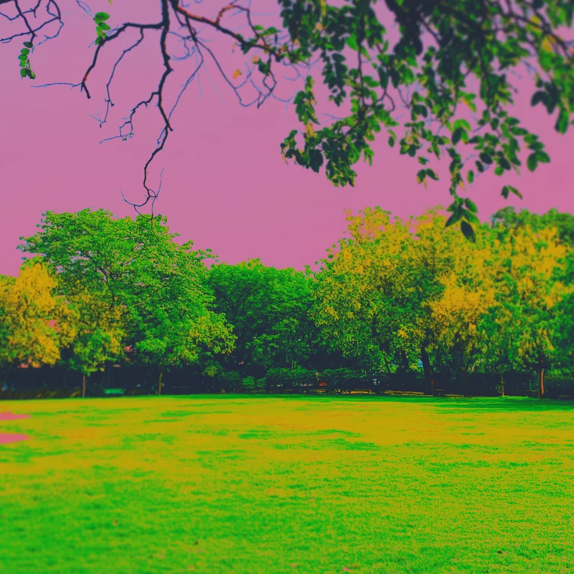

Distorted colors to achieve dreamlike feel, taken in 2020.

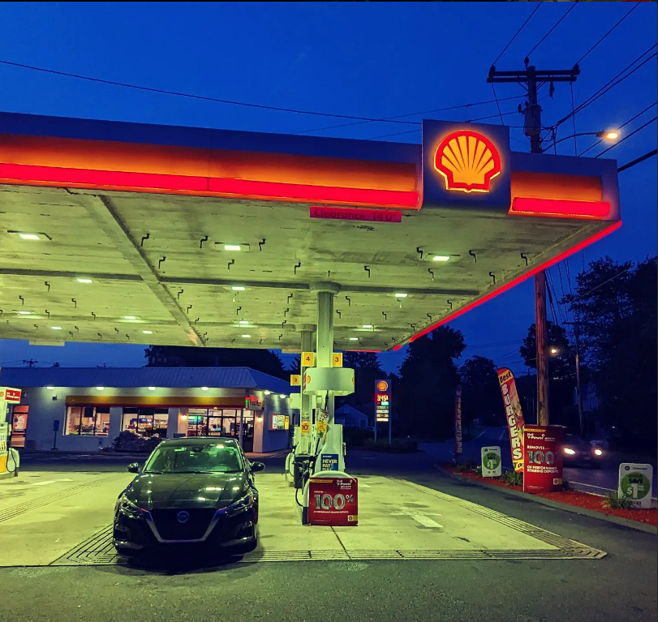

Gas Station in Hatfield, MA. Increased saturation, dimmed brightness. Taken in 2023.

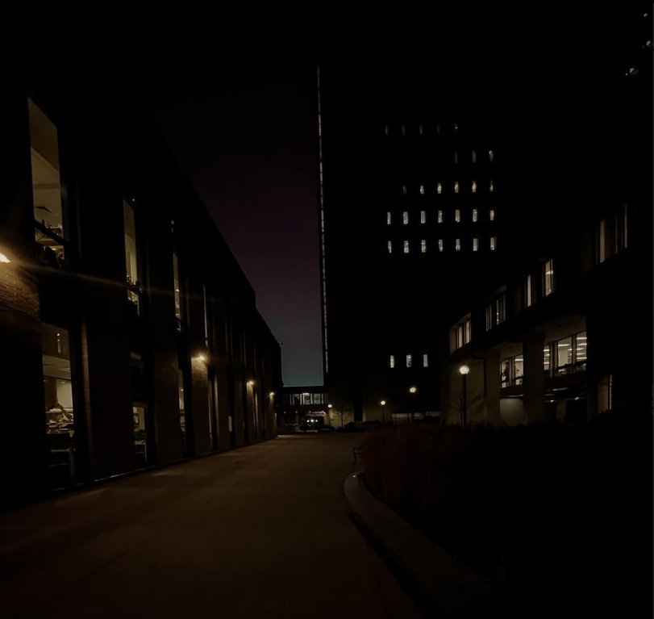

Lederle at Night. Very minor edits, this is an actual liminal space I experience. Taken in 2023.

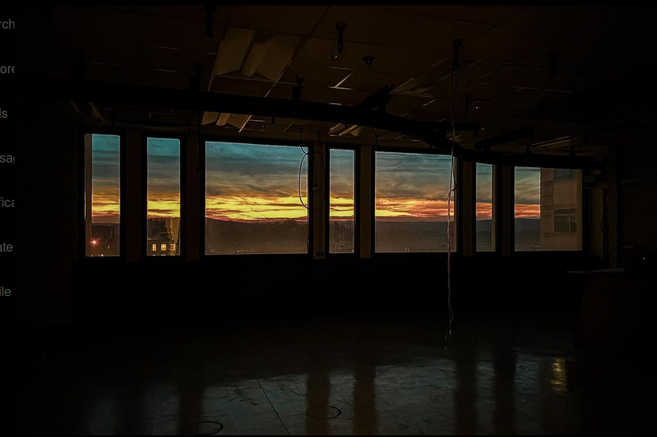

A sunset through an abandoned lab at Lederle, minor edits. Taken in 2024.

I have more pictures I have taken in the other post, and also will be uploading them all (plus unpublished pictures) once the Photography page is up and running. But, we have nailed the first two aspects of a Liminal Space.

## So...Data Bending?

Computers represent an astounding feat of engineering, functioning at their core by storing and manipulating data in the form of bits. The nature or structure of the data becomes inconsequential; in computer memory, all information is universally encoded as bits (you can verify this by opening any file in an editor, not just text files).

At its essence, we encounter the ubiquitous entity known as a file. A file is a digital container that encapsulates information, acting as a fundamental building block in the realm of computing. Whether it houses text, images, or complex algorithms, a file serves as the elemental unit through which computers organize, store, and retrieve data.

File formats, as we recognize them today, simply provide a standardized way to designate the type of a file, ensuring clarity and preventing user error. This facilitates seamless interaction with relevant software. However, it's vital to recognize that a file format is essentially a tag—a means for programmers to establish standardized characteristics. For instance, an MP3 file is tagged as a music file, with bits encoding sound wavelengths over time. This tag allows relevant software to recognize and process the file accordingly.

Nevertheless, beneath the surface, all files share a fundamental similarity, and are stored in the exactly same manner. The distinction lies in the representation of data within the container. This brings us to the intriguing concept of data bending.

Consider a picture, fundamentally a 2D array of pixel colors, where each point in the plane is assigned a specific color. This 2D array is processed by photo software to meet our requirements. Similarly, an audio file is also represented by a 2D array, and music-making software anticipates this format. By altering the file format of a picture, it is possible to deceive the music software into interpreting it as audio—effectively *bending* the data and producing captivating glitch effects.

Let's dive into this a bit more:

## Glitching Lederle

We are going to use this image as our testbench.

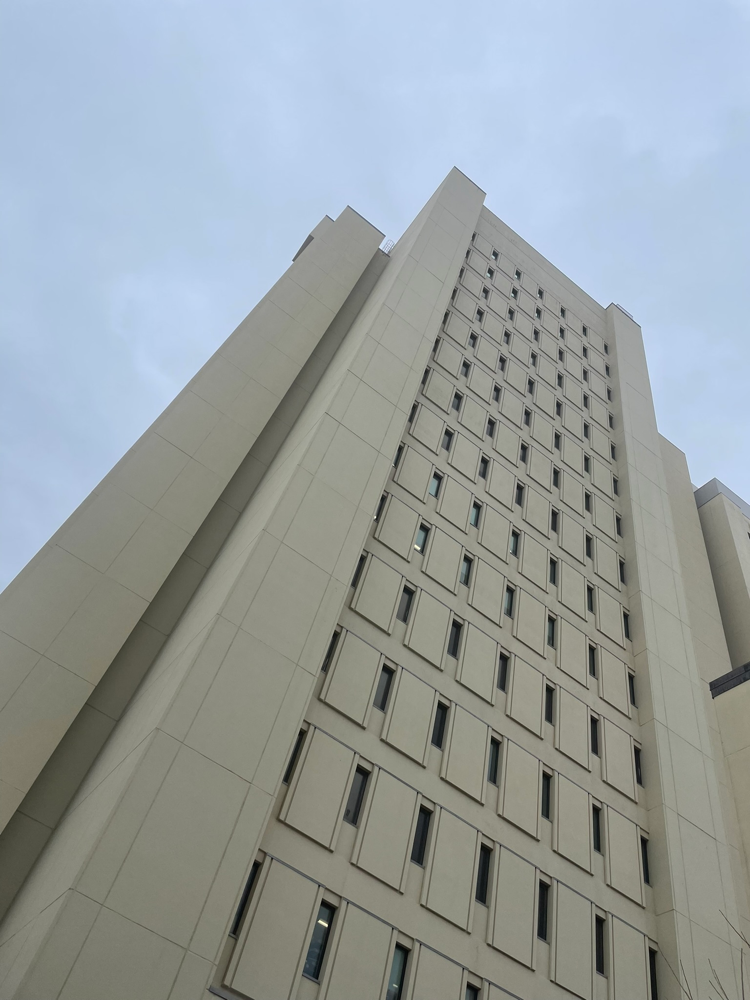

(Have we identified my favourite building on the UMass Amherst Campus??)

I altered the file format to MP3 without making any adjustments to the image itself. As expected, given that a file serves as a mere container, Audacity—a digital audio workstation, or music editing software—accepts it without issue, presuming it to be an audio file. Although no audible sound is produced, no error is triggered either.

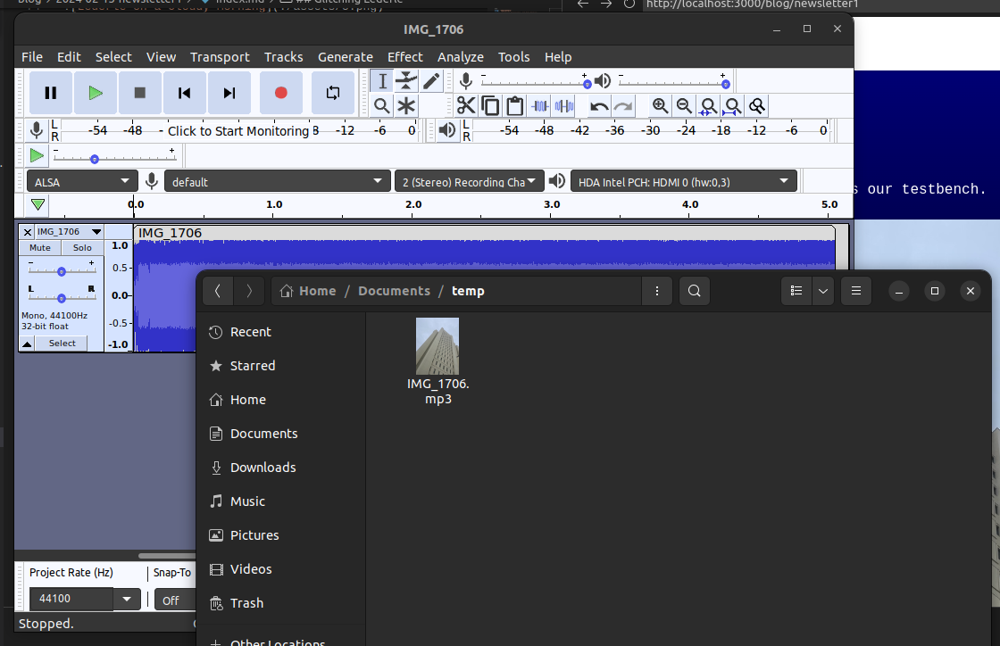

Now, let's explore and experiment a bit! 😄

I modified the pitch of the final third of the image and introduced an echo effect to the middle third. Here's a visual representation of the alterations in Audacity:

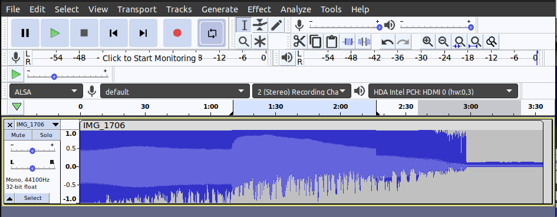

Now, time to export this as a RAW file, and change the format back to .bmp (uncompressed image) so that we can open it in an image viewer:

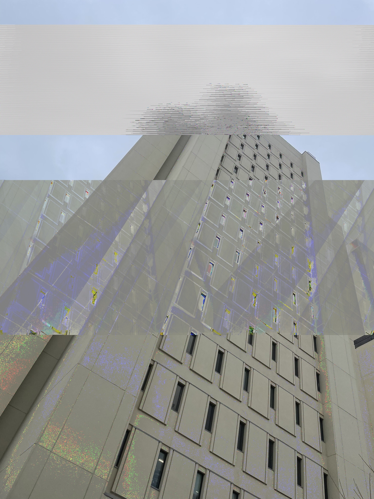

Woozy, right??

Since a file is just a container, if the data representation is close enough in the two files: we can pretty much manipulate a file format meant for one type of file in a software that was meant to edit something completely different. That, to me, is insanely cool. 

It's the kind of stuff that makes my career interesting to me!! :D

## Some more edits

The following are me just selecting most of the whole image (Ctrl + A messes header files and corrupts the whole thing, I am still getting the hang of it), and applying one effect to it. Enjoy :D

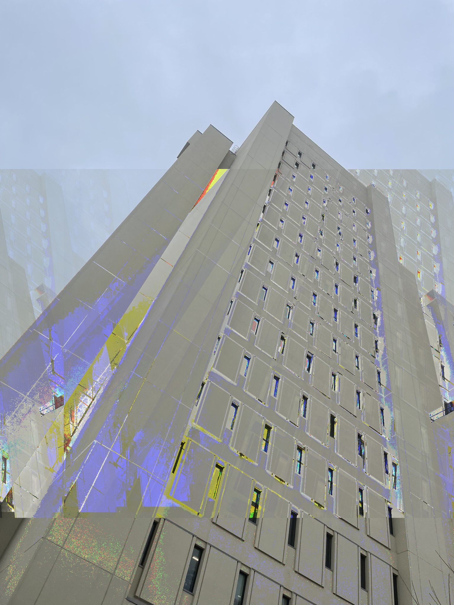

> Echo

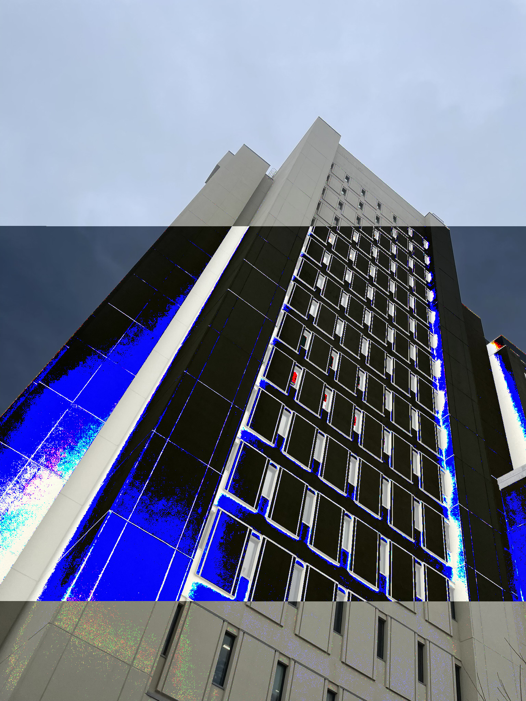

> Invert

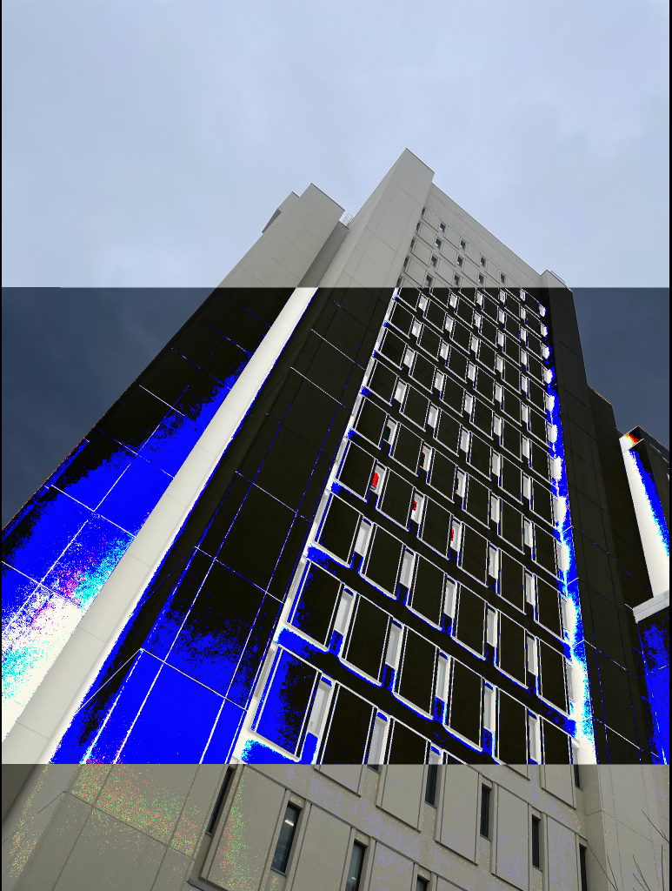

> Pitch & Invert on one section

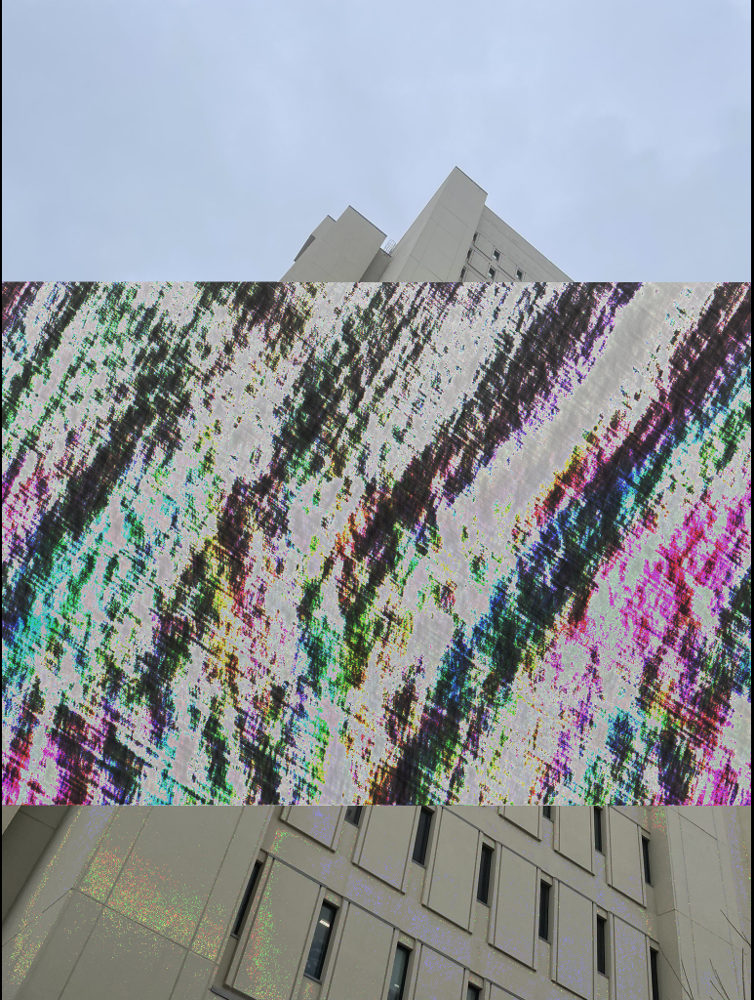

> Reverb

Fluff time :D

### What am I listening to?

> Last Year Was Weird Vol. 3 - Tkay Maidza

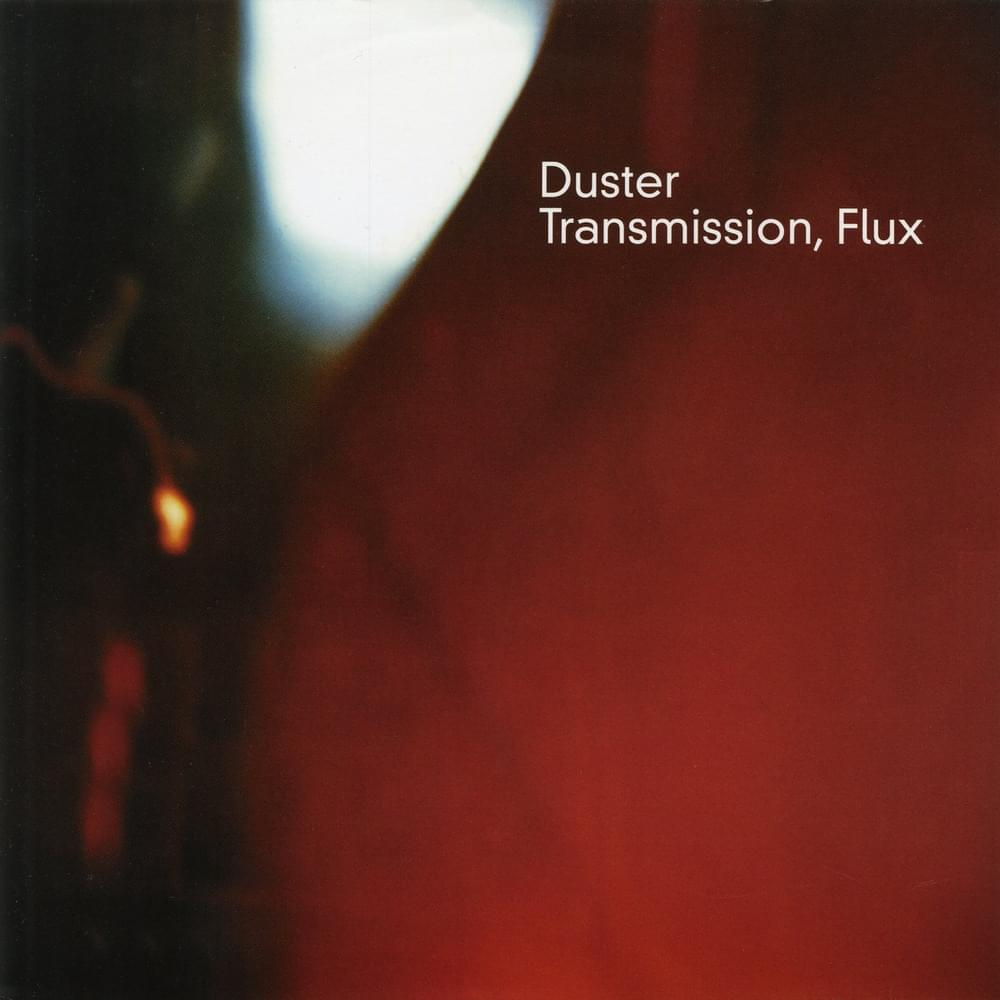

> Transmission, Flux - Duster

This is the end of Newsletter 1.