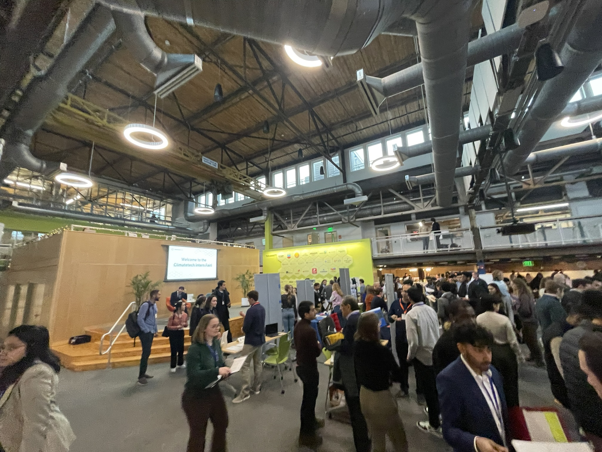
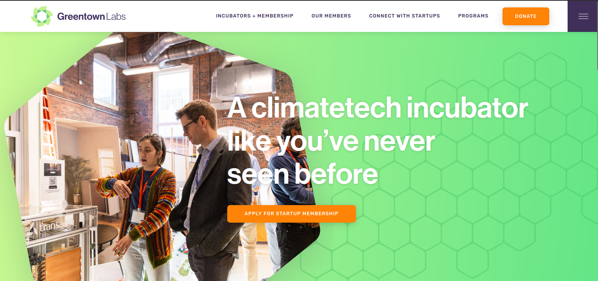
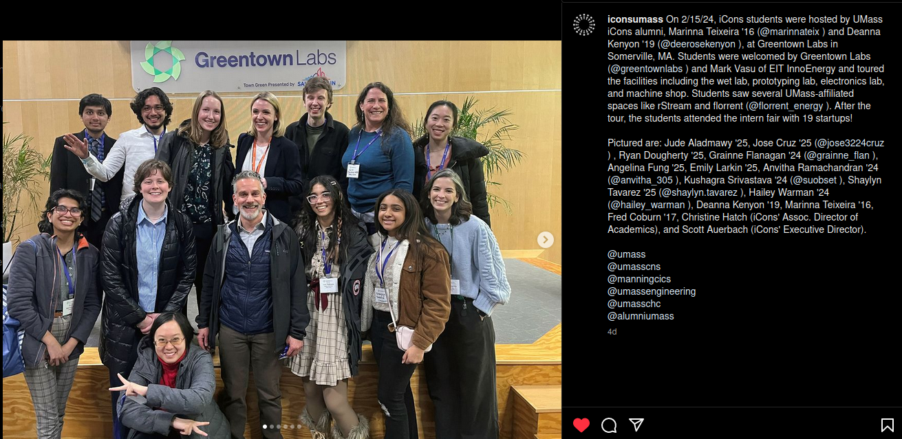
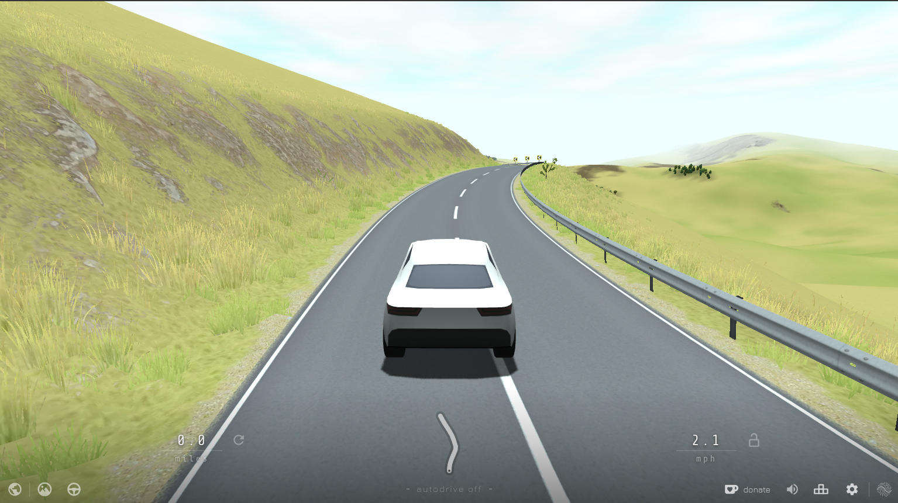
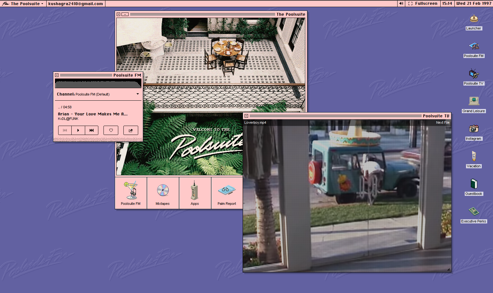

# Climatech Wonders, and Chill Vibes

Welcome to the second episode of my Newsletter, accompanied by a gorgeous picture of the UMass Amherst West Experimentation Station. I take a lot of pictures in my daily life, but most do not see the light of day, which is why I am going to attempt to merge my different art forms. The Photography page in the Finechive is still under construction, and hopefully it does not take long. 

<!-- truncate -->

In today's newsletter we take a tour of Greentown Labs (well, at least what I am allowed to show on here), discuss the issues of Open Source Collaborators having to deal with arduos amounts of people who "feel they are entitled to a .exe", and I go over some of my own history of trying to maintain a platform such as this. Finishing off, we have some (read: one) cool thing I found on the Internet.

## Greentown Labs

I had the opportunity to visit on a personalized tour of [Greentown Labs](https://greentownlabs.com/): a Climatech Incubator providing resources to startups to achieve their maximum potential in developing cutting-edge solutions to combat Climate Change. They provide, essentially, lab space + funding + connections and networking to startups. They also provide legal advice to startups for licensing their IP to larger companies, and essentially do a lot of, for lack of a better term, insanely cool stuff. 

I got an opportunity through [UMass iCons](https://icons.cns.umass.edu) to visit the labs, and have a peek at all the amazing startups and the work being done there. From deicing airplane wings, to testing environmental structures in an indoor weather simulator; it is essentially an elevated makerspace. 

I got the furthermore opportunity to participate in their career fair, as well as talk to some people behind the scenes. [Fleet Robotics](https://greentownlabs.com/members/fleet-robotics/) uses roomba-like robots to clean biofuling, [De-Ice](https://greentownlabs.com/members/de-ice/) uses electric pulses over the body of an aircraft to de-ice the airplane, and [Cyvl.ai](https://greentownlabs.com/members/cyvl-ai/) uses Computer Vision to aid local governments in analyzing what road signs & traffic equipment needs maintainance. 

Huge shoutout to Marinna Teixeira '16 ([@marinnateix](https://instagram.com/marinnateix)) and Deanna Kenyon '19 ([@deerosekenyon](https://instagram.com/deerosekenyon)), at Greentown Labs in Somerville, MA for organizing this and graciously welcoming the 11th and 12th iCons cohorts to Greentown. 

## Vibin' out
These months currently feel like an Academic Limbo: a place where I am a bit uncertain as to how things may be headed. I am waiting on Grad Schools, finishing up on my Honors Thesis, and writing my drafts for [MassURC](https://honorspaths.honors.umass.edu/massurc), on top of already being committed to academic work. Personally, I have felt that while I do have a good framework of dealing with stress, I need to realize that I am not alone, and others are in this same journey as me. 

I have been looking at ways to destress at times, and outside of my usual hobbies of Photography + Newslettring, I have found myself surfing the web to find hidden gems. One of them is a web-based game, [slowroads.io](https://slowroads.io). Put on some music, and drive on an endless road (in different times of day and weather conditions).

Now, want some music to go along? [Poolsuite](https://poolsuite.net) has you covered with a website inspired by old MacOS and Windows, with 90s ads playing on loop and endless mixtapes on different radio channels. It is the perfect blend of neo-retroism.

Poolsuite and Slowroads are not my products, and belong to their respective owners. I just loved finding out about them.

## Some Finechive Updates

Funnily enough, I have been writing blogs and online content in an on and off basis since 2017. The Finechive is also a place wherein I want to archive all my previous blogs and websites. It is a continual process, but look out at the [archive](/archive) page for more info. A quick debrief:

* Minded Mindlessness was the last big blog effort I ran, from 2017-2019. 
* I had a high school blog before that
* I used this domain between 2019-2020 for teaching music.
* I now write this newsletter here :)

Finding the bits of online content here and there has been a transformative experience for myself, to say the least. Minded Mindlessness was an effort with my then-partner, and reading that especially has instilled this deep sense of appreciation of how far we come in life. I was like 16 when i wrote those. While I have matured so much more than where I was at that time, so many of my traits and perspectives on life can be traced back to the moments when I last wrote that endeavour.

Similarly, my interests in my field can be seen today in my first blog as well, which was such a weird endeavour. I write about some politics, AI, Machine Learning, despite just having a very novel outlook towards such things. Yet, here I am specializing in the very thing, as well as working in low-level systems (stuff that makes everything else run, computationally speaking).

It's a bit beautiful, but I love looking back at life like this. Also, doesn't hurt you to reach out and say thanks to the people in your past, even after years of disconnect. Life's beautiful. 

Outside of this, I think I will keep writing a mix of wacky internet stuff + personal stories and opinions on here. I'm still figuring this newsletter out, but I am excited about it's future. 

It can become a bit tricky at times to know the direction of a specific creative endeavour. However, for the time being I am just uploading archives of these past experiences on this website. It is all completely done, except Minded Mindlessness. I will post an edit to this space once that is done as well.

