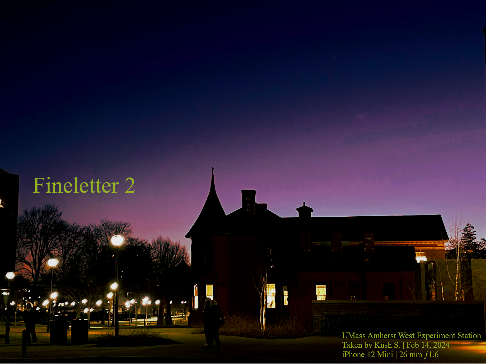

# Climatech Wonders, and Chill Vibes

Welcome to the second episode of my Newsletter, accompanied by a gorgeous picture of the UMass Amherst West Experimentation Station. I take a lot of pictures in my daily life, but most do not see the light of day, which is why I am going to attempt to merge my different art forms. The Photography page in the Finechive is still under construction, and hopefully it does not take long. 

<!-- truncate -->

In today's newsletter we take a tour of Greentown Labs (well, at least what I am allowed to show on here), discuss the issues of Open Source Collaborators having to deal with arduos amounts of people who "feel they are entitled to a .exe", and I go over some of my own history of trying to maintain a platform such as this. Finishing off, we have some (read: one) cool thing I found on the Internet.

## Greentown Labs

I had the opportunity to visit on a personalized tour of [Greentown Labs](https://greentownlabs.com/): a Climatech Incubator providing resources to startups to achieve their maximum potential in developing cutting-edge solutions to combat Climate Change. They provide, essentially, lab space + funding + connections and networking to startups. They also provide legal advice to startups for licensing their IP to larger companies, and essentially do a lot of, for lack of a better term, insanely cool stuff. 

I got an opportunity through [UMass iCons](https://icons.cns.umass.edu) to visit 