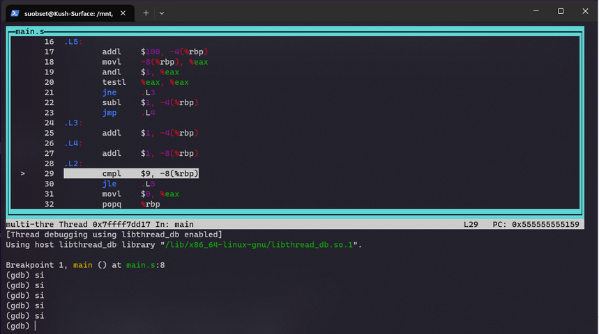
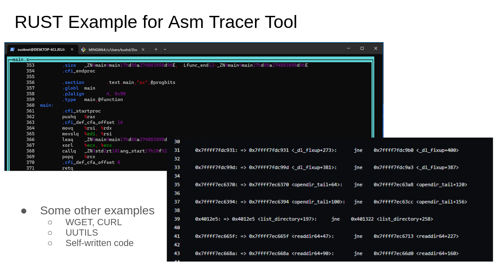

# Metamorphosis


Slightly late blog update this week, owing mainly to the amounts of midterms and the thesis progress that had to be made last week. However, we are back and kicking: and I hope that I will be able to keep this momentum up next week as well. In today's newsletter, I would love to highlight some fun code I wrote for my Honors Thesis last semester.

<!-- truncate -->

The banner for this newsletter was taken on my trip to Washington D.C. Fall 2023, during the U.S. Census Department's Justice Week Event. I was one of the 6 people who worked on [ASSERT](https://suobset.github.io/assert), a GIS Web-App that directs emergency responders (like Eversource, National Grid) to counties that are more vulnerable to energy inequity. A lot of data processing and web development later, we were able to successfully demo our product, which earnwed us a spot on the Census Department's [website](https://opportunity.census.gov/showcase/?year=2023&partner-agency=Department+of+Energy). 

More details on ASSERT can be found in the Research Section of my website [here](https://skushagra.com/docs/research/ongoing#umass-integrated-concentration-in-sciences-icons), though once the project is done forever the location may move to the [iCons Page here](https://skushagra.com/docs/research/icons).

## The Times of Uncertainty, and my love for PyGDB

It is during the times of uncertainty that I believe the best things happen. Such was the case for ASSERT mentioned above, and I believe such will be the case for life ahead. I touched upon how I wanted to work in Systems in Grad School in my last post, and so I thought I'd go a little deeper into my biggest formal systems project as of right now: the Honors Thesis. 

The following is not going to be a deep dive into the intricacies of my project, I'd rather have people look out for my formal thesis for that one. However, I do want to pick out a certain aspect of the project, in an effort to hopefully demonstrate my approach towards problem solving. 

## Background

For my thesis, I am trying to compare performance differences between RUST and C++. I go more over the details in the Research -> Ongoing portion of my website, but in a nutshell here's the workflow

* Write the same program on RUST and C++
* Execute and extract the Assembly (on x86 platforms)
* Assemble and run, and trace the assembly's execution
* Analyze trace files

My big hurdle in the past semester was point 3, the tracing of an Assembly file's run. I wanted to basically capture each Assembly instruction (for jumps and compare), and write them out to a file as they got executed. Here's the story of how I achieved it:

## Tracers

Until 2 semesters ago, I had dealt with a lot of techniques pertaining to decompilation, reverse engineering, and the like. The most stable way to parse through an Assembly File was this RUST program I came up with:

```cpp
use std::arch::asm;

pub fn assembly() {
    unsafe {
        asm!(
            // paste the assembly code here
        );
    }
}
```

However, this approach caused a lot of issues. For once, it introduced RUST overhead, which would skew off calculations if we are trying to compare between RUSt and C++. Moreover, there was still no way of actually running Assembly on bare metal and recording metrics off of that.

We needed to put decompilation, Ghidra, and RUST Inline Assembly aside; we needed to start from scratch.

To begin, I wrote a small program serving as a testbench, and extracted the x86 Asm:

```cpp
int main(){
    int j = 0;
    for(int i = 0; i < 10; ++i){
        j = j + 100;
        if(i % 2 == 0){
            j = j - 1;
        }else{
            j = j + 1;
        }
    }
    return 0;
}
```

I extracted the x86 Asm, and tried to make some changes to the bare files in a manner that would print a statement on the terminal before every jump.

This method was inspired by Prof. Joe Chiu's Python Bytecode Tracer, which adds similar print statements in the Python Bytecode to trace the same. Here's a [link](https://github.com/terry3800/python_tracing_tool-1). The choice of the registers here was based on ones that store variables in the x86 documentation, and through lots of trial and error and reading documentations. 

For now, we are also only tracing Jumps and Compares.

My x86 Asm implementation was pretty janky, here's what a Snippet looks like:

```py
.LBB0_1:                                # =>This Inner Loop Header: Depth=1
	# User Code
	 lea 	.LBB0_1_message(%rip), %rdi
	 call 	printf
	# User Code
	lea 	.LBB0_7_message(%rip), %rdi
	call 	printf
	cmpl	$10, -8(%rbp)
	jge	.LBB0_7
	# User Code
	lea 	.No_jmp_message(%rip), %rdi
	call 	printf

# User code below serving as helper functions to print
.LBB0_1_message:
	.asciz	"jmp .LBB0_1\n"
.LBB0_7_message:
	.asciz	"jmp .LBB0_7\n"
.No_jmp_message:
	.asciz	"No Jmp\n"
```

This, did not work. The registers ```%rip``` and ```%rdi``` would get severly messed up, and result in a plethora of Segfaults that were honestly near impossible to debug. 

Most importantly, we were messing with the values in pre-defined registers, which could (and did) mess up program execution. So, the problem persisted and we marched forward bravely. 

I tried to use a stack to maintain the old values of ```%rip``` and ```%rdi```, do the print, and then pop those values back into the respective registers. Equally janky snippet:

```py
.LBB0_1:                                # =>This Inner Loop Header: Depth=1
	# Save the values of %rip and %rdi onto the stack
    pushq   %rip
    pushq   %rdi
    
    # Load the address of the message string onto %rdi
    lea     .LBB0_1_message(%rip), %rdi
    
    # Call printf
    call    printf

    # Restore the values of %rip and %rdi from the stack
    popq    %rdi
    popq    %rip
	# Save the values of %rip and %rdi onto the stack
    pushq   %rip
    pushq   %rdi

.LBB0_1_message:
	.asciz	"jmp .LBB0_1\n"
```

My third, equally short-lived implementation was to use my own variables instead of the Stack. I also tried printing using my own variables. Both did not work:

```py
	# User Code
	# pushq	%rip
	movq    %rdi, saved_rdi
	lea 	.No_jmp_message(%rip), %rdi
	call 	printf
	movq    saved_rdi, %rdi
```

This also did not work, probably due to the reasons mentioned before. After all, the Stack was just a band-aid to solve an issue that was secondary; the execution of this Assembly code was still causing issues with tracing. 

For one, if we were to measure how efficient a programming language was based on tracing their Assembly outputs, it seemed counter-intuitive to edit such Assembly files. 

But secondly, the execution of all these three edits seemed dubious at best. Even if we run the same program with the same inputs, sometimes these prints would work and sometimes they wouldn't. They were not reliable at all, and did not provide an accurate trace. 

So far, here's a list of everything wrong with this method:

* Does not work well
    * Messes up stacks, registers, values of core registers
    * Segmentation Fault Minefield
    * Needs to uniformly change Asm files through a janky script
    * And pray that it executes well
* For real life programs with hundreds of files, does not work well
    * Cannot go outside the context of one file
    * Can break interoperability
* Most importantly, false metrics can be analyzed, since we are adding our own jumps and calls

It was time to switch my methodology. 

## A Debugging Approach to Tracing

I went back to the drawing board for a bit. What we want to do is trace a file; we are essentially looking at this Assembly File and seeing it's behaviors across different commands, variables, and the like. 

What I needed, was a debugging approach to tracing. Here's a quick cut to the chase, and a rundown of what I ended up doing. 

My primary debugger for low level systems stuff has been GNU GDB so far, and I am super comfortable with it. By nature, it has a lot of extensible capabilities, owing partly to the amount of time and community surrounding its development. 

Utilizing GNU GDB as our debugging tool, we leverage the 1v1 binary compatibility of LLVM. The x86 assembly generated from LLVM LLC seamlessly integrates with GDB, enabling us to step into each component, make observations, and generate a trace file. By assembling the x86 assembly with the appropriate -g flags, we can then employ GDB to generate a trace, providing valuable insights into the execution process.

I found PyGDB, a Python Package that acts as an API to GDB and helps us extend the functionality. So here's how everything works at the end:

* Compile each program till the Assembly
* Assemble with GDB flags
* Start GDB, and my own Python program that notices each GDB step and notes down the execution state
* Output this data to a file, and you have a trace :D

Here's the initial Python Script I had, for Jumps:

```py
import gdb

# Define the file path where you want to save the log
log_file_path = "./gdb.trace"

# Initialize a flag to track whether a 'jne' or 'jge' instruction was executed
jmp_detected = False

def log_jmp_event(event):
    global jmp_detected  # Use the global flag to track if 'jne' or 'jge' was detected
    pc = int(gdb.parse_and_eval("$pc"))
    instruction = gdb.execute("x/i " + hex(pc), to_string=True)
    
    if "jne" in instruction or "jge" in instruction:
        jmp_detected = True
        with open(log_file_path, "a") as log_file:
            log_file.write(f"{hex(pc)}: {instruction}\n")

# Connect the stop event to the log_jmp_event function
gdb.events.stop.connect(log_jmp_event)

# Define a command to check if 'jne' or 'jge' was executed and write to the log file
class CheckJmpCommand(gdb.Command):
    def __init__(self):
        super(CheckJmpCommand, self).__init__("checkjmp", gdb.COMMAND_USER)

    def invoke(self, arg, from_tty):
        global jmp_detected
        with open(log_file_path, "a") as log_file:
            if jmp_detected:
                log_file.write("jne/jge was executed.\n")
            else:
                log_file.write("jne/jge was NOT executed.\n")
        jmp_detected = False  # Reset the flag for the next check

CheckJmpCommand()
```

Here's how the actual execution takes place:

* Start GDB and load your Assembly files
* Attach this Code to GDB
* Run, step into each command
* During each step:
    * Detect Jumps
    * If a jump is detected while executing code
        * Log it in a file
* Repeat until end



Here's what the snippet of an end trace for just Jumps looks like:

```
0x40120d: => 0x40120d <_main+71>:	jne    0x401219 <_main+83>

0x40128b: => 0x40128b <list_directory+107>:	jne    0x40125b <list_directory+59>

0x40128b: => 0x40128b <list_directory+107>:	jne    0x40125b <list_directory+59>

0x7ffff7fdc895: => 0x7ffff7fdc895 <_dl_fixup+117>:	jne    0x7ffff7fdca9c <_dl_fixup+636>

0x7ffff7fdc89f: => 0x7ffff7fdc89f <_dl_fixup+127>:	jne    0x7ffff7fdca70 <_dl_fixup+592>
```

The best part: the Python as an API implementation is extensible, and can incorporate really any variables or states that you'd want to incorporate. 

The above is the initial version of the tracer I had, and I'd be very excited to show the end results soon as my thesis comes out. 

I know some of the explanations seem cut short, but I am saving them up for the thesis. This blog was to just give some hints on what I am doing, and how Systems programming can sometimes be a success through entirely unexpected means. 

Until next time :D

