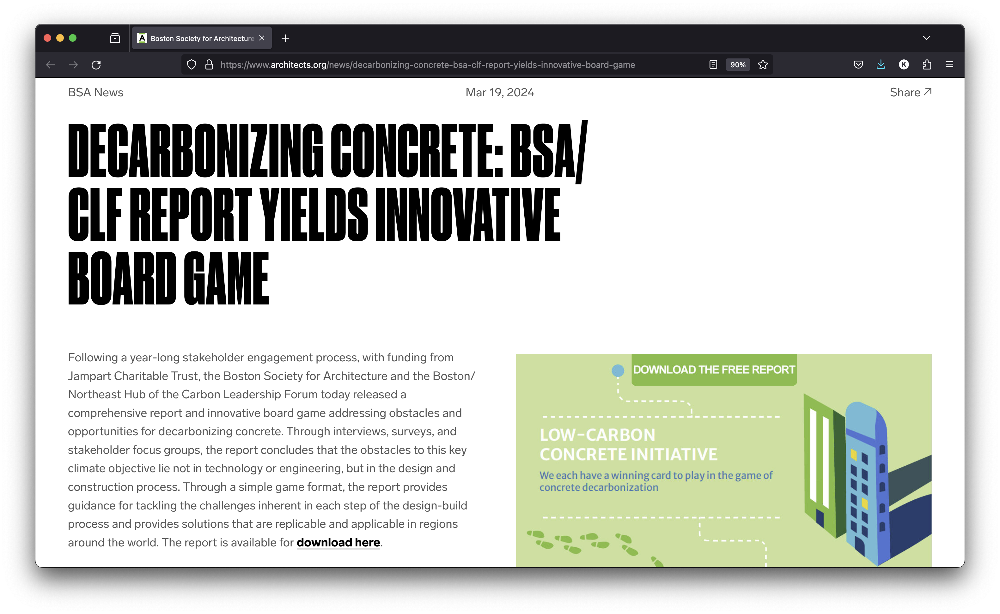
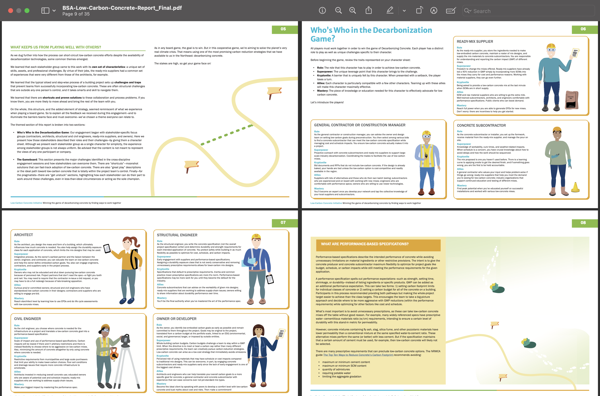
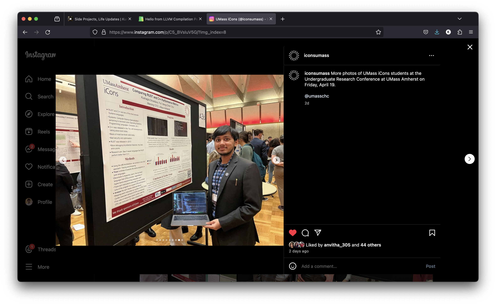

# Side Projects, Life Updates

I have decided that writing this newsletter every week was resulting in a content churn, which was essentially me writing a blog post for the sake of writing it. Hence, I am putting down some changes as to how I write this thing: i.e. I would write whenever I have quite a lot to say (in a meaningful way), while also making it such that I write at least once every month. 

<!-- truncate -->

Regardless, it's been a month: and naturally I have a lot of things I want to put in here. From almost completing my thesis work to helping create a video game for a friend's thesis (a first for me), I am so excited to be back into writing stuff. Maybe my Tom Scott expectations of a weekly newsletter were too high (then again, the man has a team), but I feel excited to be writing about this stuff again. 

## Side Projects

Ad my own thesis wraps up and I get a bit more time to pursue other avenues, I am trying to get into more side projects as well as start some of my own again. I felt that there needed to be a fine balance between my actual academic work, side projects, and other hobbies altogether (like photography) so that I do not burn myself out doing one thing only. 

However, my mind is also pretty good at coming up with new ideas left and right, without much consideration of if I will be able to pull it through. Which then raises the question: "How many side projects are one too many?"

I think I have come up with a non-exhaustive list to tackle the problem of resource allocation for projects that do not relate to my academia/career or professional work. This is my approach:

1. Come up with an idea.
2. Does this idea:
	* Solve an issue a lot of people have/is it for someone else?
	* Solve an issue you have?
	* Help you learn something new?
	* Help you create something that is just interesting?
3. Take the above as a priority list, and proceed accordingly. 

This is not to say that any of the above criteria are good or bad, but rather become a way to allocate my limited availability of resources (mostly time) into things that help me grow more. Again, this does not apply to academia or career: those avenues get all my attention as required. But whatever time I have remaining after academia/career need to be used wisely, and the above is my approach towards the same.

Weeding out all my side projects based on the list above result in these big projects that I am doing currently:

### Tra86: The LLVM Compiler Performance Tracer

Misleading, as I should not technically consider this a "side project", but as part of my thesis on comparing RUST and C++ Performance Metrics, I developed a whole range of scripts that would take a C++/RUST Project, Compile to Assembly, Assemble to Object File with Debugging Symbols, Link Header Files, Pass to GDB, and Trace Asm Calls as the program executes. After the tracing, it passes the trace output to another script for analyzing CPU performance. 

Currently, this is only C++/RUST based and on the x86 platform. I am expanding this, since I believe that this could be extended for comparisons between any programming languages (or most). I also plan to create a UI for the whole thing allowing others to be able to use and contribute towards this project. 

More details to be noted in my thesis, and at [https://tra86.skushagra.com](https://tra86.skushagra.com). Genuinely super excited to get this out in the world, this is my magnum opus currently: 

### Anna Biondo's Low Carbon Concrete Project 

A first for me: but I (and [Anvitha Ramachandran](https://github.com/anvitha305) of iCons) are currently working with [Anna Biondo](https://www.linkedin.com/in/anna-biondo-2024/) (iCons) to create a video game for her Low Carbon Concrete Project. Part of a bigger project posted [here](https://www.linkedin.com/feed/update/urn:li:activity:7176237788382515200/), Anna served as a Project Intern for Boston Society for Architecture and helped create a report that details the obstacles and opportunities for decarbonizing concrete production. 

This report can be accessed [here](https://www.architects.org/news/decarbonizing-concrete-bsa-clf-report-yields-innovative-board-game).

Part of this bigger project includes Anna's vision of a Video Game that would guide a player through each of these objectives and hurdles. Each player picks one of the many available personalities and goes through a map, with each section pertaining to a specific challenge in the production of low carbon concrete, while also highlighting the opportunities at each point. We're currently discussing Anna's overall vision in implementing this game, and I will be learning video game development to be able to deliver. 

(Screenshot from the BSA LCC Report linked above)

I will post more updates as we realize more of Anna's vision and bring it to fruition for her project. Temporarily, the video game project is linked under [here](https://lccumass.github.io/).

### MorbiOS: The RUST-Based Operating System

MorbiOS is a currently under-development RUST-based Operating System that Anvitha and I are developing, half as a joke and half to teach ourselves more in-depth about different Operating System paradigms and how does one even go about creating one. While we both have extensive Systems experience, them having created a [legv8sim](https://github.com/anvitha305/legv8sim) for their thesis and me having compared different programming languages on a low-level baseline, we both believe that this project would provide an immense learning opportunity that classes sometimes do not have time for. And above all, this is a hobby: we actually love doing this stuff.

While there is not much out there: be on the lookout [here](https://skushagra.com/docs/finechive/morbios) for more updates to the project as they keep on coming. 

## Life Updates

I am nearing graduation, which is a bit wild to think about because my mind refuses to accept the Zoom semester as a real one. Regardless, here's almost everything new that at least I wanna put out there:

### 2024 Eclipse

I saw the 2024 Eclipse at the Metawampe Lawn at UMass Amherst with a bunch of my friends and the UMass Astronomy Department. Here's a video I took :)

<iframe width="560" height="315" src="https://www.youtube.com/embed/Pbg3e3i-ErQ?si=24bIviEZzZI84Bi7" title="YouTube video player" frameborder="0" allow="accelerometer; autoplay; clipboard-write; encrypted-media; gyroscope; picture-in-picture; web-share" referrerpolicy="strict-origin-when-cross-origin" allowfullscreen></iframe>

### iCons: Thesis, ASSERT, and the end of 11.

As a last project stretch under my affiliation with iCons (honestly THE big thing I will miss from UMass), I presented my Honors Thesis at the Massachusetts Undergraduate Researchers' Conference (MassURC). This is the same thing that tra86 is a part of:

ASSERT has seemed to come to a point of equilibrium, as most people working on it did not get the time to contribute more towards it. However, the whole thing is very Open Source, and people in the future are welcome to contribute towards it at any point :)

My other iCons projects have been published on the iCons innovation portal as well. In all terms, iCons has been the best journey I have been a part of, and I look at my work under this endeavor as some of my best. It had ups and downs (some projects being stressful beyond belief), but it gave me the biggest edge in research and scientific communication possible. Above all, at the risk of sounding cheesy, it gave me my closest friends, lifechanging opportunities (Museum of Science, U.S. Census, and an upcoming project) and the best network possible.

All my iCons projects are listed under my website.

### The Move to Boston

I am moving to Boston to work for Psivant Therapeutics as a Software/Systems Developer Intern. Yes, Grad School did not work out the way I expected it to this application cycle, but I am looking at this as a hidden opportunity that I would have not even imagined to pursue prior. 

My introduction to Psivant was thanks to Prof. Scott Auerbach, and it seems that my skill-set in Systems (tra86 and the rest) are a perfect fit to the work at Psivant (projects like STORMM). I will not delve into it further, but what it essentially means is that I am pursuing the biggest jump in my career possible. 

Facilitating the same, I will be moving to Boston for the duration of the summer. While it is currently an internship, I hope that we're able to find an appropriate career fit and I could continue until the next application cycle (or beyond). Either ways, I am super excited to start working at and contributing to Psivant, and in this move to Boston as well. 

I may also continue to work for LinKaGe Lab at Smith College under my contract, but that will be a very part-time avenue based on the project I am given. 

This was genuinely a career move that was unexpected just a while ago, but has given me an avenue that was completely unimaginable a couple of months ago. I have loved interacting with everyone at Psivant, and the work genuinely feels like something that is the perfect balance between things that I love doing and am good at (systems, code), while also having that factor of learning and growing more (Physics, Chemistry). Most importantly, this is the one avenue where I believe I do not lose my iCons edge: working on a multidisciplinary global problem, contributing my skill set on the table, and learning new things and interacting with people that help me grow exponentially in my career. 

I thank Prof. Auerbach for introducing me to Psivant, and I cannot wait to join the team and start!! 

Apart from ending my academia and finding this amazing avenue, I do not have much updates. I am glad to be back at writing this stuff, and I will probably do more writing here as time goes, albeit just not in a weekly fashion :)

**Update: 28 Apr 2024**

As part of planning my accommodations in Boston, I ended up creating a quick web app: [Apartment Pointer](https://skushagra.com/docs/finechive/aptPoint). Give it a look :)

Peace <3
