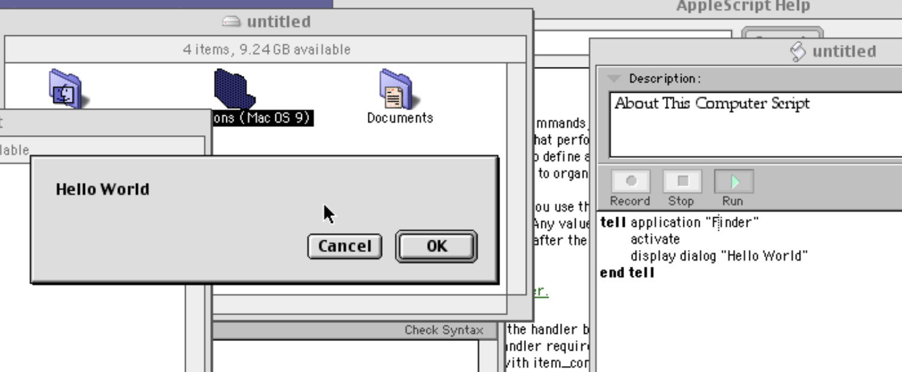
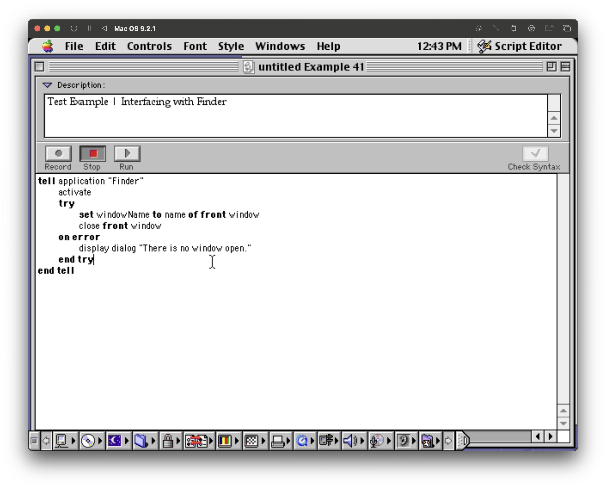
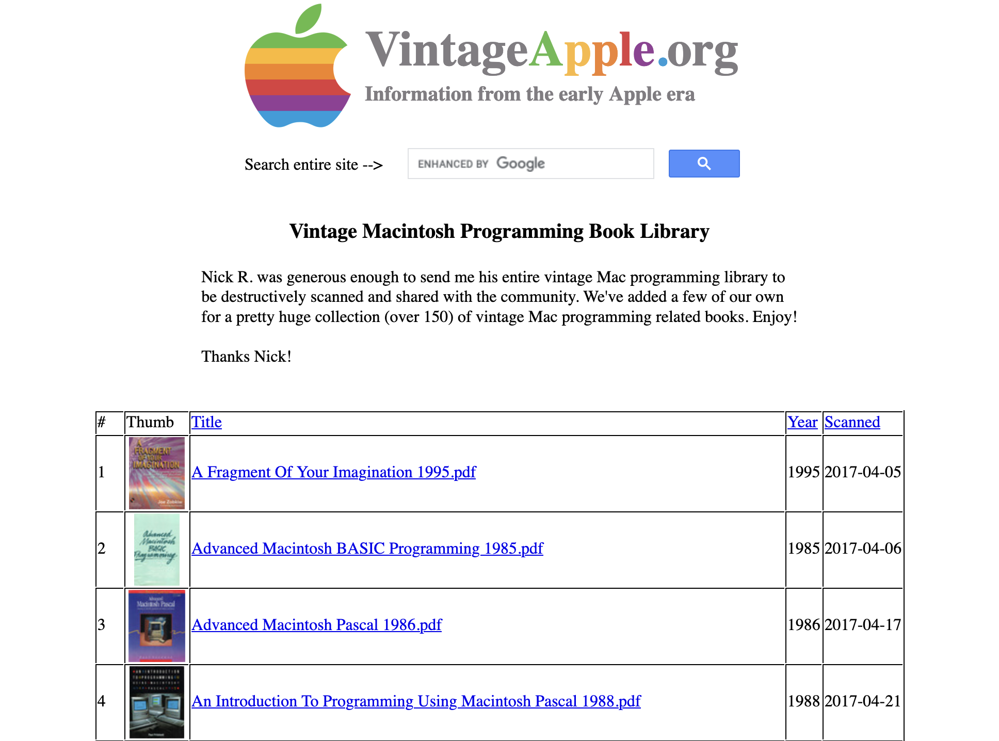
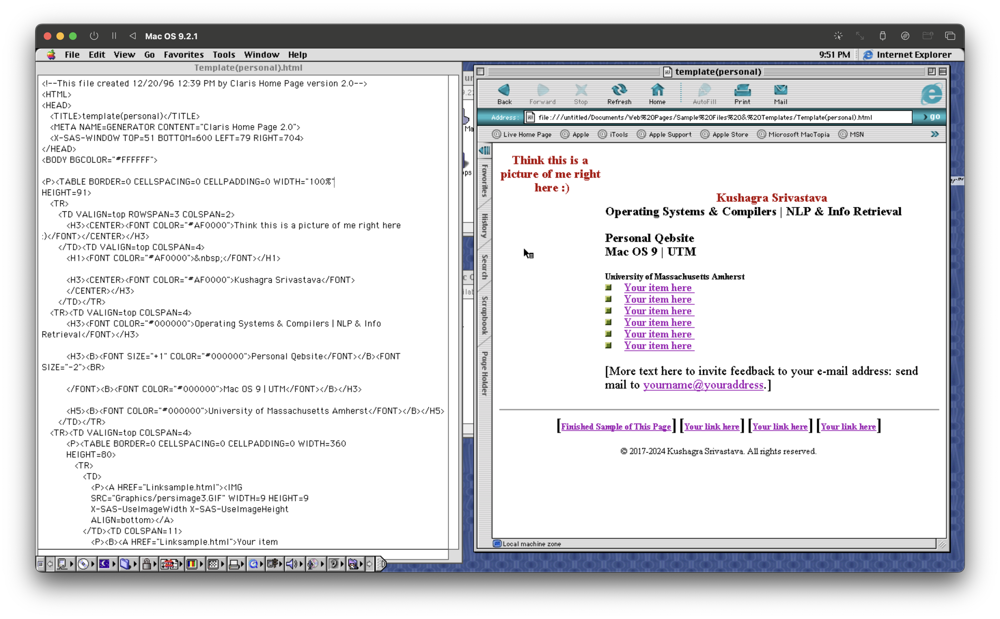

The following series (which is separate from my newsletter), is going to be a comprehensive deep dive into programming for Mac OS version 9: the ancient pre-UNIX version of the Operating System which barely has much documentation on the Internet today. This post is mainly initialization, I just got the VM working and a pipeline to install 3rd party (old) software :)

<!--truncate-->

I do not exactly have a plan in mind, but I hope to be able to share the "why", and possibly the "how", in this blog post. I have always been interested in vintage computing, having dabbled with Windows 3.1 in High School for kicks and giggles, to having just completed my Undergraduate Honors Thesis on comparing performance differences between 2 programming languages on the Assembly level. To me, working through the difficulties of programming and figuring out this puzzle is the fun bit in of itself, and what better platform to take than one that shares very little resemblance to any modern OS (Win 9x uses the Windows API which is still used today, and recent macOS is UNIX based). 

In fact, Classic Macintosh Operating Systems do not share any resemblance to UNIX or macOS as it stands today. Released in October 23, 1999, MacOS 9 ran hard with making everything self-contained in the Graphical User Interface. Absurdly so, there is not even a terminal or any way to interface with the system outside of the Graphical System that was shipped with the OS. 

On top of it, I just love Apple's stuff to a great extent. Yes, I support and use Libre Software wherever possible, but my intrigue for tinkering with computers as a subject started from looking at Apple Computers in my childhood. I remember being in middle school with my Windows laptop, unbelievably looking at my friend's MacBook Pro (I didn't even know computers made of metal existed). I bought a Mac when I could, especially knowing the UNIX layer underneath making programming much easier than it needs to be. Heck, outside of my tinkering with Python through middle and high school, it was my awe of what computers could actually be that caught my fascination with the subject matter (I remember seeing this picture of Jobs wondering what this machine was even....again this was middle school so cut me some slack).

Throughout my life, I have tinkered with Computers. Started off as Python Programming through Middle School, tinkering with C/C++ and modding Win 3.1 in High School (+ web dev and client dev), and now (as mentioned above) completing my thesis in Programming Language Performance (most of which included tinkering). 


Well, I believe I am at a point where I can now start tinkering with older OSes, and want to learn programming and backporting a modern program for this particular OS. 

However, even when I got the OS to work in a Virtual Machine on my M2 MacBook Air (that's 30 years of hardware differences), I noticed that the system was actually very self-contained. It had a Java Runtime Environment shipped with the core OS (for Applets), and AppleScript (shown in banner image above) was a pretty powerful scripting language which does not have much documentation today (for the version shipped with this OS, I know that a more recent AppleScript is still present in current macOS). 



I felt that one of the best aspects of this Operating System was how there is a "Help" section built in. I tried some of the Java Applets built in, perused the source code for the same, and tried editing a website as well. All in all, I felt that MacOS 9 is actually very self-contrained and I may be able to learn more of programming for this specific platform based on the guides and help sections already included in the OS itself. 

I currently want to learn programming for this Operating Systems for 2 main reasons, outside of the fun hobby aspect I mentioned above:

1. Backport a recent app to this OS as a project, inspired by [this video](https://youtu.be/CTUMNtKQLl8?si=4TbIgIjPpVcz50FG) from MattKC backporting ```.net``` to Win 95. 
2. Learn more and understand the workings of older Operating Systems, as an Operating Systems person. Older systems had hardware limitations and needed some clever programming to get around...which makes it an excellent project to see some bodging and optimized programming. 
3. Take on the challenge of learning a programming language and go on this fairly complex journey with very minimal recent documentation available, and take on this challenge. 

Fun bit is how much resources there already are to go on this journey. I found [this collection of resources](https://vintageapple.org/macprogramming/) to learn more, and also there's an incredible Software Repository thanks to the [Infinite Mac](https://infinitemac.org/) project.



Anyways, I will be putting more updates as this journey unfolds. I will record my programming journey and also mention what app I want to either create or backport. Until then, here's some more tinkering on a Website (+ I got external ISOs to load and 3rd party software to install on this VM successfully). 


