# Graduated. Part 1.

```
$ ./status-update

This entry is going to be published in multiple
parts.

It's the process of looking back and into my
whole academic journey. It's gonna take a while to
complete, but I am enjoying the process of writing this.

Also moving to Boston, which delays stuff.
```

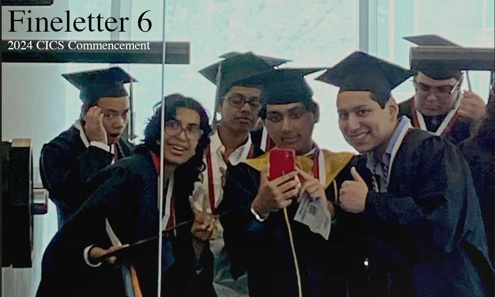

So this is it, in the past month I graduated from my Undergraduate journey at UMass Amherst, and now I look forward to greater opportunities in life. I think for this newsletter, I'd like to take a step back and recount some good memories, what I learnt, and what I want to take forward in life as a UMass Amherst Alum.

<!--truncate-->

UMass Amherst provided me with a ton of opportunities, and an incredible social circle. It was a very transformative journey for me personally, despite the shortcomings and such. As I sit here after 4 years, I cannot help but think of so many ways that the people in this University have shaped me to who I am today, and I wanted to dedicate this post to remembering some of those experiences and people. 

I will divide this blog post in terms of the years at UMass, as well as opportunities. For the most of it, I am making this as we go...so we'll see how it goes. I think it is also worthwhile to mention how this is my second attempt at a reflection: my first being a personal document I wrote for my own purposes, reflecting on every class I have taken at UMass and my takeaways. That one's personal, and for my own records. This one is a bit more overarching, and consists of things that were more personal in nature. 

This is the story of my personal UMass journey, not my academic journey. 

## Freshman: It's going to be a long night

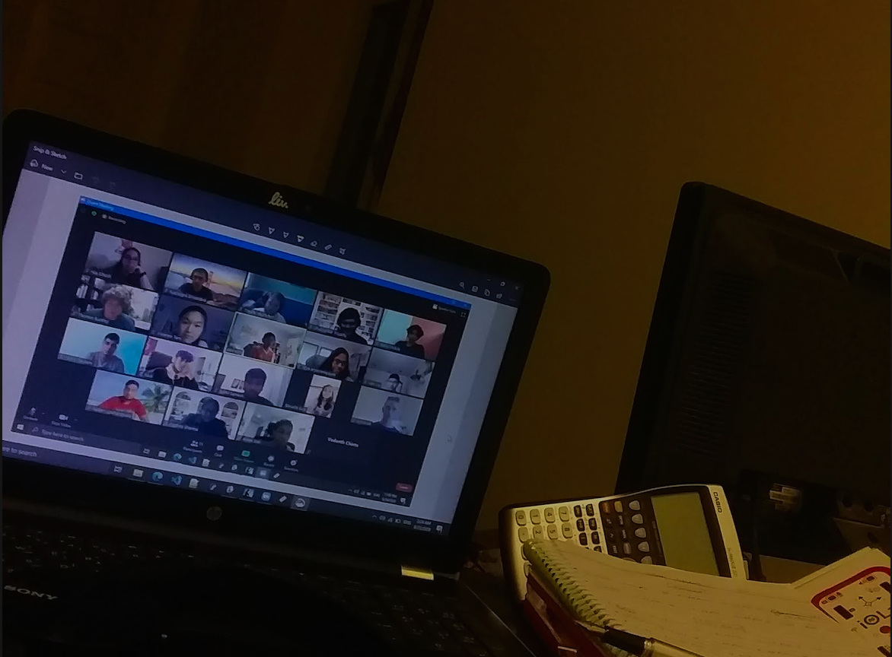

We started off weird, huh? At this point it feels that even pointing out COVID has become like beating a dead horse, but it was quite the influential time. I have a weird lens to remember this time, from weird grudges to abysmally awkward time schedules: this was a hard one.

Picture this: you're on a group study session for about 3-4 hours now (more realistically, this is a mix of half friendly sessions and half serious study). It's a Discord call, with about 8-12 people present. We all help each other with our coding assignments, and we talk to each other and get to know each other as well. Some of the best people I knew came in from here: Ibrahima, Varshini, Carter, James, Stefanie, and many others. After many hours, though, everyone is kind of tired; and we all want to continue for the rest of our day. We have been on this call since 9AM EST, and it's almost 4PM EST. 

Except I am in Dubai as we speak (and later India). It's not EST for me, in fact quite the opposite. The moment I hit that "End Call" button, I am left alone with my thoughts at the middle of night. It's 3AM, I cannot sleep because I have been functioning on Eastern Standard Time throughout (I closed every window, set my watch to EST, and almost never looked outside).

Which also meant that my family was awake while I was asleep, and vice versa. Even though we lived in the same house, I barely talked to them (almost if at all). The brief periods we were both awake at the same time was cherished a lot, but for the most of it I had meals alone and spent time in my room alone. 

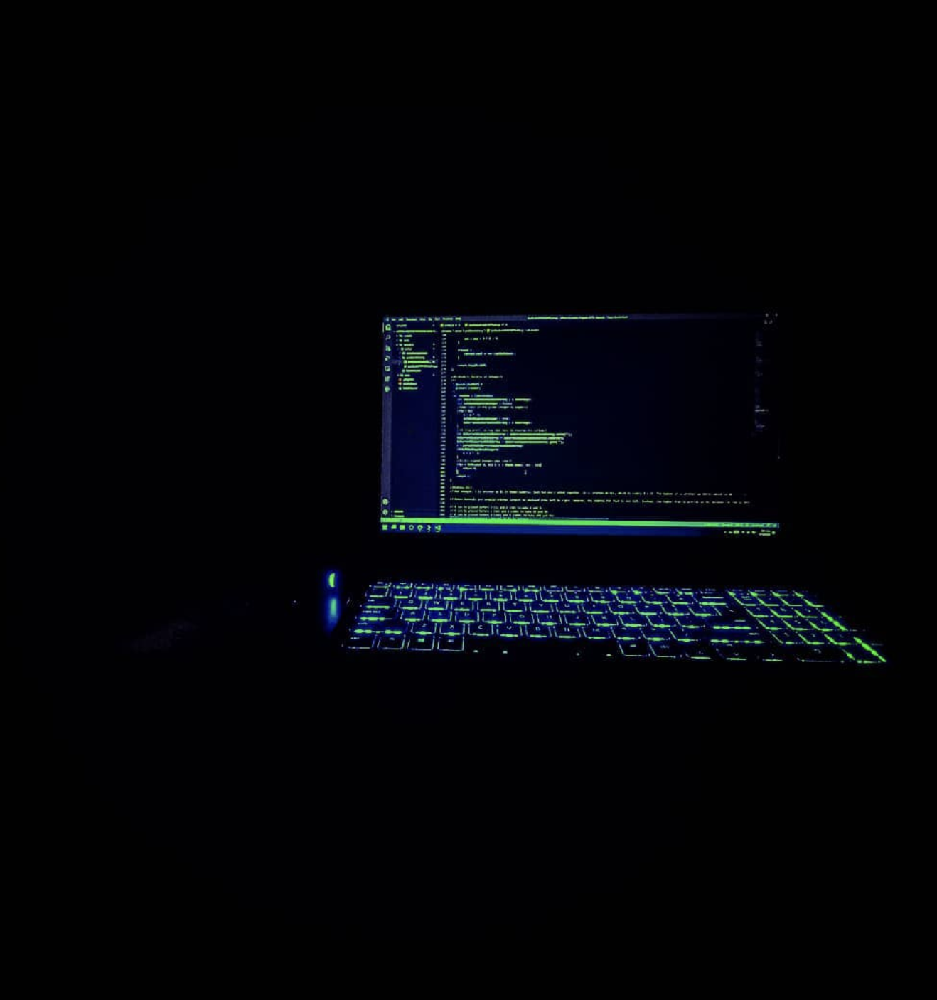

This isn't to say that I completely hated this time. It was the only time I was completely alone with my thoughts, and I feel that this may have been the only time to have provided me this specific circumstance. Almost my entire love for the Liminal Space aesthetic comes from this time period, as well as the thrill of getting into deep lores for different art works (Regional at Best, The Backrooms, and all sorts of Internet Exploration). It felt nice being alone with my thoughts, figuring out what I really wanted to be. It seems apt that this is when I found Internet Communities, aesthetics that work with how I perceive the world, obscure music, and tons of Internet friends. 

Notably, this is when I decided to post on the ```r/penpals``` subreddit, looking for a closer Internet friend to share notes and letters with. I got to know Fania, who still remains a very close friend (both Rose and I know her at this point). Fania and I talked through multiple phases of our university lives: even though we sometimes went off thanks to university life being difficult, we always remained close friends to this day. 

For me personally, it was the second half of Freshman year that became more difficult, even though it had more positive things to present. While dealing with COVID trauma and some losses in our family, I also had to navigate the perils of being falsely accused of Academic Dishonesty (it was a Gradescope error). While I was able to make a case for myself and come out of that situation, it was one of the most stressful things I have ever been in. I remember going without sleep for almost the whole week and a half: in between taking care of my sister and managing everything in the house as the sole "adult" while my family were tending to emergencies for other family members. I felt drained and tired and alone. I made a case for myself, got up, and continued. Eventually, I was able to make a compelling case and things got resolved. I passed the class, everything continued to being great. It was just too much to take in all at once at the time, however. 

I remember waking up in an exceptionally chilled room, seeing my laptop on the table and the sunrise outside. Freshman year was the worst in many cases, but I have the clearest memories of the time, plus the experiences were something that I required to undergo this metamorphosis into who I am today. 

This is the sunrise on the day of me resolving that issue, also moments before I got the news of my grandfather's passing. All in the week and half. 

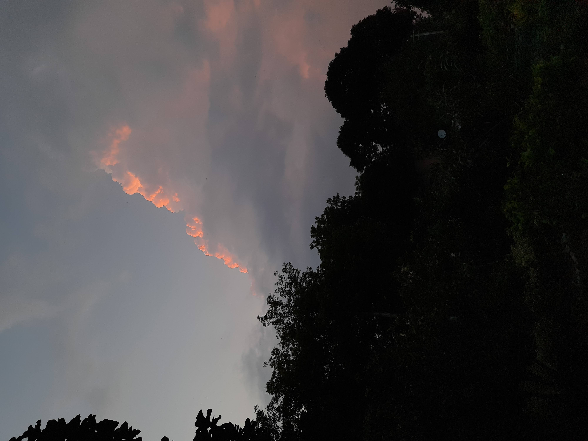

Here is the amazing that happened around a week after all of this, though: the biggest (and far exceeding anything else) achievement was the fact that I was inducted into iCons after a rigorous application & interview process, and was inducted into the Honors college prior to that. As was everything else at the time, we got inducted online!! 

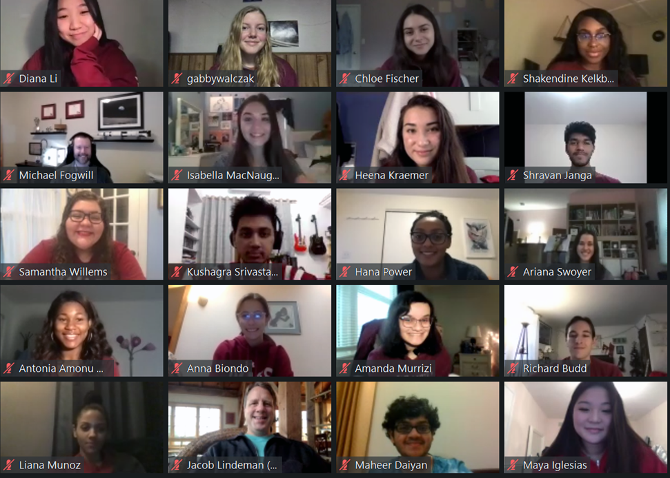

Now, in hindsight while I can say that iCons is my primary UMass social circle, and also the platform to some of the best work I have done as my time here: I really had absolutely no clue how big of a thing it would be back then. We started with iCons 1 in this semester, and I made a pretty cool website to demo our data in an interactive manner alongside our poster. Terrible UI/UX, but impressive research for a group of people who had never done it before ([archived here](https://skushagra.com/docs/undergraduate/hydrogenBatteries)). The idea of giving people an interactive method of playing around with our data as opposed to looking at inanimate graphs on a poster stuck. I have since made a website for every single iCons project, without fail. 

Oh, and I helped organize the whole class into coming up with our name and logo. This was the design after a long voting process (s/o Anvitha):

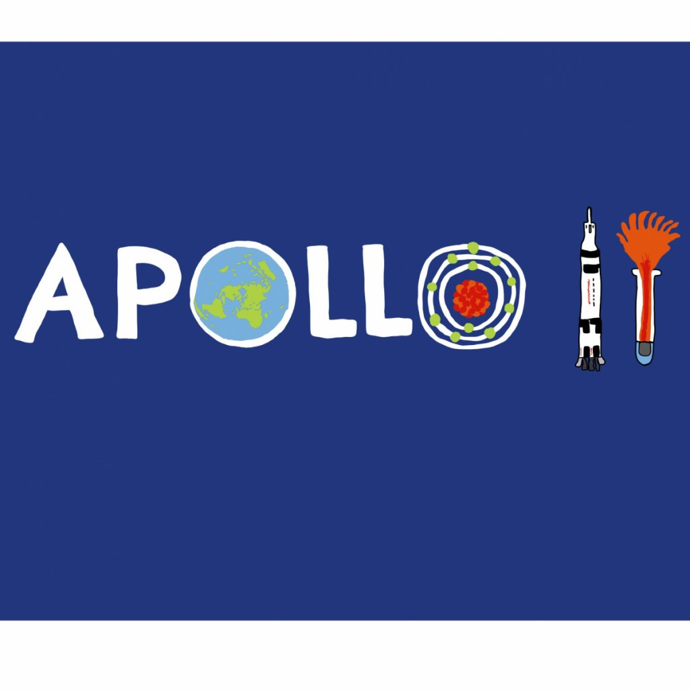

Honorary alternate logos at the end :')

Every single close friend I have going out of this university are iCons friends, with a few exceptions of close friends from other avenues. I have enjoyed working with all of them so much, and I continue to work with some of them in some capacity. iCons gave me my social circle; and it is honestly great to have found other semi-introverted nerdy friends to hang out with. 

Another fun thing I did was to pull 3 all nighters in a row for [HackUMass VII](https://hackumass.com/) to create my first ever mobile app (I had done cloud computing and client web dev beforehand). We created [DermSafe](https://skushagra.com/docs/undergraduate/dermsafe): a computer vision app that can detect skin cancer from a picture. Good implementation, trash design. I did learn that I could pull myself much more than I could anticipate. And I did, ever since.  

I took a lot of "liminal" pictures during these time. Yes, they are heavily edited and saturated, but I was trying to grasp this aesthetic and find my tone more. I was taking influences from Vaporwave, Outrun, Liminal Spaces, and Dreamcore (huge overlaps but they are also different in their own ways). Essentially, a feeling of eerieness stemming from being alone coupled with some nostalgia (or tapping into emotions you didn't know you felt).

The awfully chilly room in the morning of me resolving the academic issue:

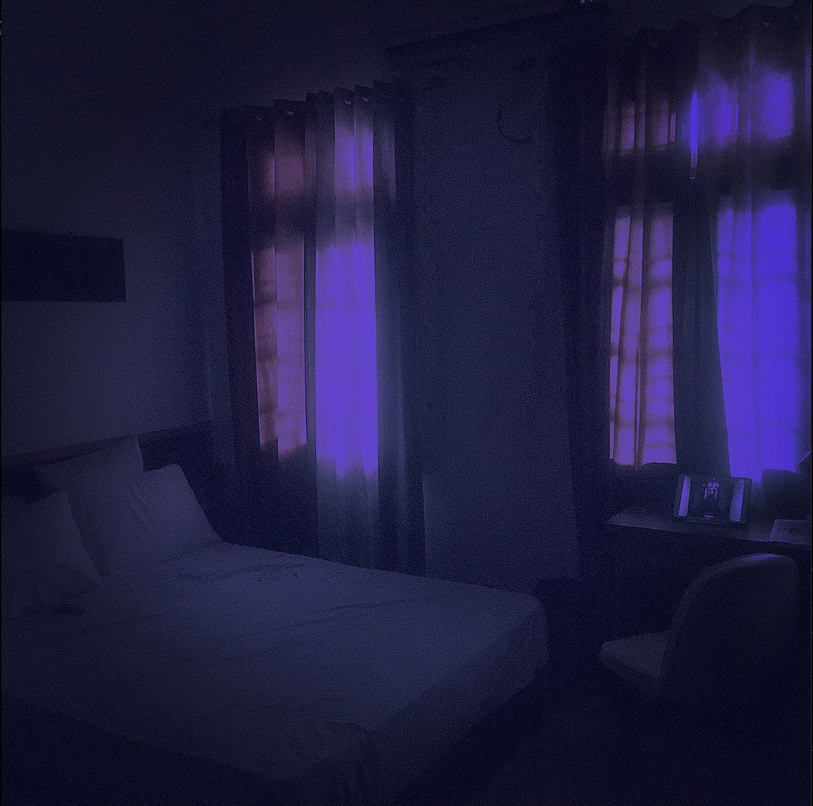

Some other pictures:

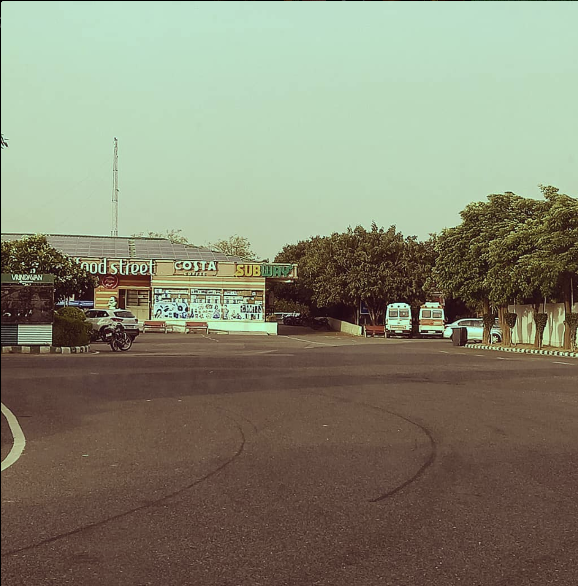

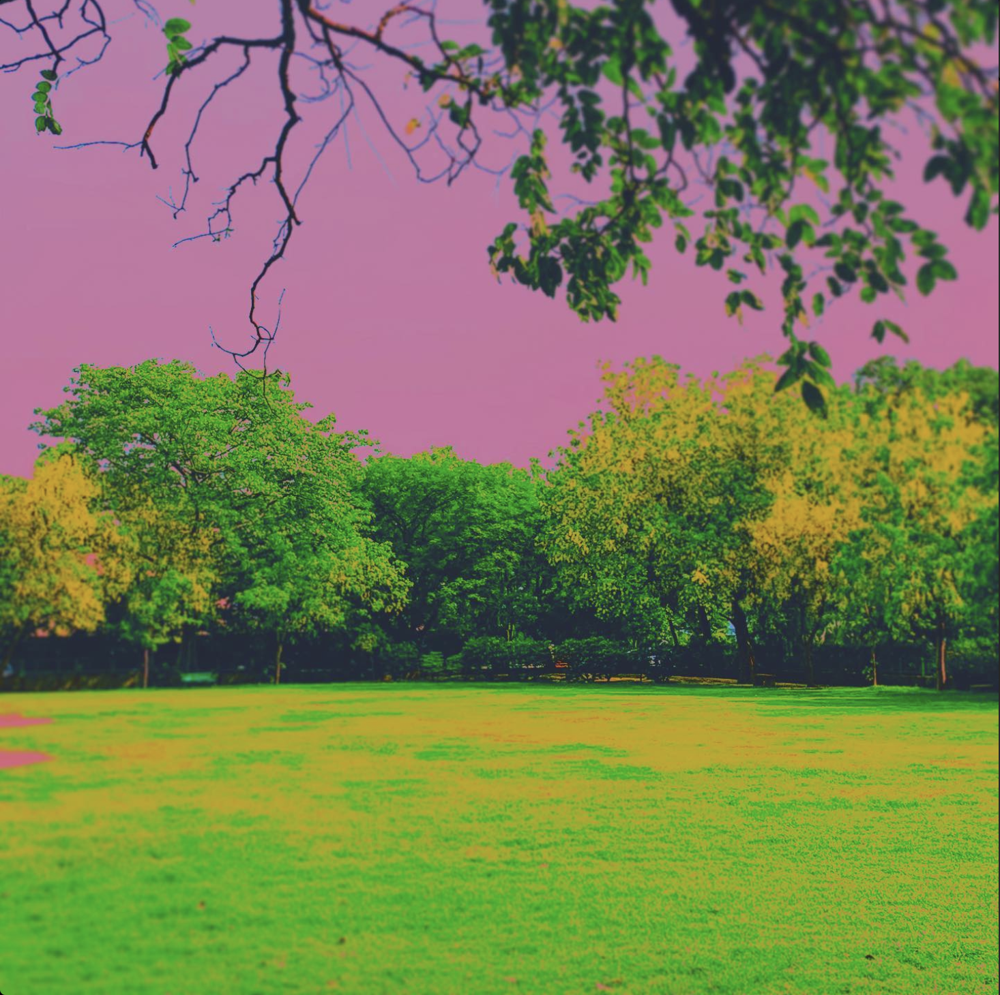

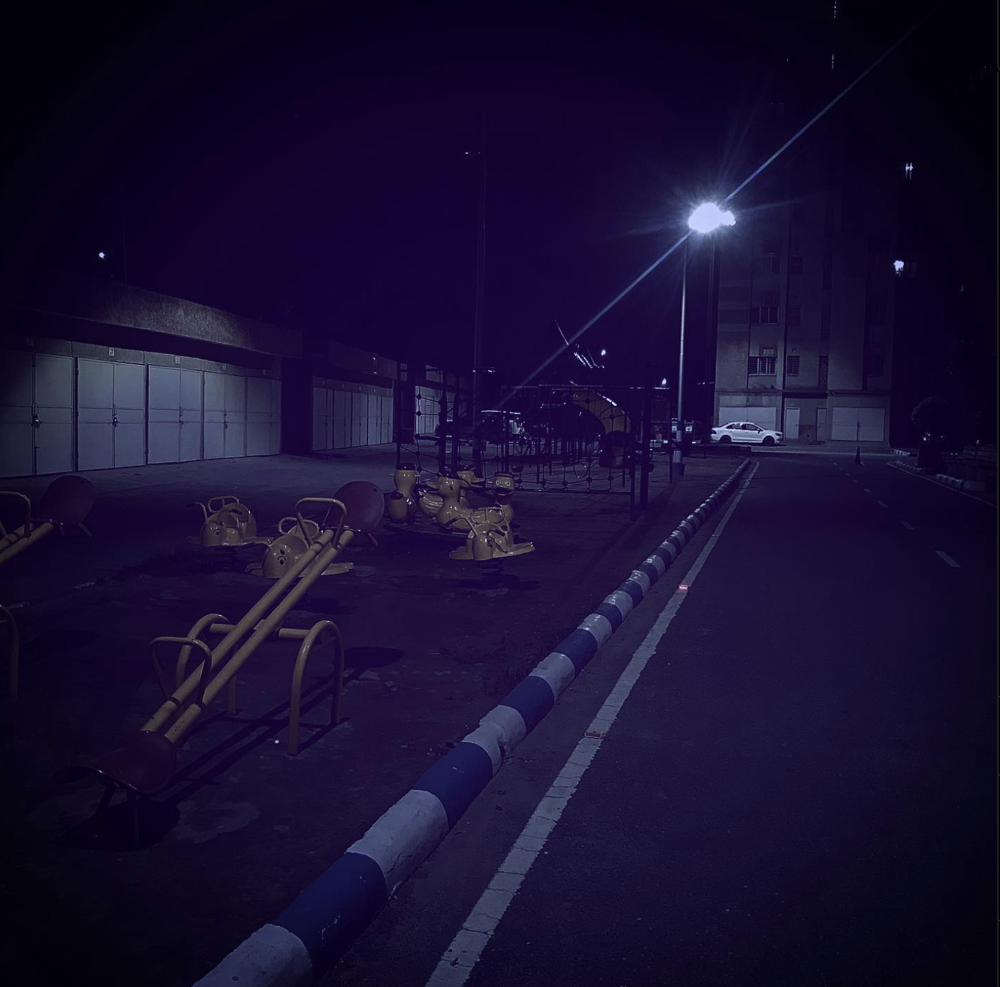

I listened to a lot of music that also went hand-in-hand with the aesthetic. I got into midwest emo, very old twenty one pilots lore (RAB, NPI, Level of Concern Demos that referenced old shit), and some Odesza for optimism.

As of writing and compiling this, I am realizing how much of a role aesthetics have taken into my life as an undergraduate. Funnily enough, this has been a theme throughout my undergraduate; and it still is today (the theming of this website is my own take on combining the eerieness of liminal spaces with the weird comfort that having nostalgic elements give). Maybe I'll write a post on describing what my outlook towards aestehtics are and how I use them to express creativity, but for the purposes of this post I'll stick to university experiences. I have a hunch that the evolution of my interactions with aesthetics will be visible here. 

Here's to part 2 and beyond for the rest of my university experiences (no more than 4 parts), I just need the time to collate media & my thoughts. Fun stuff. 

## Honorary Notes

Footnotes, I guess.

### Alternate iCons logos:

1. 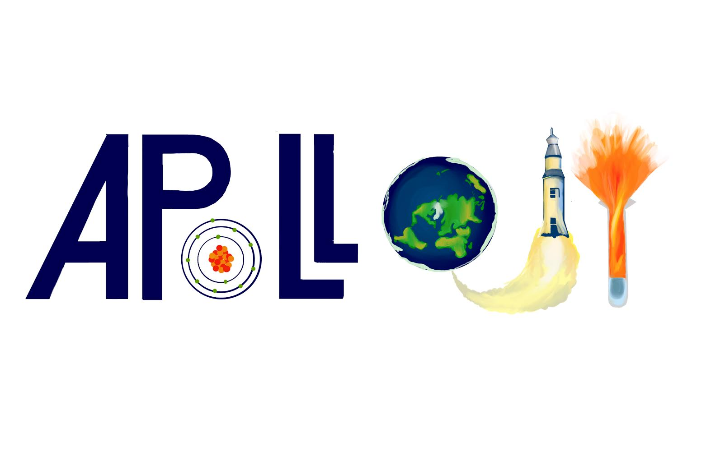
2. 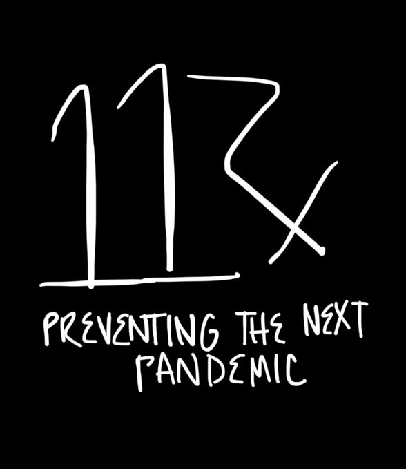
