# Graduated, Part 2.

```
$ ./status-update

This entry is going to be published in multiple
parts.

It's the process of looking back and into my
whole academic journey. It's gonna take a while to
complete, but I am enjoying the process of writing this.

Also moved to Boston, and plan to write all my thoughts 
in the next couple of weeks.
```

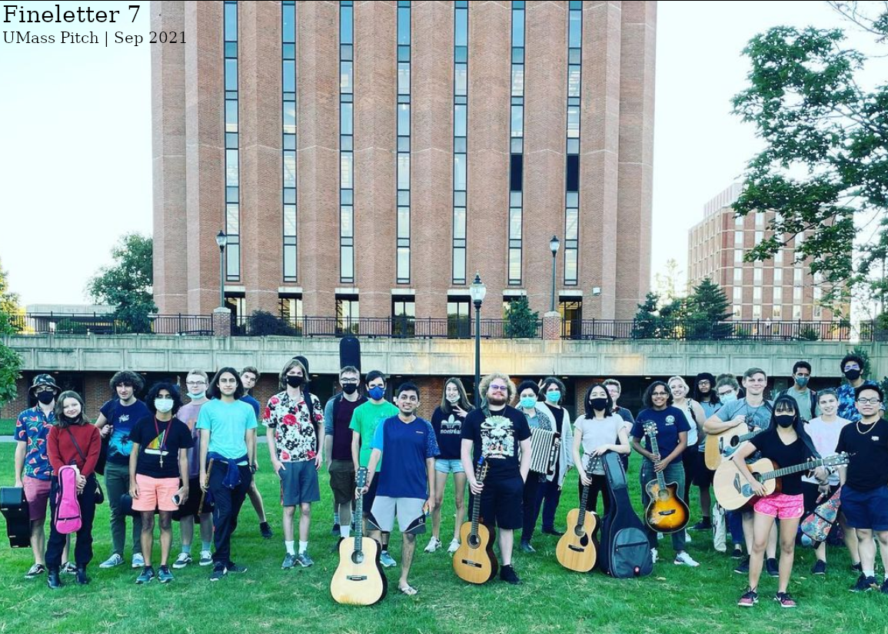

Pls. read Part 1 first, then come back here. 

Sophomore year of university: somehow things get both worse and better. I think the weirdest part to grasp, personally, was the new and unknown environment. 

<!-- truncate -->

I have been inducted into iCons, have come out of my academic issues in certain course, and am finally starting to get a hold of things. I came to the US by myself, had a family friend help me get from New Jersey to Amherst, and got into quarantine in an empty apartment. Since I was an international student coming in during the global pandemic, my first exposure ever to is new environment was even more isolation. 

It was good and bad, in it's own right. I believe that the good was getting mental peace3. I had been up on my own, and was in a perpetual 1 year isolation prior to this, so it wasn't the isolation bit of it that i had to get used to, as much as it was the 1) getting my sleep schedule to be at night again, and 2) feeling comfortable.

And that second point is the big one. 

## On feeling comfortable

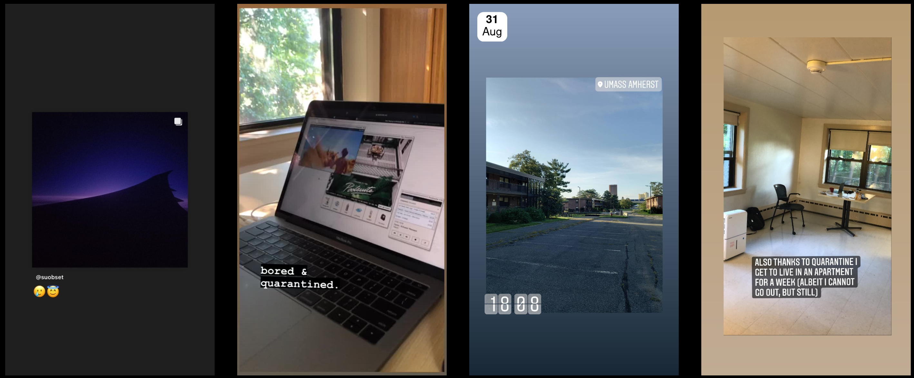

You see, Amherst is a small town. But UMass is not (by a longshot), and it genuinely frightened me a little bit coming in here as a Sophomore. I was genuinely nervous about being able to make friends, or finding that niche. 

For about 14 days, I was in this apartment pictured above, with no furiture or anything. Food was boxed from the UMass Dining folks, and I would just stay alone in the room. After this period, however, I moved into my room at OHill. And that was terrible, in it's own way. 

For one: UMass did not provide much help in me moving in. They just, kind of, left me on my own to drag my suitcases up the hill and into my room. Ok fine, was an ordeal but not too bad. The moment after I went in my room, I walked to Whitmore to get my ID. Not knowing any of the bus routes and stuff, walking through the entire path made me feel even more lonely. The isolatiopn I had felt for so long met with constant people my age around me: a complete shift in how I had lived life for about a year or so now. 

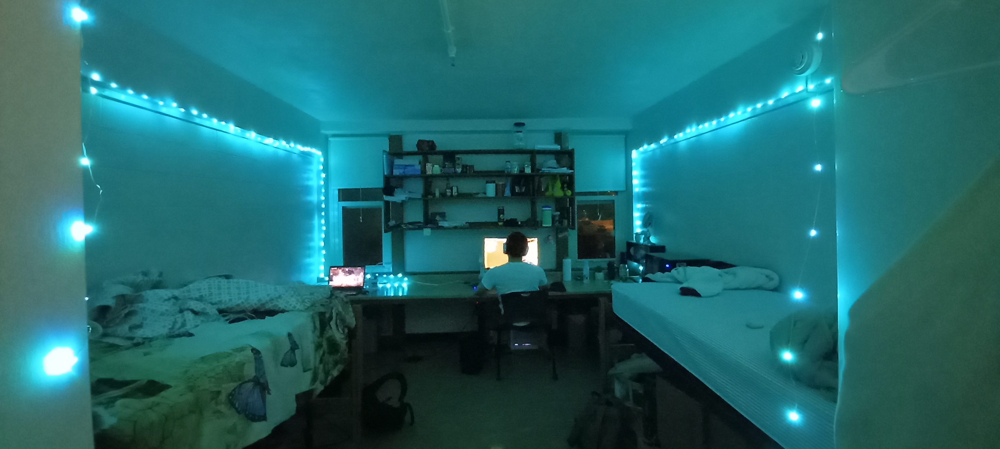

Secondly, not too many professors were accomodating in me being able to attend coursework. Missing the first 2 weeks, especially in a STEM degree, just meant I kept playing catch-up for the rest of the semester. I had my first midtern 5 days after I got out (and being able to only attend 2 classes for that course), and I bombed it. The rest of the semester was just playing catch-up for the most of it. Fun times. 

I did soon get more comfortable with peolpe around me. My roommate and I never truly bonded over on much, we both did play Video Games as a hobby but preferred wildly differengt genres. I still liked living with him, fun times. 

The other big benefit that living at OHill bought was the fact that a lot of people I knew lived here as well!! Made it super easy to follow up on projects, socialize, and have fun!! Each floor had a common room, and I genuinely appreciated having such a great community. 

I was mainly nervous thinking that I'd not find a lot of friends, but UMass is genuinely such a vibrant community that was extremely welcoming. Being a big university actually worked more in my favor than less. You can find whatever niche you love. 

That's programming and lightsaber battles for me. And [I found that niche so easily.](/docs/independent/saberstat)

I made some more friends as I went by. I met Nhi, Krishna, Frank, James, Justin, Ibrahima, Carter, and Rachel: all close frienjds of mine even today. The bad was mostly surrounding academics, when it came to socializing & trying to find my niche (the thing I was more worried about), I had an upwards trajectory for once in my life (after the pandemic)!!

## HackUMass 9, CICS

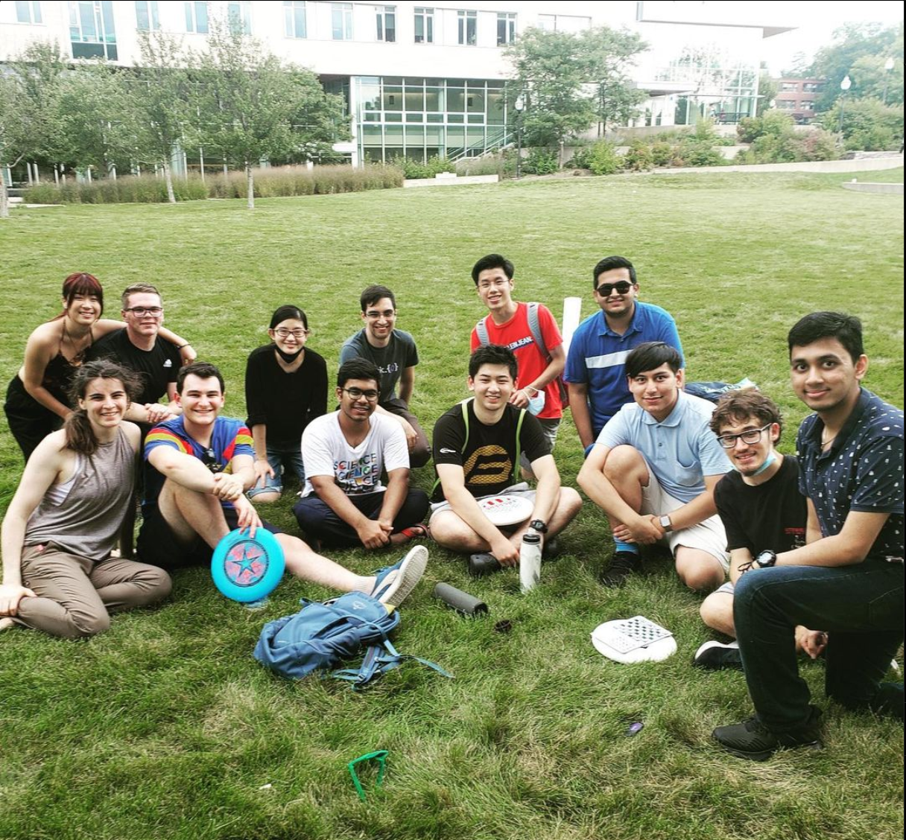

So, blazing through some highlights here:

* I met up with a lot of people in the CICS Discord and became friends
* I created [MoodMusic](/docs/undergraduate/moodmusic) in hackUMass 9.
* I joined the Student Alumni Association. I left shortly after since my other stuff became a bit more time consuming and I had to realign priorities.
* I joined the UMass Pitch, a student org dedicated to playing instruments for fun at an amateur level as a hobby. (title image)
* I created a mini video game using embedded systems: [Tilting Ball Game](/docs/undergraduate/tiltingBall). 

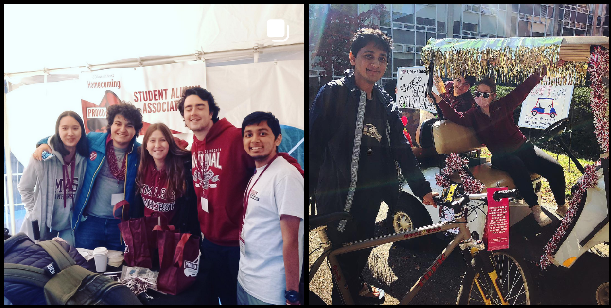


But, here are the more important things that happened during this year.

## Integrated Concentration in STEM

This was the first year that I was officially a part of UMass iCons, and a big one at that. iCons went on to become my primary social circle, as well as the perfect playground for all my academic projects. 

For the Fall semester, the iCons group just met up in the engineering quad and had a fun time. We got our shirts, saw each other in real life for the first time, and generally had a great vibe. This weas also the semester that i was still moving around different social groups and trying to find a fotting as to what it was that I wanted to do, so things were not too solidified yet. As mentioned above, I went to UMass Pitch, and to the SAA. Never truly found myself at home at either of these places, but I persisted. 

It was the Spring semester that bought more things into place, with the advent of my first iCons class. I teamed up with Jack, Yi, Gabby, Cleo to create a through analysis of the [Boston T System](/docs/undergraduate/iconsMoS). This project was sponsored by the Museum of Science, and went on to be one of the best iCons experiences I have had. We hung out in Boston, made videos, talked at the Museum of Science, I was even invited to give a talk on this project at MIT about half a year later!! 

<iframe width="560" height="315" src="https://www.youtube.com/embed/lu-qJayZEmE?si=RPO5K_8e4EOjxeio" title="YouTube video player" frameborder="0" allow="accelerometer; autoplay; clipboard-write; encrypted-media; gyroscope; picture-in-picture; web-share" referrerpolicy="strict-origin-when-cross-origin" allowfullscreen></iframe>

I also found Seb, Anvitha, Frank through iCons. It felt good to have a social circle that solidified more. iCons became the primary social circle I had in UMass, and stayed that way till the end. 

This was, still, the second best thing to happen that year.

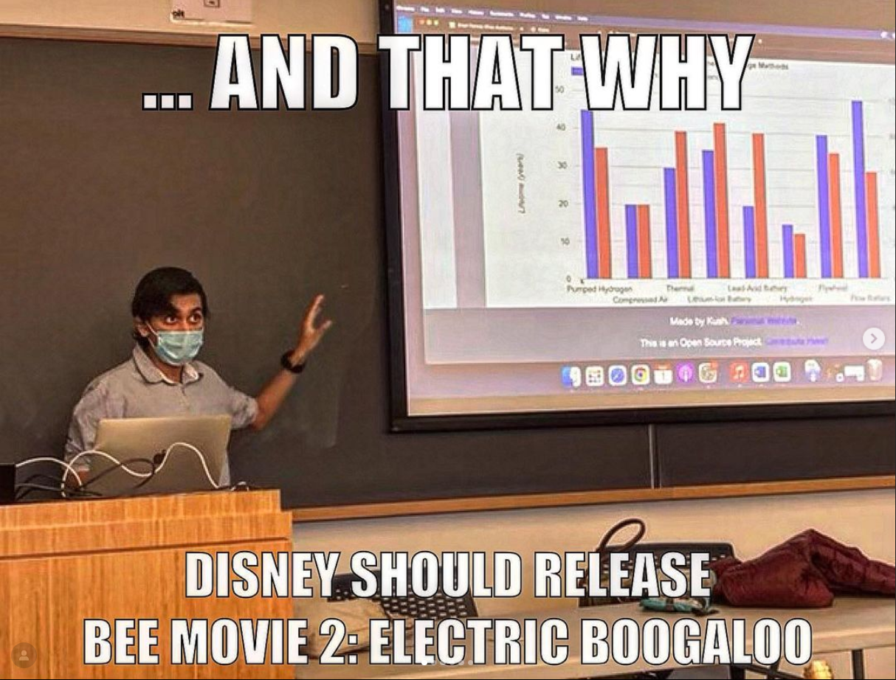

## Rose

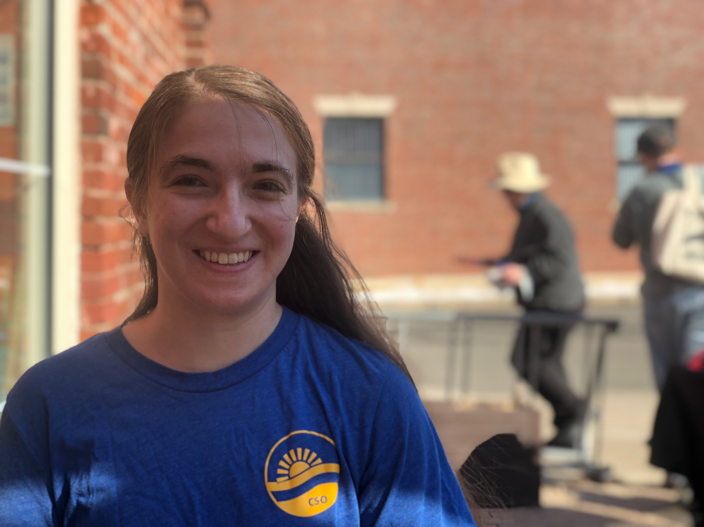

Genuinely, the best thing to happen this year was on November 21, 2021, when I met my long term partner Rose. It's a bit funny in retrospect how I found my partner while going through a period of time when I was uncertain about being able to make any friends, but it was amazing in it's own way. 

Rose and I met at Smith College, and started dating at about December of that year. I met her parents, and bought her to a vacation in India next year. We moved in together the next year as well, and continue to share an apartment in Boston, MA. 

I don't say much about her usually, but I am genuinely amazingly grateful to have her in my life. 

## Personal Developments

So at the end of the day, I needed a re-calibration in academia; mostly just during the Fall semester. I was able to regain academic performance the semester after. I met my long-term partner, and officially met everyone in iCons and started being closer with them. 

At the same time, I tried out the Student Alumni Association & UMass Pitch, both groups that I genuinely loved beign a part of, but both groups that i had to leave due to personal life stuff. Most of my time went into the iCons social circle (especially as iCons in itself was a program that funded student ideas and innovation). 

Creatively, September 2021 to May 2022 did not have any output. Was I having writer's block?? Maybe. 

For the longest time, I had stayed inside and captured the trapedness of indoor life. If a photo opportunity mimicking similar constraints presented itself, I went for it. But all in all, I did not feel creatively motivated at all.

Maybe it was due to the fact that the liminality aesthetic, which had become the cornerstone of my self-expression, was only applicable during a time of staying inside, and having the feelings of loneliness. However, this year was different. This was more of a "trying to find my identity in a new environment, and my social circle" YEAR, i BELIEVE.

In my personal life, I have only been able to create art at a time when I have known how I feel, and what contexual clues and references from my life are shaping up what my state is. 

After I met Rose, and after the Spring semester of having worked with iCons & being entrenched in that program: I took up photography, properly. I had been using my phone so far to create artwork and capture images, but I moved on to first using more professional tooling (actual image editors, concepts from photograpghy, and Chromatica: a professional manual control camera app). 

At first, most of my pictures were, I'd say, a little generic. I was mainly trying to figure out landscape photography, as well as get a hang of my editing suite. Nevertheless, these are some of my first pictures. While they may not identify with a given aesthetic too much, there are still some inspirations I have taken from some aesthetic stuff.

If I did find myself in an aesthetic that I identified with, I did capture that. But, this is just to say, i also captured a lot of generic stuff in an effort to learn.

I am still proud of these pictures. I had been into photography for a long time, but these were some of the first that I had properly learnt photography for, focused on some theoritical aspects, and learnt to edit & create in a more streamlined manner. I went from just shadows & highlighting & filters to full blown color correction, levels & curve adjusting, and proper workflows that I have refined on ever since. 

Currently, my photography has become an all-around self-expression: refining on these workflows above while incorporating different goals, aesthetics, and conditions. But that's for a different time. Currently, I am just proud looking back at my pictures, and I hope you enjoy them too, even if they are a bit more on the generic side at times :)

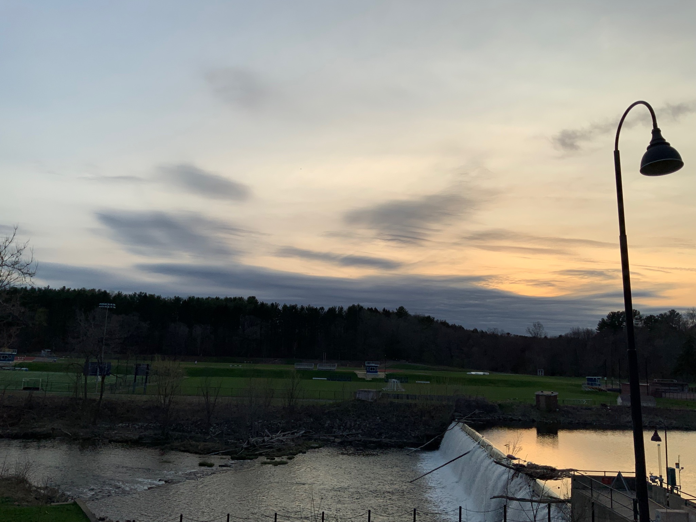

Smith College: Campus Pond


UMass OHill Parking spots: a liminal space that I captured

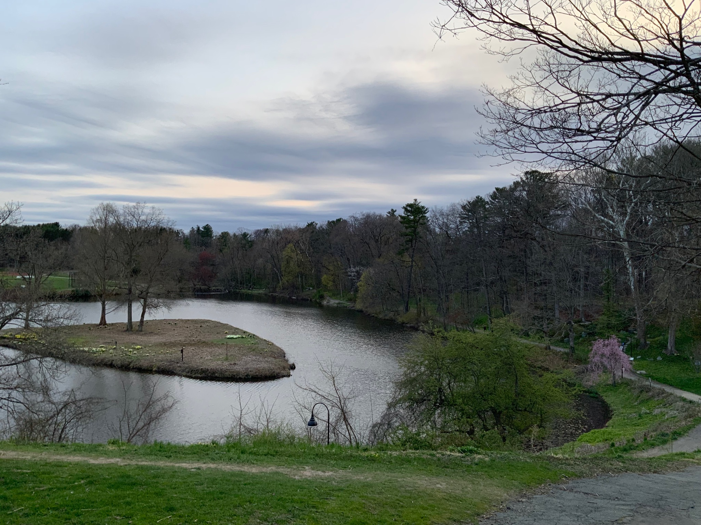

Smith College Campus Pond

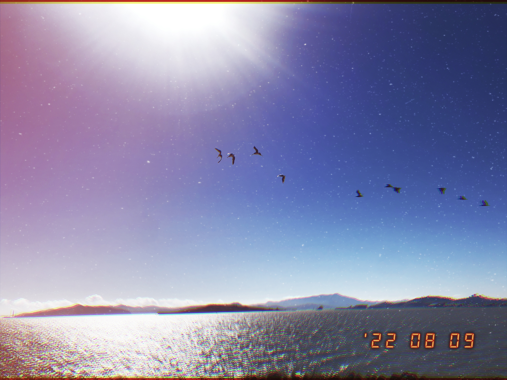

San Francisco, I loved film photography, especially it's influence in a lot of aesthetics like Vaporwave


Central Park, NYC

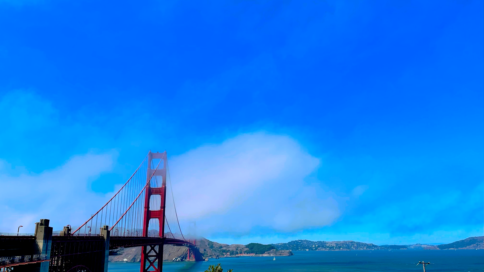

Golden Gate Bridge

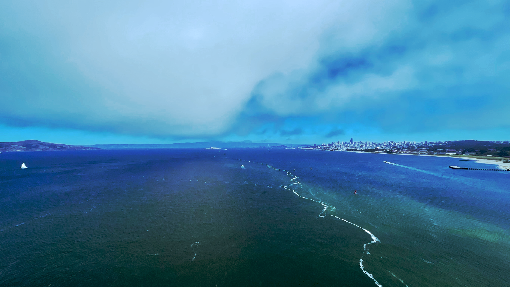

On the Golden Gate Bridge


Uttrakhand, India


Uttrakhand, India

## Tl;Dr

Met a lot of friends, got my social circle footing, did amazing work with Museum of Science and with embedded systems, met Rose, got into photography properly.