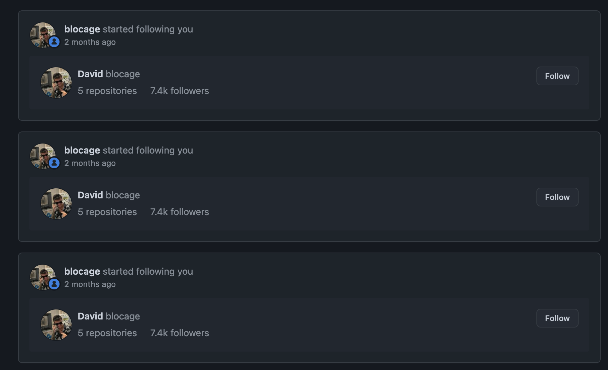
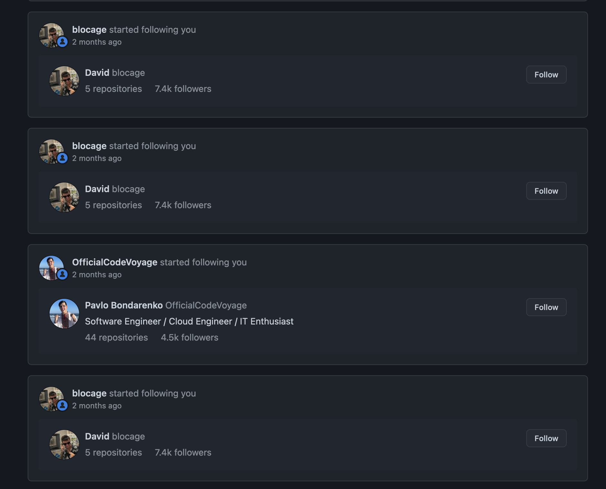
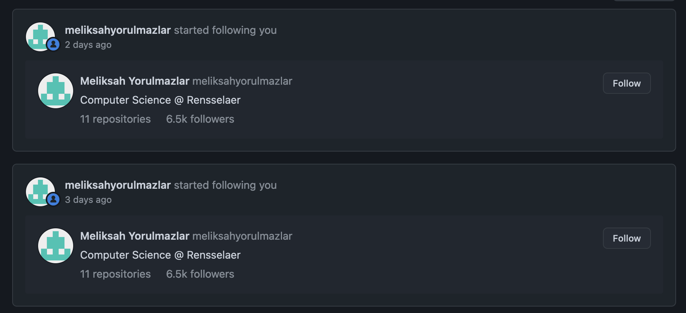
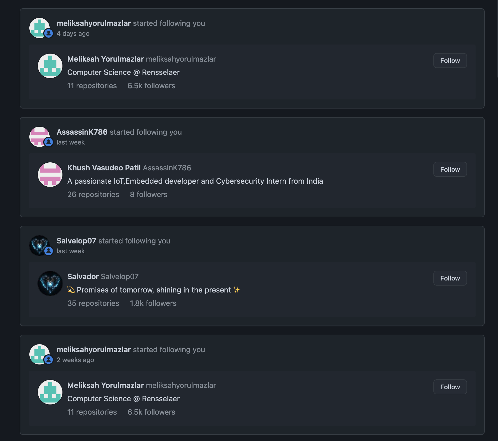

# GitHub Bots: Stop Doing This

One of the more infuriariting things I have come across on the GitHub platform is people using bots to mass follow other people, in hopes for a follow back (or more importantly, some stars and forks on their projects). 

<!-- truncate -->

However, when unreciprocated with a follow and some stars, their main goal is to unfollow and refollow, thus coming on the top of my timeline again. 

They keep this up for a very long period of times, sometimes almost thrice a week for 2 months.

I am done with this stuff, and obviously GitHub's reporting button does not do anything much. 

None of these accounts have much meaningful contributions to anything, outside of copy and pasted Leetcode solutions. Seriously, that is all. Between templates for generic web dev projects, Leetcode solutions, and profile readmes that read like you entered a rave in Ibiza, I have not found anything substantial. And these generic repos (which all of them have a version of) have a good amount of stars, from each other. 

Fun.