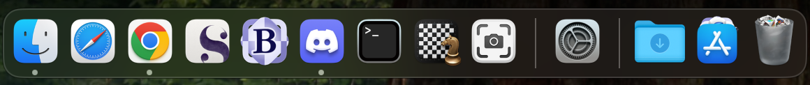

# The Essentials: Mac Edition



> If I were to be stranded on an island and have only one option for an Operating System and a collection of bare minimum software to go with it, this would be it.

<!-- truncate -->

As part of my work, I have been using a work-provided M3 MacBook Pro. Now, I like to keep my work life and my personal life completely separated, given this is a [MDM managed Mac](https://support.apple.com/guide/deployment/welcome/web).

However, I have also been requiring sometimes, to access personal documents and get some written stuff done at my own time. **This, however, is only constrained to the 1 hour break I get everyday**. Carrying a second laptop, only to be able to get the personal stuff done in the 1 hour of lunch break, makes little sense to me. 

I do have a page dedicated to all the software I use. But, that is ALL the software I use (even then, it's only the desktop subset...I do not go into details on my mobile software). This is the essential software I require, anything less hinders on my ability to get stuff done.

## Enter, a (Mac) Virtual Machine

In order to keep my life life, and my work life, separated and containerized, I opted for a Virtual Machine. Initially, I was on a Debian VM. However, as much as I love Linux, I ran into a couple of issues there:

1. I use Chrome's sync features, and there is no chrome on ARM Linux (even though there is Chromium).
2. For 90% of my use cases, I rely on FLOSS software ([More Info](/disclaimer_fsf)). However, while I identify with the OSS ideology, I do not necessarily agree with the hardcore "Open Source or Nothing". Truthfully, there are tons of amazing software that I require, which do not have an Open Source component at all: because building something like that can become muddled in a community driven aspect. While I alig with the GPL and MIT licenses, I align harder with "use what gets your job done". 
3. I talked about the Mac and it's [prevalence in OSS software](/blog/on-macos-and-libre-software) early this year. Since then, I have had my Microsoft Surface (running Ubuntu) fail spectacularly on me, and I have completely jumped ship to a MacBook on the laptop front. On the desktop front, I am still hardcore Linux, and I do not see this changing anytime soon, if ever (this is after macOS has become my primary in desktop computing: there's just so much that Linux helps me get done as well, and again, I am on that "use what gets the job done" bandwagon).

So, what does this mean for this project? Truthfully, while Linux is still instrumental to a lot of my computational workflows and I will possibly forever require at least one of my computers to run it forever, the scope of Linux resides in the more advanced stuff. While macOS is UNIX based and lets me do most of the Linux things, I find some more of the advanced things to be well executed on Linux only.

However, because macOS is UNIX, I can get by with it being my primary desktop OS on my laptop: the thing that comes along with me everywhere I go. Which is great, because I can have one OS run most of my Command Line Utilities, industry standard software (some that will never get released on Linux), and get a rock solid & stable environment that's hard to mess up. Most of my work happens on a Mac, and that is fine.

## So, how does macOS look for me, when considering the bare minimum

Honestly, pretty amazing.


If I were to be stranded on an island and have only one option for an Operating System and a collection of bare minimum software to go with it, this would be it. Everything you see on this desktop, is all there is to this setup: 95% of which is just default out-of-the-box Mac.

### The eyesore: Screenshot utility in Dock.

Simply put, the screenshot combo (and most keyboard shortcuts) will invoke the host OS, and not the guest VM, unless I lock the cursor. Locking the cursor is an additional headache that breaks the continuous flow between the host and the guest.

Thus, an icon to the utility lives on the dock, for when I want to take screenshots and save it in the context of the VM, not the host OS.

### Goodbye, Launchpad

I never got the appeal of the Launchpad. To me, it was one of those trickle down features of iOS, bought to the Mac only to make it more familiar to the masses.

I mean, iOS is Apple's largest OS. There are people who go their entire lives into the iOS ecosystem (including iPadOS, and more frequently, watchOS), without ever needing to touch macOS. It makes complete sense why Apple made Launchpad.

I also do not use any of Apple's pre-loaded stuff too much: especially in a barebones setting. So all of them get removed from the dock.

To me, Launchpad is trying to bring a touchscreen first OS into a pointer based environment. I much rather prefer removing Launchpad from the dock, and pinning the ```Applications``` directory into the dock. This gives a alphabetical list of everything installed on your OS, in a nicer and more compact manner.


Something to note: most of these applications are Apple pre-installed and I have no way of removing them. There is no workaround. WHich is why, I do not even have to visit this directory in most cases: because the list of my essential software is rather short and already pinned on the Dock.

### List of Everything Else

1. [Chrome](https://www.google.com/chrome/): I like Chromium better than WebKit, and I rely on Google's sync features to work between Linux and Apple. Firefox exists, and I used it for the longest time ever (up until 2 months ago). I switched because Chrome feels just faster. When bare minimum is not a constraint, I have all the big 3 browsers (Safari, Chrome, Firefox).

2. [Scrivener](https://www.literatureandlatte.com/scrivener/overview): A writing software that comes with a binder and a corkboard (along with tons of other cool stuff, but these two are the biggest features I use). As a developer, my closest analogy is that this is an IDE for writing. It provides you with everything you will ever need, to write anything. Binders, corkboards, bibliographies, character trackers, Zotero connectors, export to Markdown/Docx/TeX/virtually anything, and so on. Scrivener has sped up my writing process by light years, and having to go back to a typical WYSIWYG editor (Word, Google Docs, etc.) feels like caveman stuff (especially when those only work in a linear fashion). Currently, used for writing statements for grad school and stuff (the primary reason why I needed a VM).

3. [BBEdit](https://www.barebones.com/products/bbedit/): The essential Mac code and text editor, that I have been using and praising a heck ton. I even wrote them a thank you email once, and if I am not using vim or an IDE, I am using BBEdit. It's blazing fast, no matter the size or complexity of the file I throw at it. This website has been entirely developed on BBEdit, including this post.

4. [Discord](https://discord.com): I use it to communicate with friends and professors at UMass Amherst (important during my grad school writing a letter era, yes my professors use Discord). I also use it to put files on a single person server, like Slack does.

5. [Terminal](https://support.apple.com/guide/terminal/welcome/mac): Specifically, a UNIX terminal (so no Powershell). I mainly need it for vim, git, executing local servers & jupyter notebooks, and writing bash scripts (for my barebones needs). 

6. [Google Drive](https://drive.google.com): File syncing for Scrivener.

Chess exists on the dock for prosterity reasons, and to pay homage to Mac history.

With this setup, I also never need to access the Applications directory. A Mac with the above will satisfy most of my basic workflows on the go, when I only get an hour and do not want to carry an entirely separate device for the sake of the hour.