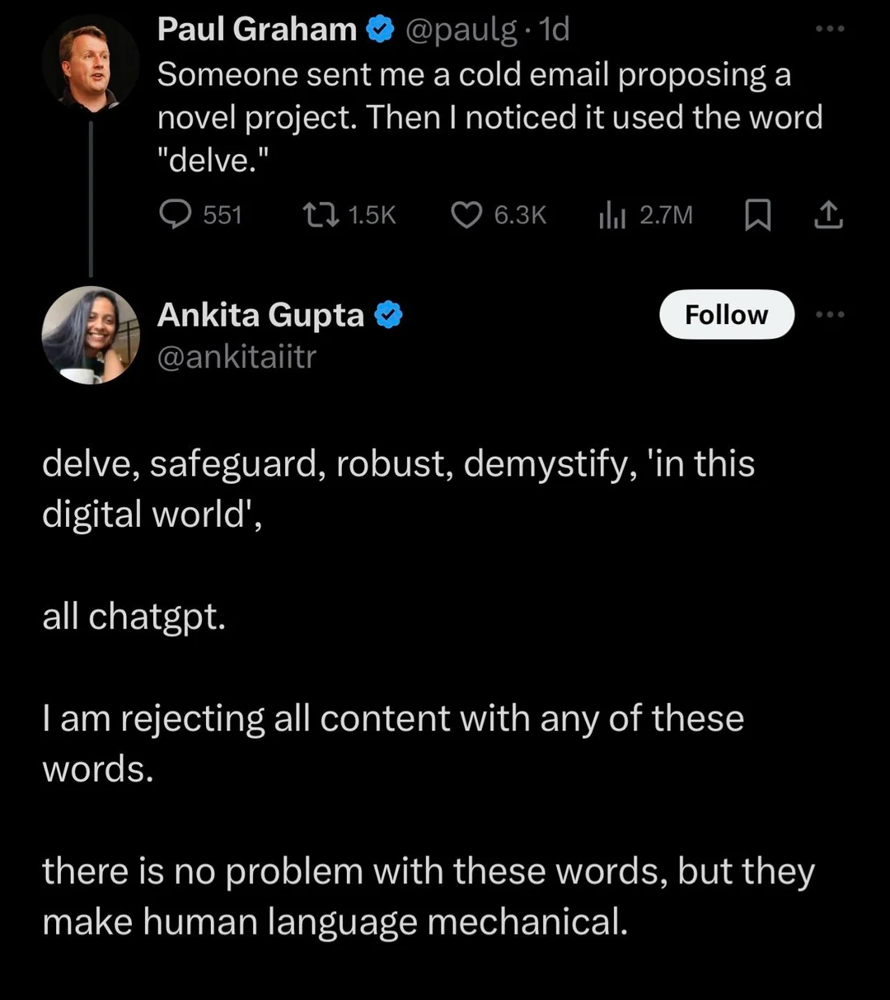

# Quick Note on LLMs for Writing

Recently, I have been seeing various posts on various platforms where people are trying to play armchair detective for usage of words like ["delve" or "whatsoever"](https://www.reddit.com/r/mildlyinfuriating/comments/1bzvgqj/apparently_using_the_word_delve_is_a_sign_of_the/). This is concerning to me for two main reasons:

1. People may/may not be reading lesser, which is resulting in a lesser set of words in their vocabulary.
2. "Delve", along with many others "AI-generated words", are actually part of my regular vocabulary. 

<!-- truncate -->

I will not dive deep into the issues with others assuming all sorts of things. However, I would like to briefly mention how I use AI when it comes to writing (online and in general).

## My use of AI

In short: if you cannot be bothered to write something (and rely on AI for the same), why would I be bothered to read it.

I rarely, if ever, use AI as a means to generate any text or piece of work that I have created: online and offline. Personally, the entire point of writing and art for me is to create things that require confusion, boredom, and pondering over my initial ideas. If, instead, I put that initial idea into a text box and have a computer come up with everything else, I did not create anything.

The pondering over different ideas is what enables us to create art and text that is worth reading, and is relatable to others. 

As far as the words are concerned, a lot of what I use and how I write is inspired by the texts I read. From research papers to fiction, writers need to read all that they can. LLMs were trained on the same written data, which is why I believe that the language used is the same. But as an aspiring writer, reading is equally a huge part of my honing of this skill. 

Words come naturally as a result; armchair diagnosing of said words being "AI" serves absolutely no one and showcases your lack of reading comprehension.

## I'm not perfect, though

I do use AI in some other aspects of my life. Here is an exhaustive list of every use of AI I engage in currently:

1. Code debug + completion: I treat it like a nicer, less-hostile StackOverflow. It's great for boosting my coding productivity, though there is a huge aspect of knowing programming so that one can filter out false/unoptimized answers with what actually solves the problem at hand. (shout-out to Cursor atm)
2. Templated emails: If an email's scope is anything greater than asking for PTO, I first draft the thing out myself. But I will only use AI for things that do not require much thought or effort, and save myself a bit of time (and not break my flow of thought).
3. Learn new things in a simpler language: taking this one with a huge grain of salt (since LLMs hallucinate), but AI has been great in explaining complex concepts in simpler terms.

Notice that none of my writing (including writing code initially), is included. Because great ideas require boredom and struggling.