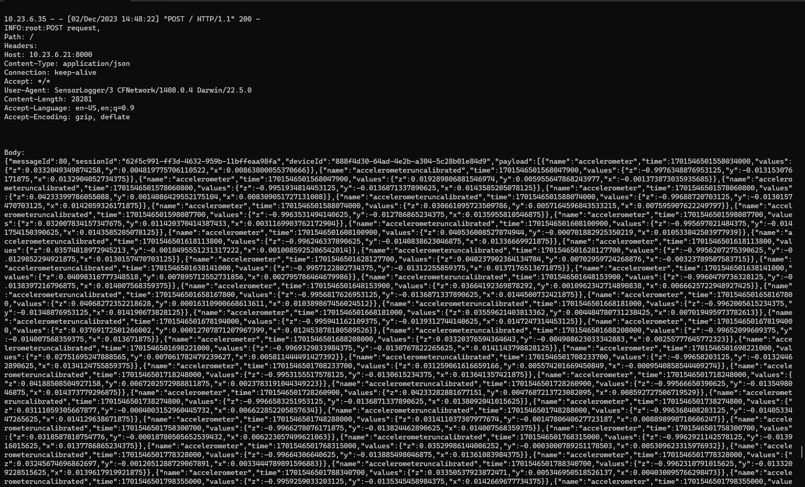

# SaberStat

Currently under development: watchOS and iOS app to measure hits/misses during a lightsaber match. 

~~Personally, I stand firm to the belief of [GPL'ing everything](/disclaimer_fsf). However, given the idea, and the tools at my disposal, creating an Apple Watch app and licensing it under MIT is the best step forward.~~

This is a fully Python-based application, and completely Libre. Sensor data is logged into a host computer via UDP, and fancy math is under development.

We plan to use the [PineTime](https://www.pine64.org/pinetime/), a fully libre watch for getting sensor data. We plan to use open standards throughout as well.

While initial testing is taking place on an Apple Watch (since that is what I have at my disposal), rest assured this will move to a fully libre solution. Due to the Apple Watch restriction, the app is currently MPL. Upon getting a PineTime, I plan to shift it under GPLv3.



Packet with sensor data from watch to host laptop. Sensor data is logged every ms and sent every s, so each packet has 1000 entries.

Follow Development Here: https://github.com/suobset/SaberStat


## Old Screenshots

Initially, this started as an Apple app for development and concept...since I had one at disposal. We are no longer pursuing that path, given Apple's proprietary nature towards everything.

The Watch is still used for current sensor dev purposes, using [Sensor Logger]: an open-source iOS + watchOS sensor logger that can send data over HTTP POST. 

I have set up my host machine as a UDP server to handle such requests. 

The desktop counterpart will (probably) not have to be changed with the PineTime. 

Old screenshots, for archival purposes:


The iOS counterpart will now be done on a computer, with UI from ```tkinter```