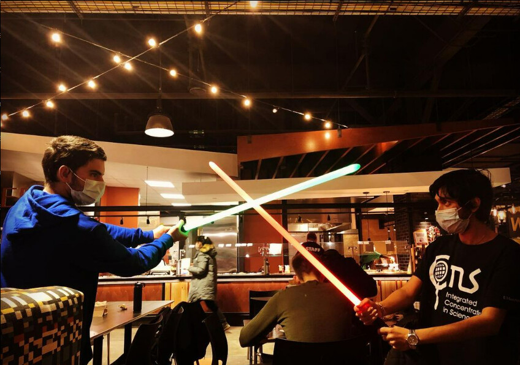
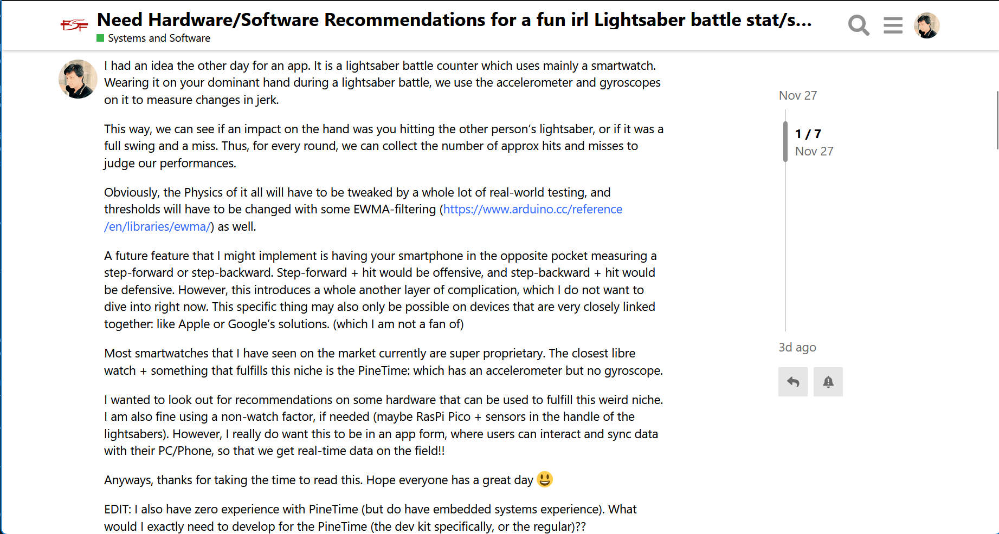

# SaberStat



Disclaimer: Please Read [About Code Projects in the Finechive](./code-projects) for more info.

Currently under development: Smartwatch app to measure hits/misses during a lightsaber match. This post below by me to the FSF forum explains all:



[Click Here](#text-in-fsf-forum-screenshot) if the text in the screenshot is a bit too small to read :)

Personally, I stand firm to the belief of [GPL'ing everything](/disclaimer_fsf). ~~However, given the idea, and the tools at my disposal, creating an Apple Watch app and licensing it under MIT is the best step forward.~~

This is a fully Python-based application, and completely Libre. Sensor data is logged into a host computer via UDP, and fancy math is under development.

We plan to use the [PineTime](https://www.pine64.org/pinetime/), a fully libre watch for getting sensor data. We plan to use open standards throughout as well.

While initial testing is taking place on an Apple Watch (since that is what I have at my disposal), rest assured this will move to a fully libre solution. Due to the Apple Watch restriction, the app is currently MPL. Upon getting a PineTime, I plan to shift it under GPLv3.


Packet with sensor data from watch to host laptop. Sensor data is logged every ms and sent every s, so each packet has 1000 entries.

Follow Development Here: https://github.com/suobset/SaberStat

## Old Screenshots

Initially, this started as an Apple app for development and concept...since I had one at disposal. We are no longer pursuing that path, given Apple's proprietary nature towards everything.

The Watch is still used for current sensor dev purposes, using [Sensor Logger]: an open-source iOS + watchOS sensor logger that can send data over HTTP POST. 

I have set up my host machine as a UDP server to handle such requests. Here's the code snippet doing exactly that:

```py
class Server(http.server.BaseHTTPRequestHandler):
    def _set_response(self):
        self.send_response(200)
        self.send_header('Content-type', 'text/html')
        self.end_headers()
    
    def do_POST(self):
        content_length = int(self.headers['Content-Length'])
        post_data = self.rfile.read(content_length)
        logging.info("POST request,\nPath: %s\nHeaders:\n%s\n\nBody:\n%s\n",
            str(self.path), str(self.headers), post_data.decode('utf-8'))
        self._set_response()
        with open("log.json", "a") as f:
            f.write(post_data.decode('utf-8'))
            f.write(",\n")
```

The desktop counterpart will (probably) not have to be changed with the PineTime. 

Old screenshots, for archival purposes:


The iOS counterpart will now be done on a computer, with UI from ```tkinter```

## Text in FSF Forum Screenshot

I had an idea the other day for an app. It is a lightsaber battle counter which uses mainly a smartwatch. Wearing it on your dominant hand during a lightsaber battle, we use the accelerometer and gyroscopes on it to measure changes in jerk.

This way, we can see if an impact on the hand was you hitting the other person’s lightsaber, or if it was a full swing and a miss. Thus, for every round, we can collect the number of approx hits and misses to judge our performances.

Obviously, the Physics of it all will have to be tweaked by a whole lot of real-world testing, and thresholds will have to be changed with some EWMA-filtering (https://www.arduino.cc/reference/en/libraries/ewma/) as well.

A future feature that I might implement is having your smartphone in the opposite pocket measuring a step-forward or step-backward. Step-forward + hit would be offensive, and step-backward + hit would be defensive. However, this introduces a whole another layer of complication, which I do not want to dive into right now. This specific thing may also only be possible on devices that are very closely linked together: like Apple or Google’s solutions. (which I am not a fan of)

Most smartwatches that I have seen on the market currently are super proprietary. The closest libre watch + something that fulfills this niche is the PineTime: which has an accelerometer but no gyroscope.

I wanted to look out for recommendations on some hardware that can be used to fulfill this weird niche. I am also fine using a non-watch factor, if needed (maybe RasPi Pico + sensors in the handle of the lightsabers). However, I really do want this to be in an app form, where users can interact and sync data with their PC/Phone, so that we get real-time data on the field!!

Anyways, thanks for taking the time to read this. Hope everyone has a great day :smiley:

EDIT: I also have zero experience with PineTime (but do have embedded systems experience). What would I exactly need to develop for the PineTime (the dev kit specifically, or the regular)??