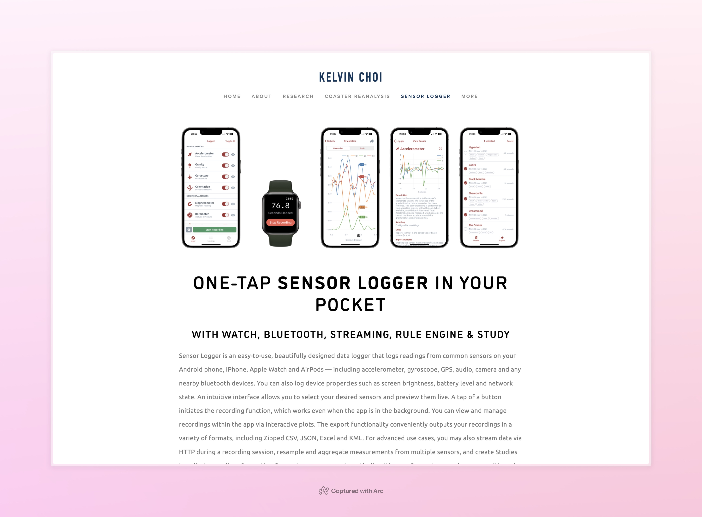
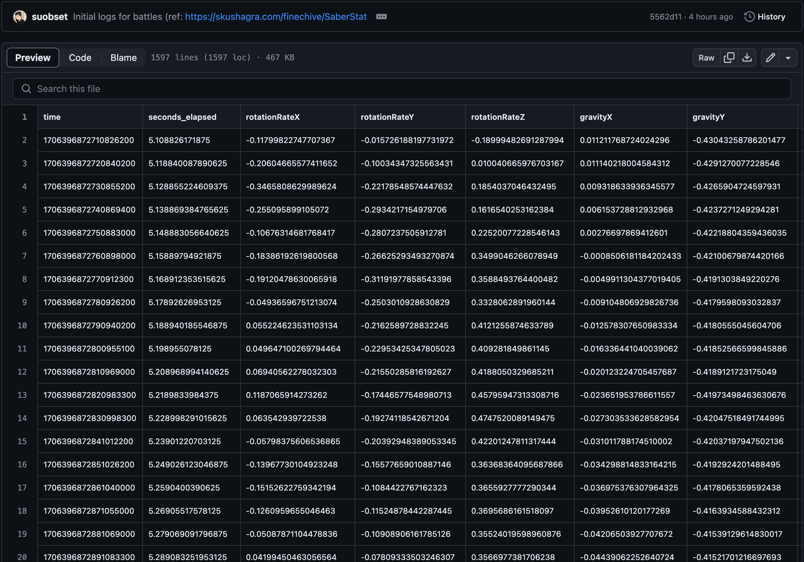
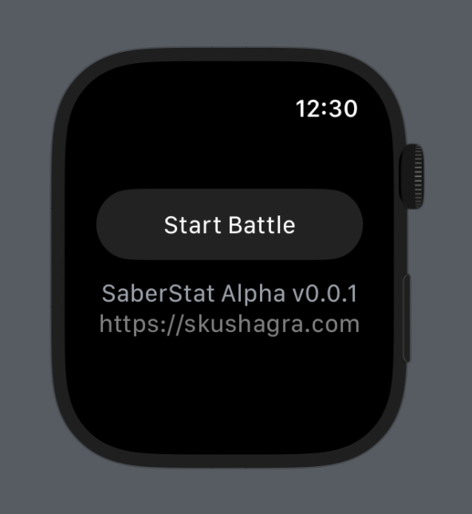
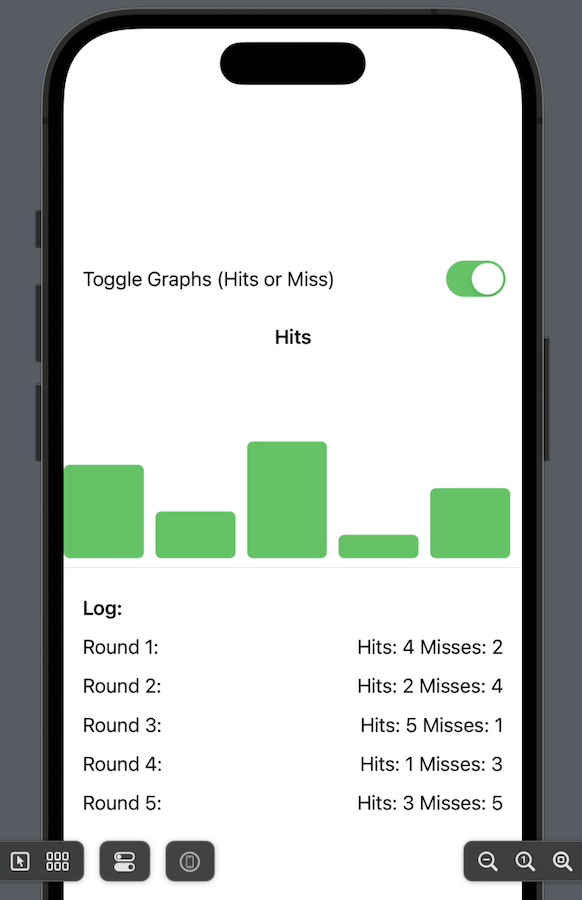

# SaberStat


Disclaimer: Please Read [About Code Projects in the Finechive](./code-projects) for more info.

Currently under development: Smartwatch app to measure hits/misses during a lightsaber match. This post below by me to the FSF forum explains all:


[Click Here](#text-in-fsf-forum-screenshot) if the text in the screenshot is a bit too small to read :)

Personally, I stand firm to the belief of [GPL'ing everything](/disclaimer_fsf). ~~However, given the idea, and the tools at my disposal, creating an Apple Watch app and licensing it under MIT is the best step forward.~~

This is a fully Python-based application, and completely Libre. Sensor data is logged into a host computer via UDP, and fancy math is under development. However, it will be released on the Apple Watch as well. I believe truly libre software is one that runs on any and **every** hardware out there.

For the folks who enjoy all things libre, we plan to use the [PineTime](https://www.pine64.org/pinetime/), a fully libre watch for getting sensor data. We plan to use open standards throughout as well, for both libre platforms like the PineTime, and for thw Swift-based apps for Apple Watch. The final product will be able to communicate between different platforms seamlessly, due to a completely open backend.


Packet with sensor data from watch to host laptop. Sensor data is logged every ms and sent every s, so each packet has 1000 entries. Frontend is web based, ensuring maximum compatibility.

Follow Development Here: https://github.com/suobset/SaberStat

## Background & Primer

Initially, this started as an Apple app for development and concept...since I had one at disposal. We are now pursuing a path where this will be compatible with Apple's offerings, and open-source platforms like the PineTime as well.

The Watch is still used for current sensor dev purposes, using Sensor Logger: an open-source iOS + watchOS sensor logger that can send data over HTTP POST. Sensor Logger can do a HTTP POST, and as such we can set up our computers as UDP servers mentioned below to receive the JSON data. 



The reason behind using SensorLogger in the Apple Watch was essentially to get a headstart on the code, withoout worrying too much about potential client-side issues. We can be assured about the data coming from SensorLogger, our current focus is to get the Math behind the tracking system working correctly, and tested in the real world.

Here's the code snippet for the UDP server:

```py
# Code snippets from Python-based local
# UDP server that handles POST requests 
# for incooming JSON sensor data
class Server(http.server.BaseHTTPRequestHandler):
    def _set_response(self):
        self.send_response(200)
        self.send_header('Content-type', 'text/html')
        self.end_headers()
    
    def do_POST(self):
        content_length = int(self.headers['Content-Length'])
        post_data = self.rfile.read(content_length)
        logging.info("POST request,\nPath: %s\nHeaders:\n%s\n\nBody:\n%s\n",
            str(self.path), str(self.headers), post_data.decode('utf-8'))
        self._set_response()
        with open("log.json", "a") as f:
            f.write(post_data.decode('utf-8'))
            f.write(",\n")
```

The desktop counterpart will (probably) not have to be changed with the PineTime. 

## Update 1: Initial Data & Getting Started on Math
** 27 January, 2023 **

Today marks the first day that Frank and I met up with lightsabers, after his return from Thailand. I had gotten the initial groundwork going on the project, but progress was stalled as I had absolutely no data to base any calculations on. 

*We recorded a bunch of videos which will be uploaded once Frank edits them.*


For the time being, we both collected data using [Sensor Logger](https://www.tszheichoi.com/sensorlogger) on our Apple Watches using Sensor Logger as mentioned above.

We did 4 rounds of lightsaber battles, data for which can be seen at [this commit](https://github.com/suobset/SaberStat/commit/5562d118da00b615497262defb0894187cb6fb38). For each of the logs, the watch's acceleration, gyroscope, gravity, and rotation data were logged on a millisecond basis. An example log has been reprooduced below:



Now, the problem at hand is to make sense of this data...by trying to calculate the jerk and movement changes at every point. We also have video evidence of each round, synchronized by a first hit. This way, we will hopefully be able to capture the thresholds for what constitutes as a hit, and what is a miss.

Obviously, today's data is not the end-goal; this would need more real-world testing as we keep going. However, it is an excellent start, given we have 3 pairs of datasets and 1 independent dataset.

The current iteration of SensorLogger has the ability to make HTTP POST requests, which makes for an ideal open system. We will be using SensorLogger in client devices until the Math has been worked out, then pivot to creating a standalone libre app that can be executed oon the exact codebase. SensorLogger is OSS as well, and can be easily replicated and tweaked for our purposes. 

We are also creating a web-based frontend, with a script that reads the JSON data and charts it out. Here is a very early iteration, which will most definitely not work as of now:

```js
//JavaScript to take out JSON data that the Python UDP
//Server Receives & Chart it out
let chart;

// Function to generate the chart
function generateChart() {
    // Fetch JSON data from the server
    fetch('http://localhost:5500/data', {
        method: 'POST',
        headers: {
            'Content-Type': 'application/json',
        },
        body: JSON.stringify({ /* Your request payload, if needed */ }),
    })
    .then(response => response.json())
    .then(data => {
        // Extract time and sensor values from the payload
        const timeArray = data.payload.map(entry => entry.time);
        const rotationRateXArray = data.payload.map(entry => entry.values.rotationRateX);
        const rotationRateYArray = data.payload.map(entry => entry.values.rotationRateY);
        const rotationRateZArray = data.payload.map(entry => entry.values.rotationRateZ);

        // Create a new chart or update existing one
        if (!chart) {
            const ctx = document.getElementById('myChart').getContext('2d');
            chart = new Chart(ctx, {
                type: 'line',
                data: {
                    labels: timeArray,
                    datasets: [
                        {
                            label: 'Rotation Rate X',
                            borderColor: 'rgb(75, 192, 192)',
                            data: rotationRateXArray,
                            fill: false
                        },
                        {
                            label: 'Rotation Rate Y',
                            borderColor: 'rgb(255, 99, 132)',
                            data: rotationRateYArray,
                            fill: false
                        },
                        {
                            label: 'Rotation Rate Z',
                            borderColor: 'rgb(255, 205, 86)',
                            data: rotationRateZArray,
                            fill: false
                        }
                    ]
                },
                options: {
                    responsive: true,
                    maintainAspectRatio: false,
                    scales: {
                        x: {
                            type: 'linear',
                            position: 'bottom'
                        }
                    }
                }
            });
        } else {
            // Update chart data
            chart.data.labels = timeArray;
            chart.data.datasets[0].data = rotationRateXArray;
            chart.data.datasets[1].data = rotationRateYArray;
            chart.data.datasets[2].data = rotationRateZArray;
            chart.update();
        }
    })
    .catch(error => {
        console.error('Error fetching data:', error);
    });
}
```

## Text in FSF Forum Screenshot

I had an idea the other day for an app. It is a lightsaber battle counter which uses mainly a smartwatch. Wearing it on your dominant hand during a lightsaber battle, we use the accelerometer and gyroscopes on it to measure changes in jerk.

This way, we can see if an impact on the hand was you hitting the other person’s lightsaber, or if it was a full swing and a miss. Thus, for every round, we can collect the number of approx hits and misses to judge our performances.

Obviously, the Physics of it all will have to be tweaked by a whole lot of real-world testing, and thresholds will have to be changed with some EWMA-filtering (https://www.arduino.cc/reference/en/libraries/ewma/) as well.

A future feature that I might implement is having your smartphone in the opposite pocket measuring a step-forward or step-backward. Step-forward + hit would be offensive, and step-backward + hit would be defensive. However, this introduces a whole another layer of complication, which I do not want to dive into right now. This specific thing may also only be possible on devices that are very closely linked together: like Apple or Google’s solutions. (which I am not a fan of)

Most smartwatches that I have seen on the market currently are super proprietary. The closest libre watch + something that fulfills this niche is the PineTime: which has an accelerometer but no gyroscope.

I wanted to look out for recommendations on some hardware that can be used to fulfill this weird niche. I am also fine using a non-watch factor, if needed (maybe RasPi Pico + sensors in the handle of the lightsabers). However, I really do want this to be in an app form, where users can interact and sync data with their PC/Phone, so that we get real-time data on the field!!

Anyways, thanks for taking the time to read this. Hope everyone has a great day :smiley:

EDIT: I also have zero experience with PineTime (but do have embedded systems experience). What would I exactly need to develop for the PineTime (the dev kit specifically, or the regular)??

## Old Screenshots

Old screenshots, for archival purposes:





The iOS counterpart will now be done on a computer, with a web-based UI. The same will be ported to iOS when the time comes.