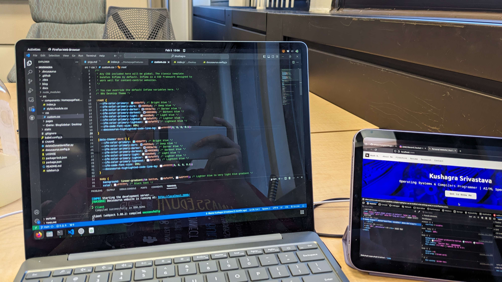

# Software Config

This is a repository of all software I use, hopefully with reasoning behind them. It is not yet complete, and will probably be ever-evolving.

I am a firm believer in free/libre and open source, but especially free/libre software. Keep in mind, free does not refer to "free of cost", but rather to the notion of providing users the freedom to truly own what they pay for. I follow the Free Software Foundation's definition of Free/Libre Software, and my thoughts+ these freedoms are linked [here](/disclaimer_fsf).

Sometimes, I do have to resort to some proprietary software. In that case, I either look for an equivalent open-source alternative, try to see if a Linux version of that proprietary software exists, or (as a last resort) just use Windows. I use an iPhone 12 mini + Apple Watch combo, mainly due to convinience factor as of now.

## Operating System

On the stable "I-want-stuff-to-work" end of things, I have been a devout [Ubuntu](https://ubuntu.com) GNU/Linux user for the longest time now. I dabbled into Pop!_OS for a bit, but Debian feels more stable and refined. Moreover, I spend most of my time in the terminal.

I tinker a lot with [Trisquel](https://trisquel.info), a fully-free (as in freedom) Operating System. I have broken it, repaired it, changed the source code in bad ways...almost everything imaginable. 

Windows is a fallback, and also the only stable OS on a Microsoft Surface. Though, it only acts as a host for a Debian WSL as of now.

[Alpine](https://alpine.org) has my heart as a no-nonsense small OS. It runs beautifully on any hardware I have tried it on.

## Code Editors

Sorted by frequency: high to low | I live in the CLI mostly so this is like 80% Vim and 20% everything else :')

* Neovim: a fork of vim with extended plugin support, and a more suistainable development model. 
^ Spyder & Jupyter: Scientific computing in Python, having a variable explorer and data-exploration based features help a lot.
* Helix Editor: A post-modern modal text editor. Really stupidly good at what it does, the only times I do not use it is when I need a Neovim plugin.
* VSCode: Good extension market, has a vim plugin; I was on VSCodium up until very recently, need VSCode for Tunnels (more secure, and less fuzzy SSH alternative).
* JetBrains: Rare, but super complex projects have really benefitted from the strong debugger, language-oriented IDEs, and refactoring capabilities. Is a memory hog though, so would recommend a high-spec computer.
* RStudio: I have a total of 2 projects on R. RStudio is really powerful for what it does, and has a genuinely very shallow learning curve (at least relatively). Good editor, I am just not the target demographic.

### Code Editors in test mode

There are 2 more code editors that I was intrigued in, and have used on my old Mac. These are, howvever, Mac only as of yet. I also do not use them anymore

* CodeEdit: A native macOS Code Editor built on Swift. Brings XCode functionality to other projects. Currently in Alpha, and will most definitely give it another shot once it's stable.
* Zed: A fast code editor made by the same folks behind Atom. It's good, but I like alternatives better. Some things are not obvious (such as git), but it's not built on Vim philosophy as well. 

### Note-taking

The default Apple Notes app + Markdown, all exported on a private monorepo holding all my work at UMass so far, since day 1 until now. Handwritten notes are exported as PDF.

## Photo/Video/Graphic Editing

The following is what I use to facilitate my Photography. 

* GIMP: [GNU Image Manipulation Program](https://www.gimp.org/) is a libre photo editr which almost rivals Adobe Creative Suite. May have a slightly higher curve of learning, but it is extremely powerful and versatile for what it offers. Beautifully amazing.
* Adobe Lightroom: For small edits on the go, I rely on the free version of Adobe Lightroom on my phone. I like it, but prefer to not use it whenever possible (only use it in circumstances where absolutely necesssary). [Website](https://www.adobe.com/products/photoshop-lightroom.html).
* Shotcut Video Editor: A Libre Video Editor which, again, rivals that of Adobe's offerings. Has a slight learning curve, but is immensely powerful, and handles a lot of Video Editing paradigms (transitions, fx, voice sampling, etc.) amazingly. I have had no complaints for my amateur Video Editing needs. [Website](https://shotcut.org/).
* Canva: An online (proprietary) graphic designer. Used only when absolutely necessary. 

## Languages

I do low level systems stuff mainly. I am highly familiar with GNU CoreUtils, and the GDB debugger. I love Valgrind as well, the stack traces and memory visualizations are honestly a godsend. I mainly use C++, though am opening up to RUST as well.

As mentioned in [Scriting Shenanigans](./scripting-shenanigans), Python is my go to for any scripts or hobby programs.

I used to code for Android, but have stopped doing so lately. 

Apart from that, I mainly do Web Dev as a means for end-user application dev (such as [ASSERT](https://suobset.github.io/assert), or this website). I have experience with PHP, HTML/CSS, JavaScript, Node, React, SQL and MongoDB, Flask, and continuously keep learning new technologies. I love the web due to its open nature, and the ability to adapt to any system regardless.

## Computer

I use Ubuntu on a Microsoft Surface Laptop Go 2 (yes, that's a mouthful). It's essentially a regular Surface Laptop, albeit with some underclocked specs in a smaller enclosure. It fares well for everything that I throw at it, and is super light and portable. Has a great keyboard, and a touchscreen. Only gripe would be lack of a backlit keyboard, and equivalently priced laptops having better specs.

I do have a Gaming Laptop connected as a Desktop at all times for high-processing tasks. That is a 16GB DDR4, 11th Gen Core i7, and a 1660Ti GPU Dell G3 3500. This specific computer, however, [got Dell a lawsuit for a weak hinge design](https://www.reddit.com/r/Dell/comments/j4buk9/class_action_lawsuit_against_dell_dell_g3_hinge/), which I can attest for as someone who also has had hinge problems, despite proper care and usage. It overheats quite easily as well, and battery life is absolute garbage; but for someone who's always on the move...it is a better option than an actual desktop tower.

I used to daily a 2017 MacBook Pro (the bad keyboard, thermal throttling generation). It served me decently, but died at the worst possible time (during data processing in an irl crunch for my [research at the time](https://suobset.github.io/iCons3)). I no longer have it.

Outside of it, I use an iPad mini as my eBook reader and note taking device all the time. This device has saved me quite a lot in textbook money (paid for itself in a semester), and I also use it as a second display through RDP on GNOME (on Ubuntu).

