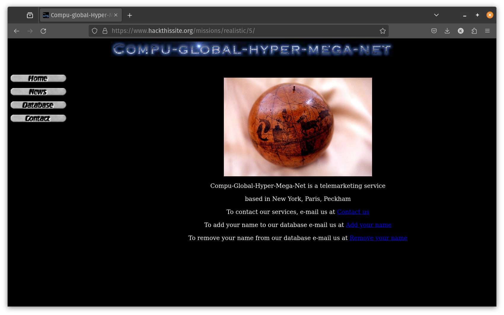
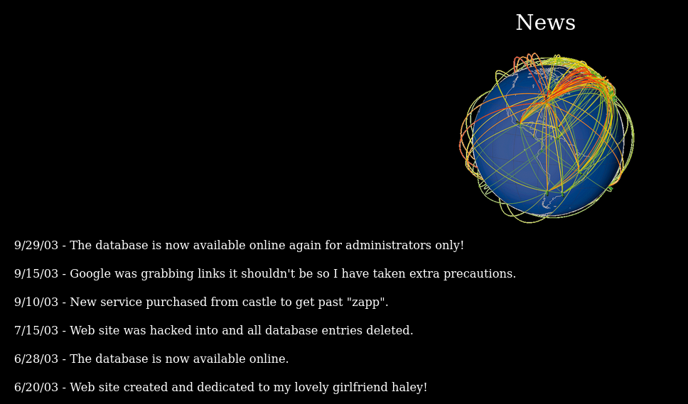
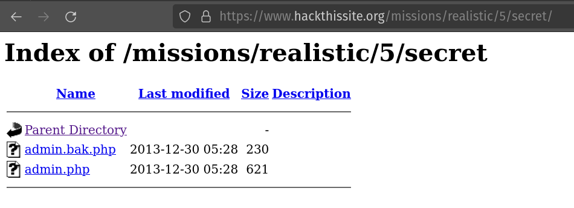
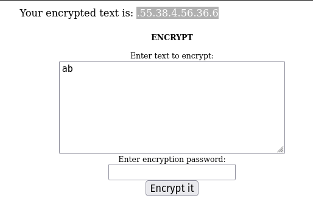
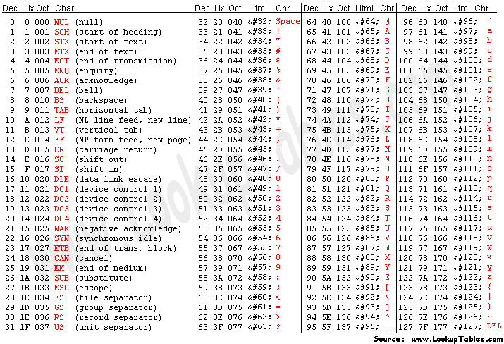
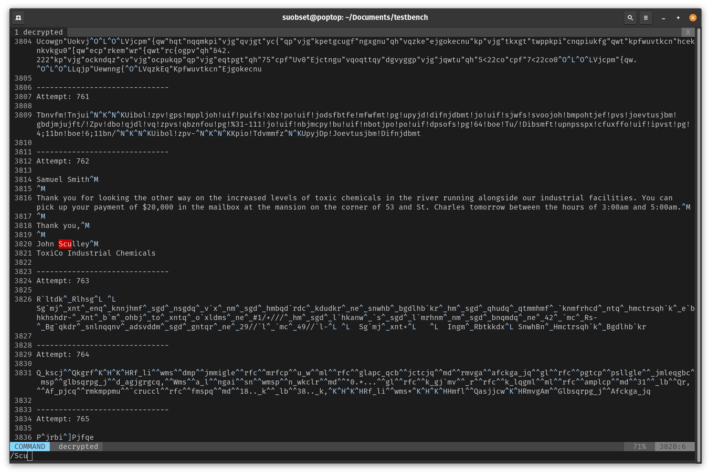
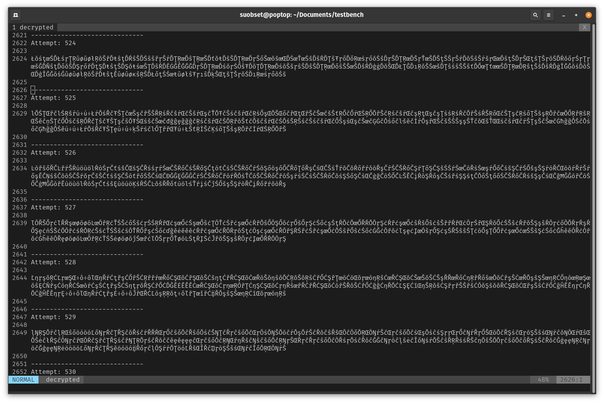

# Hack This Site

Sometimes my coding mind is inactive, but my tinkering mind is active. I crack cybersec puzzles on this site during those days. 

The following is a list of all the challenges in [HackThisSite.org](https://hackthissite.org), as I unfold and crack them. These may sometimes differ from how people have typically done them as well. 

For example, I rely heavily on Wireshark for these challenges. Regardless, bottom line:

* The following are not the intended correct answers to these puzzles. They are my way of doing and approaching things that have been successful.
* **SPOILER WARNING:** It goes without saying, if you intend to do these puzzles on your own, **stop reading and go to [HackThisSite.org](https://hackthissite.org) NOW**.

Heavy recommend to also use a Linux/UNIX compatible Operating System. For one: all web servers run on Linux, you need access to tooling and reverse-engineering stuff. Mosyt support forums and documentation will assume access to UNIX CLIs and tooling. 

MacOS and any Linux distro will work fine. For Windows, get [WSL](https://learn.microsoft.com/en-us/windows/wsl/about) or a VM. If this is your first ever Linux experience (VM or installing your first Linux OS), I highly recommend [Pop!_OS](https://pop.system76.com/), a fork of Ubuntu simplified for everyone!!

[Here's my profile](https://www.hackthissite.org/user/view/k-u-sh/).

Disclaimer: With great power, comes great responsibility. The ```sudo``` message applies here:

>We trust you have received the usual lecture from the local System
>Administrator. It usually boils down to these three things:
>
>    #1) Respect the privacy of others.
> 
>    #2) Think before you type.
> 
>    #3) With great power comes great responsibility.

Spread positivity, don't use this knowledge for nefarious purposes. This is a controlled environment for learning purposes ONLY.

## Basic

These are the solutions to the [Basic](https://www.hackthissite.org/missions/basic/) challenges on the site. Heavily recommend to stop reading here and give them a shot yourself if you haven't so already!! 

**THIS CANNOT BE REITERATED ENOUGH, SPOILER WARNING AHEAD**

### Level 1

Inspect element, password is in a comment. 

### Level 2

> However, he neglected to upload the password file

There's nothing to compare your input against whatever the actual password is. The whole script is broken, ```Submit``` and enjoy.

### Level 3

The password file is unencrypted. Inspect element on the submit button, see what file the submit button requests to compare the value against, find the name of the password file, and ```view-source``` in a new tab. You're in!!

The name of this password file cannot be more obvious. 

### Level 4

> However, the password is long and complex, and Sam is often forgetful. So he wrote a script that would email his password to him automatically in case he forgot.

```html
...
    <form action="/missions/basic/4/level4.php" method="post">
    <input type="hidden" name="to" value="sam@hackthissite.org" /><input type="submit" value="Send password to Sam" /></form></center><br /><br /><center><b>Password:</b><br />
    <form action="/missions/basic/4/index.php" method="post">
    <input type="password" name="password" /><br /><br />
    <input type="submit" value="submit" /></form>
...
```

ffs, Sam. Enter your own email, execute the script, enjoy.

### Level 5

> Rather than actually learn the password, he decided to make his email program a little more secure.

Yes, but he did not change the script. Using a more secure email program on your end does not define the behavior of your script. 

Same as Level 4.

### Level 6

Simple cypher encryption. Funnily enough I was initially trying to get the source code to see what the encryption is doing, but if you treat the encryption as a black box and give it some of your own strings...you can soon construct the password. 

I'll save you the fun of doing so. Just know that you have to reverse engineer the encryption by giving it your own inputs.

### Level 7

If you know the UNIX command line, you know that you can execute multiple commands using ```&&```. The script is essentially a simple ```cal $year```, where you can replace the year variable with whatever the user put in. The script is not protected (using variables and abstractions), so entering the string ```2024 && ls``` would actually execute ```cal 2024 && ls```, giving you the output of ```cal``` (not interesting), and ```ls``` (VERY interesting).

The password file is located in that ```ls``` output. As above,```view-source``` and have fun. 

For people unfamiliar with the UNIX command line, ```ls``` basically lists all directories and files in the directory you are currently in. (Read directory = folder if from a Windows background).

### Level 8

> She recently learned about saving files, and she wrote a script to demonstrate her ability.

The script is a PHP file, with an I/O stream. This means this PHP script has the necessary permissions on the server to edit and save files, as well as execution permissions (```-rwxr-xr--```).

If you know PHP, you can essentially make it execute CLI commands if the file itself has the execution permissions (which we just saw it does). Typing in ```<!--#exec cmd="ls ../"-->``` will make the PHP script execute ```ls```, and you have the password file there. 

From here, ```view-source```.

### Level 9

> In the last level, however, in my attempt to limit people to using server side includes to display the directory listing to level 8 only, I have mistakenly screwed up somewhere.. there is a way to get the obscured level 9 password. See if you can figure out how...

Oh, did the author not mess up this badly. What this means for us is that the script in level 8, while initially supposed to only limit users to seeing the files of Level 8...actually has the above permissions for the whole directory. Which means you can just go back, and execute ```ls``` on the level 9 directory, instead of 8.

How to do so, I will leave up to you. Just remember, ```../``` hops 1 directory above. We know where the Level 8 script is (see the URL), and we know where Sam put the level 9 password (read the prompt carefully).

You got this!!

### Level 10

It seems that Sam has stopped writing in detail about his mishaps, which is probably for the better. The level is just a "Enter Password", and no other clues. 

When I was initially solving this puzzle, I was coming from Level 9. Upon successful completion of a level, the site just gives a button to the next level. So for the longest time, I was trying to solve this in a clean manner, and was a bit stumped. 

The hint lies in the Level description, which gets bypassed completely if you come from a previously successful level. Here it is:

> This time Sam used a more temporary and "hidden" approach to authenticating users, but he didn't think about whether or not those users knew their way around javascript...

JAVASCRIPT. Now, this is an interesting one.

So, the way your web browser actually stores authentication in the current day and time is using these things called Cookies. When you hit that "keep me signed in" button, and the auth is successful, the web server downloads a cookie in the context of your browser (a snippet of JavaScript code). 

This cookie stores a long encrypted string, that only the server has the key to decrypt and read. If the read is successful, the server knows that it is the same computer that was authenticated, and grants access. 

This is why you get logged out of sites when you clear all cookies. 

How are we saved in the real world if this cookie is what determines our identity?? Encryption!! The key to decrypt a password cookie lies only between the server and the client, nobody else. 

What is the one thing that Sam has not done throughout?? Encryption!!

While there is a JS way to see cookies in the console, modern browsers will also show you the cookies in a nicely arranged manner. For Chrome/Chromium browsers:

```F12 -> Application -> level10_authorized (this is Sam's cookie)```

And we see that Sam has NOT encrypted the value of this cookie at all (value: "no"). Update this to the equally unencrypted string "yes", reload, hit submit, enjoy.

(Cookies irl store more data than an (even encrypted) yes/no. Email addresses, passwords, device details, and so on. Don't worry, not only are they not human readable, they are also not readable by other computers: that's what encryption means. You need a key to decrypt an encrypted string, and 1. only the server and client has access to those, 2. these days even the keys are randomly generated). 

### Level 11

> Sam decided to make a music site. Unfortunately he does not understand Apache. This mission is a bit harder than the other basics.

Apache has directory traversal turned on by default. What this means is that if not configured properly, you can see the directory of the server via a URL that does not lead to a ```.html``` file (or ```.php```). 

All songs are Elton John songs when you reload his music app. Append ```/e/l/t/o/n``` to the end of the URL, and work your way backwards to the parent dir. You'll see what happens :)

<hr />

## Realistic

These are the solutions to the [Realistic](https://www.hackthissite.org/missions/realistic/) challenges on the site. Heavily recommend to stop reading here and give them a shot yourself if you haven't so already!! 

### Level 1 - 4

To be written down. Already completed.

### Level 5

[Link to puzzle](https://www.hackthissite.org/playlevel/5/)



> Message: Yo! This is Spiffomatic64 from Hackthissite.org! I'm a bit of a hacker myself as you can see, but I recently came upon a problem I couldn't resolve.....
> Lately I've been getting calls day and night from the telemarketing place. I've gone to their website and hacked it once deleting all of their phone numbers so they wouldn't call me anymore. That was a temporary fix but they put their database back up, this time with an encrypted password. When I hacked them I noticed everything they used was 10 years out of date and the new password seems to be a 'message digest'. I have done some research and I think it could be something like a so-called hash value. I think you could somehow reverse engineer it or brute force it. I also think it would be a good idea to look around the server for anything that may help you.

Points to note:

* 10 years out of date
* "message digest hash value" (whatever that means currently)
* Reverse engineer and look around website

In the "News" page, we see this:



> Google was grabbing links it shouldn't so I have taken extra precautions

This is the big hint!! Google (and other search engines) all read a file called ```robots.txt``` to parse through links that are secret. Append ```/robots.txt``` to the webpage, and you'll get this:

```
User-agent: *
Disallow: /lib
Disallow: /secret
```

"For all user agents, do not track links that are in the lib dir and the secret dir."

Appending ```/secret``` to the URL gets us to Apache dir traversal:



The first file in this directory gives us the value of the hash (of the actual password). We do not have the Math formula that does the hashing, though.

Ok, so we go along. Going to ```/lib``` we get another hash file, which gets downloaded to your computer. 

Now, you gotta be using a UNIX compatible CLI to do this. Executing ```file $path_to_hash``` tells us what kind of file are we dealing with (user file that can be edited, executable, script, etc.).

Output:

```bash
suobset@poptop:~/Downloads$ file hash
hash: ELF 32-bit LSB executable, Intel 80386, version 1 (FreeBSD), dynamically linked, interpreter /libexec/ld-elf.so.1, not stripped

suobset@poptop:~/Downloads$ ls -l hash
-rw-rw-r-- 1 suobset suobset 11612 Jul  6 20:45 hash
```

Good, this is a 32-bit executable. Bad, I run a 64 bit OS. 

We keep this aside for a bit. Going back to the original message, we see that the sender notes 10 years out of date message digest hash. Let's [look that up](https://en.wikipedia.org/wiki/MD5). 

I'll not go into details about MD4/MD5, but I will tell you about [hashcat](https://hashcat.net/hashcat/), a Linux CLI utility that can be used to brute force (**not dehash**) passwords. This is extremely easy for us, given we have the final hash and we have a fair shot at what algorithm might be in use here. 

**WARNING:** Hashcat is super resource intensive. We use every possible permutation and combination to come to a password that may be true. Having a GPU is a high recommendation!!

Let's try to wager our bets to super old times (based on the website graphics) and use MD4 to brute force a password:

* hashcat: This is the command to run the hashcat tool, which is used for password recovery.
* -m 900: Specifies the hash type. In this case, 900 corresponds to MD4.
* 66dda7123d9c33f44b1b2be233e37091: This is the target MD4 hash that you want to crack.
* -a 3: Specifies the attack mode. 3 stands for a brute-force attack.
* -o cracked: This option specifies the output file where the cracked password will be saved. In this case, the file is cracked.

[Hashcat Documentation](https://hashcat.net/wiki/).

```bash
suobset@poptop:~/Downloads$ hashcat -m 900 66dda7123d9c33f44b1b2be233e37091 -a 3 -o cracked
hashcat (v6.2.5) starting

* Device #1: WARNING! Kernel exec timeout is not disabled.
             This may cause "CL_OUT_OF_RESOURCES" or related errors.
             To disable the timeout, see: https://hashcat.net/q/timeoutpatch
* Device #2: WARNING! Kernel exec timeout is not disabled.
             This may cause "CL_OUT_OF_RESOURCES" or related errors.
             To disable the timeout, see: https://hashcat.net/q/timeoutpatch
nvmlDeviceGetFanSpeed(): Not Supported

CUDA API (CUDA 12.4)
====================
* Device #1: NVIDIA GeForce GTX 1650, 3709/3896 MB, 14MCU

OpenCL API (OpenCL 3.0 CUDA 12.4.125) - Platform #1 [NVIDIA Corporation]
========================================================================
* Device #2: NVIDIA GeForce GTX 1650, skipped

Minimum password length supported by kernel: 0
Maximum password length supported by kernel: 256

Hashes: 1 digests; 1 unique digests, 1 unique salts
Bitmaps: 16 bits, 65536 entries, 0x0000ffff mask, 262144 bytes, 5/13 rotates

Optimizers applied:
* Zero-Byte
* Early-Skip
* Not-Salted
* Not-Iterated
* Single-Hash
* Single-Salt
* Brute-Force
* Raw-Hash

ATTENTION! Pure (unoptimized) backend kernels selected.
Pure kernels can crack longer passwords, but drastically reduce performance.
If you want to switch to optimized kernels, append -O to your commandline.
See the above message to find out about the exact limits.

Watchdog: Temperature abort trigger set to 90c

Host memory required for this attack: 1475 MB

The wordlist or mask that you are using is too small.
This means that hashcat cannot use the full parallel power of your device(s).
Unless you supply more work, your cracking speed will drop.
For tips on supplying more work, see: https://hashcat.net/faq/morework

Approaching final keyspace - workload adjusted.           

Session..........: hashcat                                
Status...........: Exhausted
Hash.Mode........: 900 (MD4)
Hash.Target......: 66dda7123d9c33f44b1b2be233e37091
Time.Started.....: Sat Jul  6 21:39:31 2024 (0 secs)
Time.Estimated...: Sat Jul  6 21:39:31 2024 (0 secs)
Kernel.Feature...: Pure Kernel
Guess.Mask.......: ?1 [1]
Guess.Charset....: -1 ?l?d?u, -2 ?l?d, -3 ?l?d*!$@_, -4 Undefined 
Guess.Queue......: 1/15 (6.67%)
Speed.#1.........:     7256 H/s (0.04ms) @ Accel:2048 Loops:62 Thr:32 Vec:1
Recovered........: 0/1 (0.00%) Digests
Progress.........: 62/62 (100.00%)
Rejected.........: 0/62 (0.00%)
Restore.Point....: 1/1 (100.00%)
Restore.Sub.#1...: Salt:0 Amplifier:0-62 Iteration:0-62
Candidate.Engine.: Device Generator
Candidates.#1....: s -> X
Hardware.Mon.#1..: Temp: 64c Util: 53% Core:1770MHz Mem:6000MHz Bus:8

The wordlist or mask that you are using is too small.
This means that hashcat cannot use the full parallel power of your device(s).
Unless you supply more work, your cracking speed will drop.
For tips on supplying more work, see: https://hashcat.net/faq/morework

Approaching final keyspace - workload adjusted.           

Session..........: hashcat                                
Status...........: Exhausted
Hash.Mode........: 900 (MD4)
Hash.Target......: 66dda7123d9c33f44b1b2be233e37091
Time.Started.....: Sat Jul  6 21:39:32 2024 (0 secs)
Time.Estimated...: Sat Jul  6 21:39:32 2024 (0 secs)
Kernel.Feature...: Pure Kernel
Guess.Mask.......: ?1?2 [2]
Guess.Charset....: -1 ?l?d?u, -2 ?l?d, -3 ?l?d*!$@_, -4 Undefined 
Guess.Queue......: 2/15 (13.33%)
Speed.#1.........:   263.3 kH/s (0.04ms) @ Accel:2048 Loops:62 Thr:32 Vec:1
Recovered........: 0/1 (0.00%) Digests
Progress.........: 2232/2232 (100.00%)
Rejected.........: 0/2232 (0.00%)
Restore.Point....: 36/36 (100.00%)
Restore.Sub.#1...: Salt:0 Amplifier:0-62 Iteration:0-62
Candidate.Engine.: Device Generator
Candidates.#1....: sa -> Xq
Hardware.Mon.#1..: Temp: 65c Util: 53% Core:1770MHz Mem:6000MHz Bus:8

The wordlist or mask that you are using is too small.
This means that hashcat cannot use the full parallel power of your device(s).
Unless you supply more work, your cracking speed will drop.
For tips on supplying more work, see: https://hashcat.net/faq/morework

Approaching final keyspace - workload adjusted.           

Session..........: hashcat                                
Status...........: Exhausted
Hash.Mode........: 900 (MD4)
Hash.Target......: 66dda7123d9c33f44b1b2be233e37091
Time.Started.....: Sat Jul  6 21:39:32 2024 (0 secs)
Time.Estimated...: Sat Jul  6 21:39:32 2024 (0 secs)
Kernel.Feature...: Pure Kernel
Guess.Mask.......: ?1?2?2 [3]
Guess.Charset....: -1 ?l?d?u, -2 ?l?d, -3 ?l?d*!$@_, -4 Undefined 
Guess.Queue......: 3/15 (20.00%)
Speed.#1.........:  9579.3 kH/s (0.05ms) @ Accel:256 Loops:62 Thr:256 Vec:1
Recovered........: 0/1 (0.00%) Digests
Progress.........: 80352/80352 (100.00%)
Rejected.........: 0/80352 (0.00%)
Restore.Point....: 1296/1296 (100.00%)
Restore.Sub.#1...: Salt:0 Amplifier:0-62 Iteration:0-62
Candidate.Engine.: Device Generator
Candidates.#1....: sar -> Xqx
Hardware.Mon.#1..: Temp: 65c Util: 74% Core:1770MHz Mem:6000MHz Bus:8

The wordlist or mask that you are using is too small.
This means that hashcat cannot use the full parallel power of your device(s).
Unless you supply more work, your cracking speed will drop.
For tips on supplying more work, see: https://hashcat.net/faq/morework

Approaching final keyspace - workload adjusted.           

Session..........: hashcat                                
Status...........: Exhausted
Hash.Mode........: 900 (MD4)
Hash.Target......: 66dda7123d9c33f44b1b2be233e37091
Time.Started.....: Sat Jul  6 21:39:33 2024 (0 secs)
Time.Estimated...: Sat Jul  6 21:39:33 2024 (0 secs)
Kernel.Feature...: Pure Kernel
Guess.Mask.......: ?1?2?2?2 [4]
Guess.Charset....: -1 ?l?d?u, -2 ?l?d, -3 ?l?d*!$@_, -4 Undefined 
Guess.Queue......: 4/15 (26.67%)
Speed.#1.........:   188.6 MH/s (0.04ms) @ Accel:2048 Loops:62 Thr:32 Vec:1
Recovered........: 0/1 (0.00%) Digests
Progress.........: 2892672/2892672 (100.00%)
Rejected.........: 0/2892672 (0.00%)
Restore.Point....: 46656/46656 (100.00%)
Restore.Sub.#1...: Salt:0 Amplifier:0-62 Iteration:0-62
Candidate.Engine.: Device Generator
Candidates.#1....: s6vq -> Xqxv
Hardware.Mon.#1..: Temp: 65c Util: 87% Core:1770MHz Mem:6000MHz Bus:8

                                                          
Session..........: hashcat
Status...........: Cracked
Hash.Mode........: 900 (MD4)
Hash.Target......: 66dda7123d9c33f44b1b2be233e37091
Time.Started.....: Sat Jul  6 21:39:34 2024 (0 secs)
Time.Estimated...: Sat Jul  6 21:39:34 2024 (0 secs)
Kernel.Feature...: Pure Kernel
Guess.Mask.......: ?1?2?2?2?2 [5]
Guess.Charset....: -1 ?l?d?u, -2 ?l?d, -3 ?l?d*!$@_, -4 Undefined 
Guess.Queue......: 5/15 (33.33%)
Speed.#1.........:  1183.1 MH/s (9.07ms) @ Accel:2048 Loops:62 Thr:32 Vec:1
Recovered........: 1/1 (100.00%) Digests
Progress.........: 56885248/104136192 (54.63%)
Rejected.........: 0/56885248 (0.00%)
Restore.Point....: 0/1679616 (0.00%)
Restore.Sub.#1...: Salt:0 Amplifier:0-62 Iteration:0-62
Candidate.Engine.: Device Generator
Candidates.#1....: sarie -> Xhzpc
Hardware.Mon.#1..: Temp: 65c Util: 87% Core:1770MHz Mem:6000MHz Bus:8

Started: Sat Jul  6 21:39:27 2024
Stopped: Sat Jul  6 21:39:35 2024

suobset@poptop:~/Downloads$ cat cracked
66dda7123d9c33f44b1b2be233e37091:74786
```

Take a look at that last line in my terminal output. That, is your password (and my bets on MD4 were correct).

Modern day passwords use much MUCH stronger encryption, which is extremely hard to crack brute force in this manner. This is just outdated security!! Also, web servers should NEVER store passwords and hashes in the wild like this.

### Level 6

> Message: Hello esteemed hacker, I hope you have some decent cryptography skills. I have some text I need decrypted.
> I work for this company called ToxiCo Industrial Chemicals, which has recently come under fire because of the toxic chemicals we are dumping into the river nearby. Ecological inspectors have reported no problems, but it is widely speculated that they were paid off by ToxiCo management because the water pollution near the ToxiCo factory has always been a serious and widely publicized issue.
> I have done some packet sniffing on my network and I have recovered this email that was sent from the CEO of the company to Chief Ecological Inspector Samuel Smith. However, it is encrypted and I cannot seem to decode it using any of my basic decryption tools. I have narrowed it down to the algorithm used to encrypt it, but it is beyond my scope. I was hoping you can take a look at it.
> Please check it out,
> more details are on the page. If you can unscramble it and reply to this message with the original text, it would be much appreciated. Thank you.

```
 I believe this document to be encrypted using the XECryption algorithm.
Please recover the original text of this document and return it to me.

.296.294.255.268.313.278.311.270.290.305.322.252.276.286.301.305.264.301.251.269.274.311.304.
230.280.264.327.301.301.265.287.285.306.265.282.319.235.262.278.249.239.284.237.249.289.250.
282.240.256.287.303.310.314.242.302.289.268.315.264.293.261.298.310.242.253.299.278.272.333.
272.295.306.276.317.286.250.272.272.274.282.308.262.285.326.321.285.270.270.241.283.305.319.
246.263.311.299.295.315.263.304.279.286.286.299.282.285.289.298.277.292.296.282.267.245.304.
322.252.265.313.288.310.281.272.266.243.285.309.295.269.295.308.275.316.267.283.311.300.252.
270.318.288.266.276.252.313.280.288.258.272.329.321.291.271.279.250.265.261.293.319.309.303.
260.266.291.237.299.286.293.279.267.320.290.265.308.278.239.277.314.300.253.274.309.289.280.
279.302.307.317.252.261.291.311.268.262.329.312.271.294.291.291.281.282.292.288.240.248.306.
277.298.295.267.312.284.265.294.321.260.293.310.300.307.263.304.297.276.262.291.241.284.312.
277.276.265.323.280.257.257.303.320.255.291.292.290.270.267.345.264.291.312.295.269.297.280.
290.224.308.313.240.308.311.247.284.311.268.289.266.316.299.269.299.298.265.298.262.260.337.
320.285.265.273.307.297.282.287.225.302.277.288.284.310.278.255.263.276.283.322.273.300.264.
302.312.289.262.236.278.280.286.292.298.296.313.258.300.280.300.260.274.329.288.272.316.256.
259.279.297.296.283.273.286.320.287.313.272.301.311.260.302.261.304.280.264.328.259.259.347.
245.291.258.289.270.300.301.318.251.305.278.290.311.280.281.293.313.259.300.262.315.263.319.
285.282.297.283.290.293.280.237.234.323.289.305.279.314.274.291.309.273.294.249.283.262.271.
286.310.305.306.261.298.282.282.307.287.285.305.297.275.306.280.292.291.284.301.278.293.296.
277.301.281.274.315.281.254.251.289.313.307.244.256.302.301.317.305.239.316.274.277.296.269.
305.301.279.287.317.284.277.305.298.264.304.286.273.275.293.309.286.282.240.287.239.268.269.
267.315.311.292.270.271.272.336.282.237.275.316.306.239.305.314.240.296.306.270.247.245.302.
317.316.241.291.310.266.274.274.313.288.262.319.280.276.238.297.295.287.285.288.301.272.275.
247.305.292.286.272.310.291.301.322.256.315.298.263.281.276.237.294.284.296.284.302.273.298.
287.298.301.265.305.270.315.278.283.302.287.263.270.345.258.270.266.302.309.262.260.277.327.
263.277.254.283.276.239.272.264.276.279.264.267.298.264.244.245.273.292.289.273.248.259.263.
288.290.294.210.288.268.311.318.312.242.285.293.216.262.276.340.292.299.275.259.293.311.234.
266.294.278.307.286.267.307.285.269.310.288.274.270.326.273.276.311.304.267.302.318.265.299.
263.283.248.257.314.288.321.321.236.284.283.227.320.312.246.261.289.316.288.263.312.241.265.
288.298.286.287.274.306.279.276.289.307.303.293.281.298.317.252.312.283.278.263.304.305.258.
266.270.294.286.293.290.291.291.258.254.282.282.283.313.268.282.316.310.299.254.264.234.296.
270.265.326.288.292.293.321.305.250.320.299.253.270.296.297.298.266.312.234.273.287.309.286.
278.269.279.316.284.276.234.293.255.267.242.253.318.270.246.278.292.285.282.314.266.292.286.
263.313.249.290.255.289.264.292.301.299.278.291.292.225.250.261.283.303.262.264.264.303.299.
297.274.288.267.293.316.320.317.233.303.258.302.271.283.323.247.279.268.312.269.297.313.280.
280.273.266.332.276.313.284.281.316.279.290.273.313.308.305.260.302.306.273.234.279.281.284.
298.278.259.290.314.275.264.339.293.322.266.261.296.306.277.275.311.284.270.318.259.249.286.
292.301.285.280.303.283.287.299.277.273.293.228.311.283.272.304.292.277.271.306.302.278.298.
300.287.281.309.243.272.279.282.300.291.295.284.285.252.291.251.285.283.245.250.252.318.298.
277.235.288.259.263.278.274.307.261.260.350.250.288.256.282.316.261.285.295.292.300.298.264.
245.241.308.301.261.253.289.264.267.300.262.248.287.257.266.275.287.297.320.287.264.279.297.
232.231.256.288.243.252.277.274.245.256.253.229.290.263.305.278.260.294.312.283.301.275.276.
299.297.312.275.282.294.272.228.302.324.257.261.286.326.280.283.316.294.254.258.275.264.236.
240.277.255.231.258.286.242.277.253.296.290.250.314.320.239.292.313.261.294.261.317.273.285.
236.292.282.271.264.297.300.272.308.299.300.269.301.269.317.284.286.262.315.276.279.328.269.
254.252.232.272.268.309.273.264.296.305.272.267.291.324.302.297.268.268.263.298.300.261.312.
241.254.299.280.263.292.260.301.311.317.297.248.314.272.293.298.281.298.276.311.291.297.318.
261.274.300.293.297.267.295.261.275.334.289.238.267.289.283.257.300.262.304.311.278.274.265.
261.345.301.296.270.273.299.289.274.272.313.282.268.320.287.320.270
```

I will admit, I have zero cryptography skills. What I do have, are tinkering skills. 

The puzzle links to this page: [XECryption](https://www.hackthissite.org/missions/realistic/6/encryption.php). We enter a text, and a password, and get our encryption.

The letter a produces (.40.17.40), the letter b produces (.8.46.44). Add them up to get 97 and 98 each, the decimal ASCII values of a and b respectively.

Ok good. Now: ab produces (.55.38.4.56.36.6). See a pattern?? (55 + 38 + 4 = 97), (56 + 36 + 6 = 98). Each letter is 3 numbers with periods in between. 



But what happens when you put in a password?? Let's try text "a" with password "a":

(.44.57.93 => 194). Also, 194 - 97 = 97. Hmm.

For further clarification, here's a handy ASCII chart.



The whole encryption is basically here goes:

".x.y.z.a.b.c" is a 2 character text, each character represented by three numbers. The three numbers should add up to the ASCII value of the character. If there is a password, take the ASCII value of that password and subtract it from the addition of the three numbers. 

To further illustrate, take the first three numbers of this text:

.296.294.255 | means 296 + 294 + 255 - {password ascii in decimal} = decimal ASCII value of the first character. 

On to scripting on Python:

```py
import sys

# Decrypt function
# Takes in the cleared array for
def decrypt(nums, password):
    message = ""
    for i in range(0, len(nums), 3):
        # Make sure the resolved number is in tha ASCII range.
        sum_value = nums[i] + nums[i+1] + nums[i+2] - password
        if 0 <= sum_value <= 0x10FFFF:
            # Get ASCII character from decimal value
            message += chr(sum_value)
    return message

def initial(fileName, bruteForceAttempts, outputFile):
    nums = []
    with open(fileName, "r") as f:
        encryption = f.read()
    # Put the encrypted strings in an array that is just the int values
    nums = encryption.split('.')
    del nums[0] # empty string due to first occurrence of delimiter
    for i in range(0, len(nums)):
        # Clean up the array
        nums[i].replace('\n', '')
        nums[i] = int(nums[i])
    # Start decrypting, with each attempt acting as the "password"
    with open(outputFile, "a") as f:
        for i in range(0, bruteForceAttempts):
            f.write("------------------------------\n")
            f.write("Attempt: " + str(i) + "\n\n")
            f.write(decrypt(nums, i) + "\n\n")

if __name__ == '__main__':
    if len(sys.argv) < 4:
        print("Incorrect number of arguments. Usage: ")
        print("python3 XECryption.py <filename> <Brute Force Attempts> <Output file>")
        print("Where: \n Filename: Name of file with the encrypted string \n "
                "Brute Force: Password ASCII from 0 to n - 1" 
                "\n Output file: file with decrypted strings.")
        exit(1)
    fileName = sys.argv[1]
    bruteForceAttempts = int(sys.argv[2])
    outputFile = sys.argv[3]
    initial(fileName, bruteForceAttempts, outputFile)
```

And in attempt 762 (i.e. the password resolves to ASCII 762), we get the following text:



Everything else is junk, though:



### Level 7

