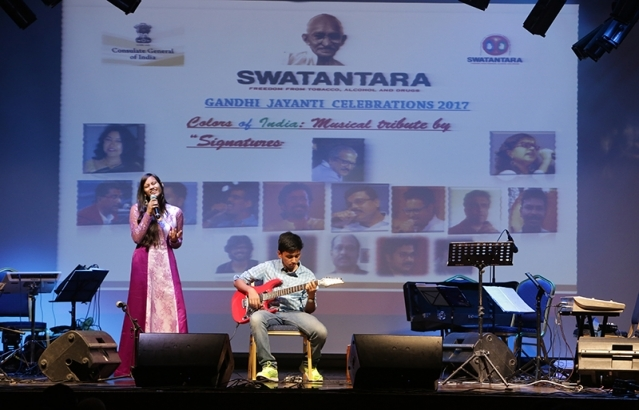

# Organizations I Support

The below is a list of some non-profit organizations that I either support, or am a member of. I have listed some that I am not supporting financially as of now, but have listed them here for outreach. I have also tried to explain my reasoning behind my support for each of them. 

  

Join the [FSF](https://fsf.org). The Free Software Foundation (FSF) is at the forefront of advocating for open-source software and the principles of software freedom. Their mission aligns with my belief in the importance of transparency, user control, and the sharing of knowledge. By supporting the FSF, I contribute to the development and promotion of free and open-source software, ensuring that technology remains accessible to all. 

**However, I do also encourage readers to read the specific ["Disclaimer on FSF"](/disclaimer_fsf)**

Join the [EFF](https://eff.org). Support Free Speech, Digital Privacy, and technology innovation through Libre + Open Source. The Electronic Frontier Foundation (EFF) is dedicated to defending civil liberties in the digital world. They champion free speech, digital privacy, and technology innovation, which are vital in our modern society. By supporting the EFF, I stand up for the protection of online rights, privacy, and the free exchange of ideas in an age of increasing digital surveillance and censorship.

Become a member of the [American Statistical Association (ASA)](https://amstat.org). The ASA stands as a cornerstone for advancing the field of statistics and promoting the significance of data-driven decision-making. Joining the ASA allows me to be part of a community that shares a dedication to elevating the standards of statistical practice and fostering a deeper understanding of the role statistics plays in shaping our world. The ASA has provided immense networking, learning, and growth opportunities. I am currently a member of the ASA through winning the [ASA Five-College DataFest 2023](https://skushagra.com/docs/research/projects#asa-five-college-datafest).

Support [The Trevor Project](https://www.thetrevorproject.org/), and their mission to crerate a safer & better world for future generations. The Trevor Project is an organization dedicated to providing crisis intervention and suicide prevention services for LGBTQ+ youth. Their work is crucial in creating a more inclusive and accepting society, where young people can thrive without fear of discrimination or exclusion.

   

PRERANA is an initiative of The Consulate General of India in Dubai, to support differently-abled individuals. I started as a volunteer and now serve as in charge of the stage management for a monthly program for the kids. Started as a volunteer in 2015, became a mentor in 2017, and by 2019 was working as in-charge of the stage management during the monthly programs organized on the second weekend of every month.

Moreover, I also contributed in the student-led Swatantara: Students Working Against Tobacco, Alcohol, Narcotics, and Related Abuses. Started as a volunteer in 2016. Organised monthly workshops by 2018 in various schools to spread awareness regarding tobacco, alcohol, and drug abuse among school students. By 2018, was the stage manager and event organizer. [View More Here](https://www.cgidubai.gov.in/event_detail/?eventid=15)

