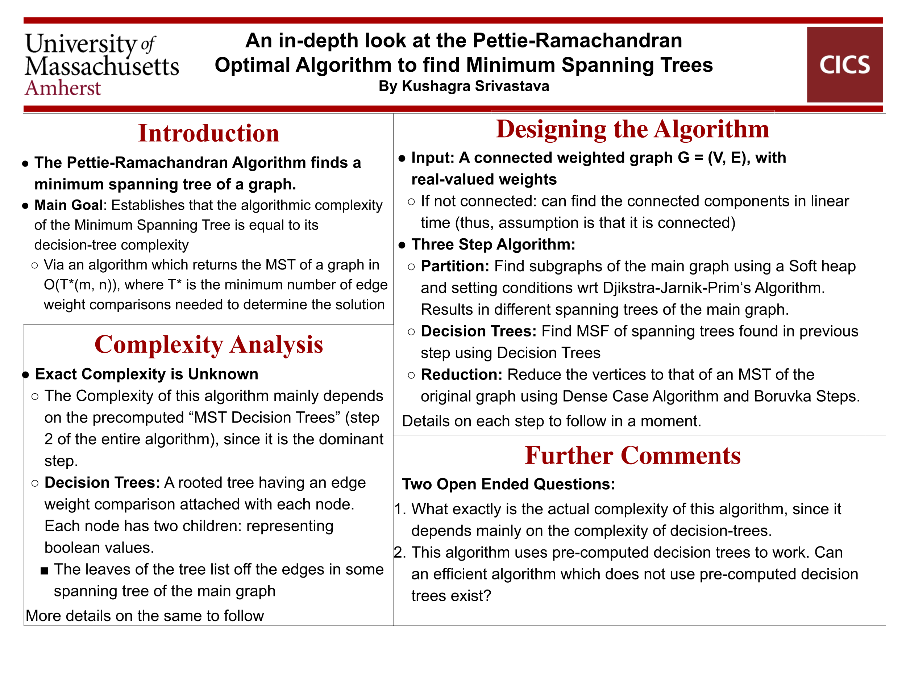

# CICS Projects

This is a repository to hold all my completed projects and/or research work done under [UMass CICS](https://cics.umass.edu). They have been listed in backwards chronological order. 

## CS 326: MeetU

Scheduling app made by Nhi Ha, James Leone, Yuni Jeong, and I: [linked here](https://github.com/suobset/meetu). Essentially a better version of When2Meet, with more features and better collaboration tools. 

<iframe width="560" height="315" src="https://www.youtube.com/embed/4S3lgxtjgRI?si=IbJwKYXOyACS0a_3" title="YouTube video player" frameborder="0" allow="accelerometer; autoplay; clipboard-write; encrypted-media; gyroscope; picture-in-picture; web-share" allowfullscreen></iframe>

### Team Overview

-   Yuni Jeong (@yunijeong5)
-   Kushagra Srivastava (@suobset)
-   James Leone (@JLeone123)
-   Nhi Ha (@hacherio)

### Innovative Idea

Existing application: When2Meet (https://www.when2meet.com/), CATME

Their limitations are:
When2Meet-- Bad UI, hard to use on phones, cannot choose location, no commenting functionality
CATME-- Confusing UI (can accidentally fill out the survey wrong)

We want to make a scheduling web app that overcomes these limitations, and add extra functionality which we believe would benefit anyone who want to organize a group meeting. Our goal is to create an app that's simple and easy to use, but also gives intuitive UX to its users.

### Data

-   Meeting title
-   Username (email)
-   Password
-   Time selection votes
-   Recurrence of meeting
-   Meeting location votes
-   Comments about the meeting
-   Specific text boxes for meeting agenda, roadmap, etc. Can give a markdown to end-user to define it to their liking.
-   Links for Zoom/Discord/Meeting Platforms
-   Links for shared Google Drive Folders, Pooled-in Resources
-   A unified system for people to mention if they can make it or not on specific days (think as marking attendance...if they can typically make it but did not on a specific day, they can mention why)

### Functionality

-   Create profile with email and password.
-   Create a new event
-   Users can add their availabilities and vote for the location they want to meet at.
-   Show times with the most overlap (color coded)

-   Private/public events: e.g. Only UMass emails can schedule an event

-   Set max number of members:
-   Users can add comments on the same page
-   Button to send out link via email

-   See all events (past/future) on a single dashboard
-   Delete / create event on the dashboard

-   (maybe) Google Map API: Mark locations on map

## CS H377: Modified xv6

Modified and tinkered xv6 with [Prof. Tim Richards](https://www.cics.umass.edu/faculty/directory/richards_tim) and the class for the honors colloquium of 377: Operating Systems. 

xv6 is a re-implementation of Dennis Ritchie's and Ken Thompson's Unix
Version 6 (v6).  xv6 loosely follows the structure and style of v6,
but is implemented for a modern RISC-V multiprocessor using ANSI C.

## CS H311: An in-depth look at the Pettie-Ramachandran Optimal Algorithm to find Minimum Spanning Trees

The following was done as a project under the Honors Colloq. for CompSci 311 under [Prof. Marius Minea](https://www.cics.umass.edu/people/minea-marius). I had also attempted to make a Java implementation of the same, but due to time constraints and it being a 1-credit course, opted to use pseudocode instead.



## CICS 256: Tilting-ball game

CICS 256 final project in collaboration with Lyle Kottke, [linked here](https://github.com/suobset/Tilting-Ball-Game). A Google Sites website also has details on the functioning of this game (made with Arduino, a 16*16 LED Matrix, and an acclerometer). This project was done under [Prof. Donghyun Kim](https://www.cics.umass.edu/people/kim-donghyun).

### Project Pitch

<a href="https://github.com/suobset/256BallTilt/blob/main/assets/CICS156%20Final%20Project%20Presentation.pdf">Link to project Pitch (uploaded to repository)</a>

<a href="https://sites.google.com/umass.edu/rollgame/home">Link to Project Website with Updates</a>

### Timeline:

* Week 1: Ordering components, brainstorming/planning as much as possible before they arrive
* Week 2: Attaching components, getting familiar with tilt sensor/using LED display
* Week 3: Coding basic ball movement with button input, possibly start using tilt sensor
* Week 4: Tilt sensor ball movement finalized
* Week 5: Adding additional features (Winning a level, failing a level, obstacles)
* Week 6: Tweaking, bug fixing, play testing, polishing

### components

* Neopixel LED display (32x32)
* 4 buttons to test ball moving input
* Tilt sensor
* Our makerboards (or potentially an Arduino Uno or Raspberry Pi, if computation/latency errors occur)

### Installation 

* Arduino Zero Documentation: https://docs.arduino.cc/hardware/zero
* Get started with Arduino Zero: https://www.arduino.cc/en/Guide/ArduinoZero
* Test ```BlinkExample``` under examples 
* Connect Acclerometer with Arduino Zero
* Test ```accl_example``` under examples
* Connecting Neopixel with Arduino Zero: https://learn.adafruit.com/32x16-32x32-rgb-led-matrix/connecting-with-jumper-wires
* Use ```3v3``` or ```VBUS``` for red, ```GND``` for black. Find an EXACT 5V port. 
* Install RGB Matrix, AdaFruit GFZ, and others as listed in above link
* Test ```neoPixel_32_example``` under examples
