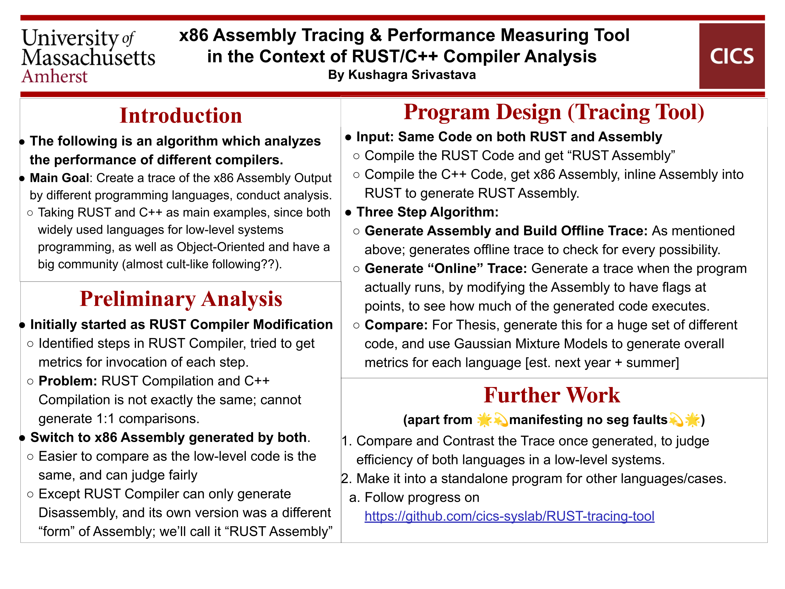
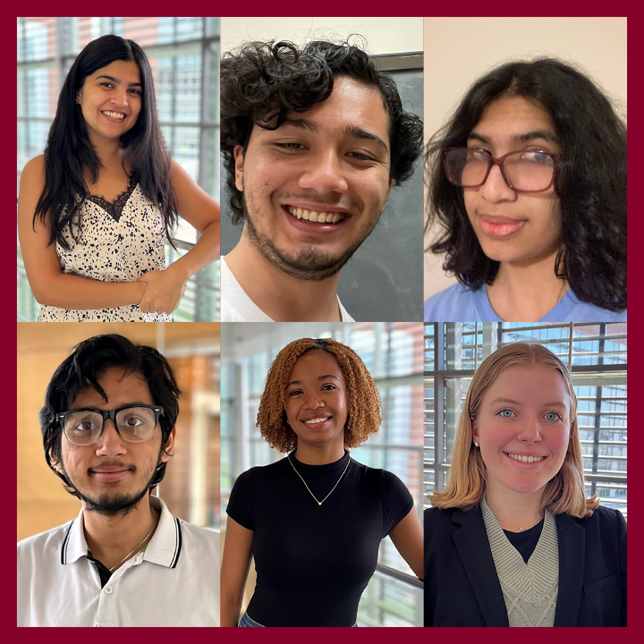

# Ongoing

This page holds all my ongoing projects and endeavours. Primarily, the heirarchy will be divided into different institutions of affiliation, in no particular order. This will be the forever evolving page, and projects that are over will be placed in their respective pages (or new pages will be created) in the sidebar.

## UMass Manning College of Information and Computer Sciences (CICS)

I am currently an undergraduate Computer Science major in [UMass CICS](https://cics.umass.edu). I am also a multidisciplinary honors student in the [Commonwealth Honors College](https://www.umass.edu/honors/).

### CICS Honors Thesis

Currently working with Prof. Joe Chiu and Prof. Tim Richards from UMass CICS on my Honors Thesis. I have put a short poster on the project hypothesis below, but obviously not all data is recorded because this is an ongoing project. Moreover, the poster is about 6 months old and a lot has changed in the project (focused on Clang, Cargo, and LLVM). 

Regardless, the poster still gives a good idea of what to expect, without giving compromising details, and thus I'll leave it here. Also, there is a [git repository](https://github.com/cics-syslab/RUST-tracing-tool) which stays private for the forseeable future :)

### CICS SysLab

As part of conducting the Honors Thesis research in an interactive way, and facilitating more Systems research on campus, I am also a member of the newly created CICS SysLab (website soon) by Prof. Joe Chiu and Prof. Tim Richards. Here's the first meeting, held Spring 2023:

## UMass Integrated Concentration in Sciences (iCons)

### U.S. Census: The Opportunity Project

[The Opportunity Project](https://opportunity.census.gov/) is a unique research endeavour by the [Census Open Innovation Labs](https://coil.census.gov/) which prompts different universities to come up with digital tools built with the help of open government data. Students in each team are paired with industry experts, and follow a range of milestones [as described here](https://opportunity.census.gov/our-process/). The final product is digital (website, app, visualizations, etc.) aimed at different industry experts, which in-turn would help them solve the issue at hand.

Currently collaborating with a team of 6 (Suhani Chawla, Sarojini Torchon, Anvitha Ramachandran, Gabrielle Walczak, Jose Cruz, and I) on a dataset provided by the [U.S. Department of Energy](https://energy.gov/) to improve energy access in minority households.

[Featured in UMass Amherst News](https://www.umass.edu/news/article/us-census-bureau-recruits-umass-icons-program-students-work-equitable-access)

### iCons 4

iCons 4 is a supplementary class that follows the same timeline as the Honors Thesis. The main aim is to communicate about your project to a non-scientific audience first, and then to a scientific audience in the second half. We use a digital medium to communicate the importance of the project, expectations, and how this may help the end user. 

I plan to create a website for the same, but do not know much yet. Details will be added as they unfold. 

## Smith College

### LinKaGe Lab

Currently working as a Software Dev. and System Specialist at [LinKaGe Lab](https://linkage.cs.umass.edu/) in Smith College. 

- Assisting in the Software Development part of the current research under the guidance of Dr. Ileana Streinu at the LinKaGe Lab. 

- Optimizing systems and server-side code to ensure the lab's software works efficiently, as well as ensuring upkeep and security.

- Porting legacy software to modern frameworks.

## Personal Projects

This section holds personal projects: anything that I am investing time in, but for the pursuit of knowledge and self-fulfillment/happiness/mainly because programming is my hobby as well. 

Projects mentioned are outside of the regular stuff that maintainance of this site entails, and the [Blog](/blog) that I am writing on this site as well. The projects below are some that I have been doing/wanted to do for a very long time now, and I just find them interesting.

I will probably keep writing about these, amongst other things, on the aforementioned blog still.

### the finechive.

I am attempting to curate a personal archival, similar to [Internet Archive](https://archive.org/) but one that is curated to me, and my experiences, and things that I want to record. Mainly serving as a personal vanity project, this pseudo life-log is probably just a present to future me from past me. The finechive will be a sub-website built into this website.

Akin to writing a book, but also not really. 

### Personal Operating System From Scratch

Rosaceae was a project that started out as a fork of MIT PDOS xv6, but now I have taken it as a challenge to write my own Operating System. More info on this soon, so far I do have a working bootloader that loads Ubuntu on an [old laptop.](https://suobset.github.io/oldLaptop)

<!-- ### Grad School Applications -->
<!--  -->
<!-- I am currently drafting my Statement of Purpose and the like. I will put more info soon, but essentially my interests lie in the intersection of "Systems Design and Architecture" (Operating Systems, Compilers, Networks) and "Machine Learning" (Natural Language Processing, Tinkering with different models...mainly use as a tool to streamline metrics I get from research on Compilers). I am also interested in other CS fields such as Computational Geometry, Computer Vision, and the like. -->
