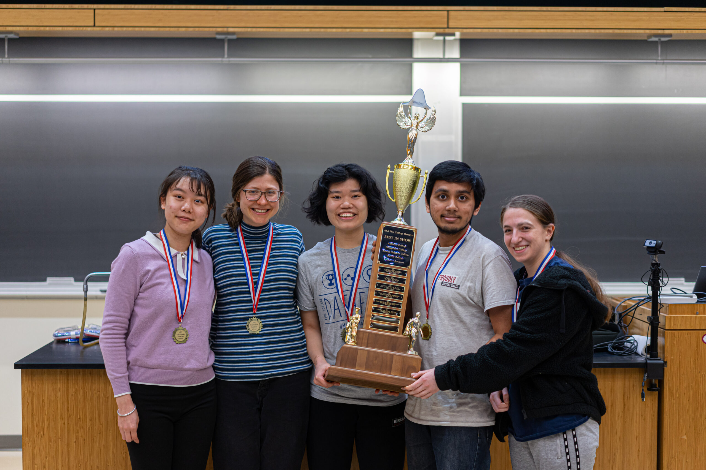

# Projects (& Competitions)

This is a repository to hold my projects/competitions outside of CICS. However, most of them were still done under or via my CICS affiliation.

## ASA Five-College Datafest

Spring 2023: Won "Best in show" (1st place) in the [ASA Five College DataFest](https://www.science.smith.edu/datafest/). Collaborated in a team of 6 (Clara Li, Nikki Lin, Quinn White, Rose Porta, Kushagra Srivastava) to create an analysis of consumer data provided by a certain legal firm. We had a 3-fold approach, wherein I contributed towards the text wrangling/NLP stuff. 

This was the first ASA Five-College DataFest team which was inter-college (Smith College and UMass Amherst). We were able to synthesize our university's main teaching aspects into our final product, thus making it an inter-disciplinary win :)

### Overview

Without giving away to much data due to its sensitive nature (we had to sign a contract): we essentially received a relative database wherein communications between consumers and a legal firm were recorded, along with other details on consumer actions with the firm. We were to analyze this data and determine how to equip people employed to better serve the consumer needs. 

### model-mavericks-2023

<a href="https://www.science.smith.edu/datafest/2023/04/10/recap-from-the-2023-asa-five-college-datafest/">Link to official report on the event standings</a>

[Link to GitHub Repository](https://github.com/suobset/model-mavericks/2023)

- `GLM.Rmd`: all R code for logistic regression model.
- `GLM.html`: knitted output of`GLM.Rmd`.
- `textWrangling.ipynb`: python notebook with text analysis.

## HackUMass IX: MoodMusic

<iframe width="560" height="315" src="https://www.youtube.com/embed/QDSUwycH-MI?si=AX_6OSPzKJ2-OXnt" title="YouTube video player" frameborder="0" allow="accelerometer; autoplay; clipboard-write; encrypted-media; gyroscope; picture-in-picture; web-share" allowfullscreen></iframe>

Fall 2021: Web App made by Krishna Kumar, Nhi Ha, and I for HackUMass IX. [Linked here](https://github.com/suobset/MoodMusic).

<a href = "https://youtu.be/QDSUwycH-MI">YouTube Video Submission</a>

<a href = "https://dashboard.hackumass.com/projects/37">HackUMass Portal Submission</a>

Note: It is not known if the HackUMass Portal submission  will be accessible, so details from that webpage have temporarily been added down here. 

### Description as a Tweet:

Using your Spotify Data to predict the mood of your songs.

### Inspiration:

We wanted to challenge ourselves, while leveraging something which is universal to almost everyone: Music. We used a common platform, Spotify, to incorporate additional functionality that gives the user more insight into the music they listen to. We also wanted to challenge ourselves, hence we used Spotify APIs and React: especially getting the audio features of each song and devising a mathematical model to judge the mood.

### What it does:

The project uses React for the frontend and Python for the backend. We implement a Spotify music player in the web, which is linked to the user's account. The Python Script in the backend takes that song, computes it's mood using values of the audio features given by thew Spotify API, and returns the mood of the song.

### How we built it:

* Frontend: React, JavaScript, HTML/CSS
* Backend: JS, Python, Flask

### Technologies we used:

*    HTML/CSS
*    Javascript
*    React
*    Python
*    Flask

### Challenges we ran into:

Figuring out the Spotify API (which was pretty complex to decipher and implement), converting the audio features values to the corresponding mood, linking Python with React using Flask (by creating our own API).

### Accomplishments we're proud of:

Frontend + Music Player looks and works efficiently. Moreover, we were able to create our very first API using Flask, we created our first ever web app using React, and we used Python to map mathematical models for the first time.

### What we've learned:

Using the Spotify APIs, learnt React, Python, Flask in software development.

### What's next:

Implementing a more accurate mood detector using ML/AI, as well as utilize the YouTube API to present a visual representation of the aforementioned moods.

### Built with:

We used React, Python, HTML/CSS, and Flask for languages. For tools: we relied heavily on VSCode, WebStorm, PyCharm, and GitHub.

### Prizes we're going for:

 *  Best Software Hack
 *  Best Web Hack
 *  Best Beginner Software Hack

This project is being judged live. 

## HackUMass VIII: Dermsafe

Fall 2020: HackUMass VIII Project, [linked here](https://github.com/suobset/hackUmass-VIII-proj-DermSafe).

<iframe width="560" height="315" src="https://www.youtube.com/embed/4e5O1B0_a2k?si=0hi55TKalJENF5Jn" title="YouTube video player" frameborder="0" allow="accelerometer; autoplay; clipboard-write; encrypted-media; gyroscope; picture-in-picture; web-share" allowfullscreen></iframe>

### Overview: 

DermSafe is an Android application that helps people with various skin-related health diseases identify the same and act upon it as soon as possible. Users can either use their phone's camera to click pictures and/or upload photos of various different kinds of anomalies that occur on their skin on the app to know their cause. Users also get access to a wide variety of resources and contact information that would help them obtain the relevant treatment(s), as well as keep them well informed about their ailments and various preventive measures they can take.   

As time was a major constraint for this event, this particular application only focuses on Skin Cancer for the time being. However, we plan to train the model with various other datasets so that it can detect various different skin diseases, as well as help the user obtain proper treatment and care for the same. 

The project is originally forked from <a href="https://github.com/MRauf1/Skin-Cancer-Detector">this repository</a>, where a basic Skin Cancer Detector had been initially created. Our team repaired the project, and used it as our own canvas, heavily modified it, as well as added various features of our own to compliment and extend upon the original application.

### Background: 

This Repo contains the project done by:

Nikhil Jain (https://github.com/jainnikhil1005)

Kushagra Srivastava (https://github.com/suobset | ksrivastava@umass.edu)

Nhan Ton (https://github.com/tonducnhan)

Rebecca Wang (https://github.com/rebeccawang06)

For the 8th HackUmass hackathon. 

### How it Works 

DermSafe uses TensorFlow and Keras in order to compare the User's uploaded photos to it's own database, from which it gives feedback on the type of the skin disease that the user is currently suffering from. Currently, the model is trained on very high quality images of various different types of skin cancer, and can therefore give almost accurate feedback on the kind of skin cancer that the user may be suffering with. 

The model was trained on ~4,000 images from ISIC, PH2, and Complete MedNode online databases. The model has an accuracy of 87% as of now; however, since it was created using high quality images taken in various hospitals, daily use cases might differ. Please seek professional medical help if you have any queries.

The application uses a Convolutional Neural Network to classify skin cancer either as benign or malignant. The model has 5 Conv, 5 ReLU activation, 5 Max Pooling, Flatten, 3 Dense (last one with Sigmoid), and 2 Dropout layers. 

### How to Use 

Upon installing the appliction on your Android device, you will be greeted with a home screen:

-> Load image: Lets you select an image from your gallery to upload to the app to judge. This is the main part of the app: it compares the uploaded picture to it's own trained dataset and determines the type of Skin Cancer the person is suffering from.

-> References: Provides information from various trusted sources 

-> Contact: Users can leave their information in case they want to reach out to a medical professional for any concerns.

-> Pictures: Provides different pictures for users to judge how severe their case is. 

#### Load Images: 

Clicking Load Images will direct the user to this screen: 

Where the users can choose their photos to be uploaded to the app; upon which the app will predict the type of Skin Cancer they have.

Users can also use their phone's camera to take a picture and upload it to the app from this screen. 

When the user uploads the picture, the app would show them the result like this (either no Skin Cancer, Benign Skin Cancer, or Malignant Skin Cancer): 

#### References: 

Clicking References will allow users to browse various trusted sources and get more information on Skin Cancer.

We intend to update the sources regularly with up-to-date information always at hand. 

#### Contact:

Clicking Contact will lead the user to this page: 

Users can fill out a form and be directly conncted with a Medical Professional to get help with their questions and queries. 

#### Pictures: 

Clicking on Pictures will lead users to a page where they can see various examples of different Skin Cancer patients, and determine the severity of their ailments.

### Contribute: 

We intend to release this project under the standard open-source MIT License, and anyone wishing to contribute to this project can do so via these links:

1.[Source Code: GitHub](https://github.com/k-u-sh/hackUmass-VIII-proj-DermSafe)
2.[Issue Tracker](https://github.com/k-u-sh/hackUmass-VIII-proj-DermSafe/issues)

### Future Improvements: 

We plan to incorporate various future improvements in this Android Application in the future, some of which include: 

1. Google Maps Integration to direct Users to the nearest Hospital in case of requirement.

2. Emergency Contact Feature to notify the friends and family of the User in case of emergencies.

3. Incorporating a more fluid UI across the entire app, as well as porting it over to various other operating systems. 

4. Including a User-Account setup through which users can save their data on the cloud. 

### Support: 

If you are having issues with the software or any part of the same, feel free to utilize the GitHub Issue-Tracker. Alternatively, you can also reach out to us through our respective emails listed under [Section 2: Background](#Background) of this document.

### License: 

This project is licensed under the MIT License
