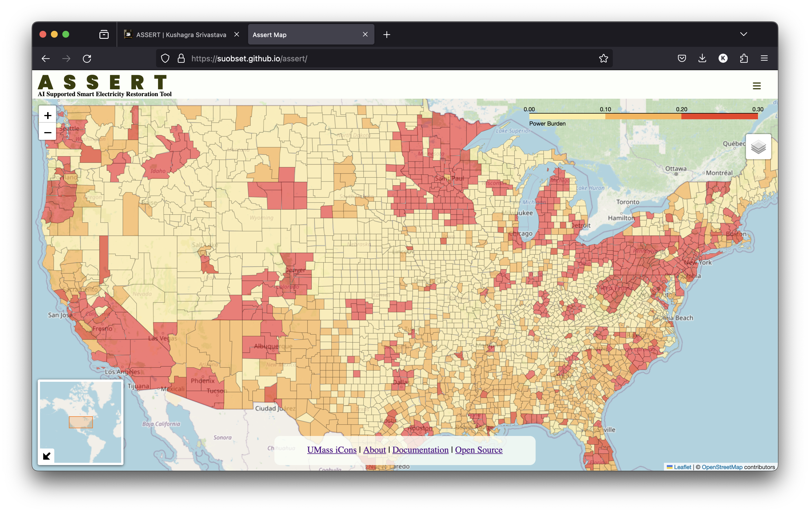

# ASSERT

[The Opportunity Project](https://opportunity.census.gov/) is a unique research endeavour by the [Census Open Innovation Labs](https://coil.census.gov/) which prompts different universities to come up with digital tools built with the help of open government data. Students in each team are paired with industry experts, and follow a range of milestones [as described here](https://opportunity.census.gov/our-process/). The final product is digital (website, app, visualizations, etc.) aimed at different industry experts, which in-turn would help them solve the issue at hand.

Collaborated with a team of 6 (Suhani Chawla, Sarojini Torchon, Anvitha Ramachandran, Gabrielle Walczak, Jose Cruz, and I) on a dataset provided by the [U.S. Department of Energy](https://energy.gov/) to improve energy access in minority households.

[Featured in UMass Amherst News](https://www.umass.edu/news/article/us-census-bureau-recruits-umass-icons-program-students-work-equitable-access)

Our project, the AI Supported Smart Electricity Restoration Tool ([ASSERT](https://suobset.github.io/assert/)) aims to add a lens of power outage overburden and vulnerability to the utility emergency response’s repair and restoration decision-making pipeline. This was done by identified key metrics that predict power overburden in counties lacking data. Additionally, we used unemployment, poverty and minority data to enhance said prediction.

The interactive map displays two layers: the actual ODIN data and the predicted ODIN data. Users can choose which layer to overlay on the map using the layer selection feature on the right side of the screen.

To select a map layer:

1. Locate the layer selection feature on the right side of the screen.
2. Choose either "Actual ODIN Data" or "Predicted ODIN Data" from the available options.

At the top of the screen, a legend provides information about the color-coded indices representing the level of overburden. The legend ranges from -10 to 10, and each color on the map corresponds to a specific overburden level. Use the legend to interpret the map and understand the intensity of overburden at different locations. Lastly, on the top left of the screen are zoom in and zoom out buttons for the convenience of the user. 

#### Media Updates

This project has apparently garnered a lot of traction across various UMass websites. Here is a record of all of them:

* [UMass News](https://www.umass.edu/news/article/us-census-bureau-recruits-umass-icons-program-students-work-equitable-access)
* [UMass College of Natural Sciences](https://icons.cns.umass.edu/news-events/news/us-census-bureau-topteam)
* [UMass Manning CICS + CICS Highlights](https://www.cics.umass.edu/news/us-census-bureau-recruits-cics-students-work-equitable-access-electrical-power)
* [U.S. Census Department](https://opportunity.census.gov/showcase/?year=2023&partner-agency=Department+of+Energy) (look for ASSERT in the filter)