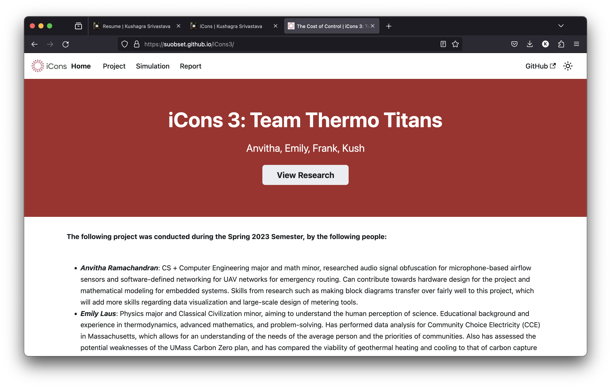

# The Cost of Control



iCons 3 entailed a group lab project wherein data was to be taken from the real world and carefully analyzed to come to a conclusion. Lab work becomes the emphasis in iCons 3, and the team (Anvitha, Emily, Frank, and I) decided to create a simulation which would help us implement methods to optimize HVAC Controllers to work in a way which maximizes energy savings and maintains occupant comfort.

Special thanks to [these folks](https://suobset.github.io/iCons3/docs/acknowledgements_references) who were instrumental in us completing this project with valuable insights.

Visit Project Website for Simulation, Details, and the Report + Insights: https://suobset.github.io/iCons3

The project uses one monorepo separate from the ```suobset/iCons``` monorepo:

* [GH/suobset/iCons3](https://github.com/suobset/iCons3) contains all code for everything: Website + Simulation
* [GH/suobset/iCons/iCons3-CS1](https://github.com/iCons) contains ONLY assets. Not much of value.

Project not yet up on iCons Innovation Portal.