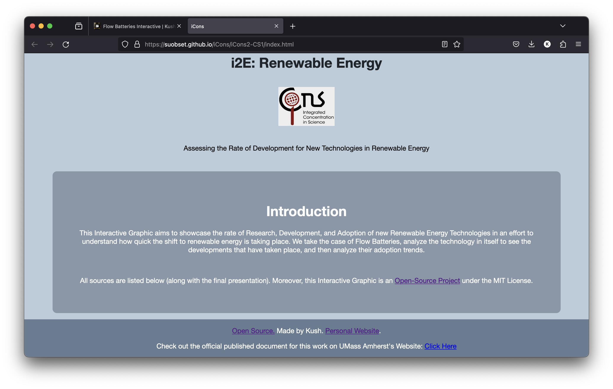

# Flow Batteries Interactive

### iCons 2: Case Study 1

An individual project to create an interactive visualization to showcase the development and adoption of Flow Batteries. 

<a href="https://icons.cns.umass.edu/innovation-portal/2125-rate-of-development-for-new-technologies-in-renewable-energy">Official UMass Entry (iCons Innovation Portal)</a>

<a href="https://suobset.github.io/iCons/iCons2-CS1/index.html">Here is the Website</a>

All the code for the website is in the "iCons1-CS2" folder of the parent Github repository of this website, or alternatively you can also <a href="https://github.com/suobset/iCons/iCons2-CS1">Click Here</a>