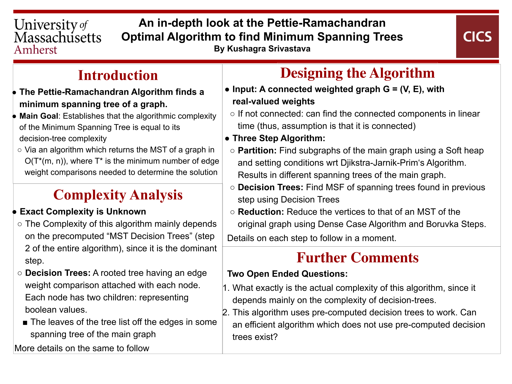

# CS H311

## An in-depth look at the Pettie-Ramachandran Optimal Algorithm to find Minimum Spanning Trees

The following was done as a project under the Honors Colloq. for CompSci 311 under [Prof. Marius Minea](https://www.cics.umass.edu/people/minea-marius). I had also attempted to make a Java implementation of the same, but due to time constraints and it being a 1-credit course, opted to use pseudocode instead.

