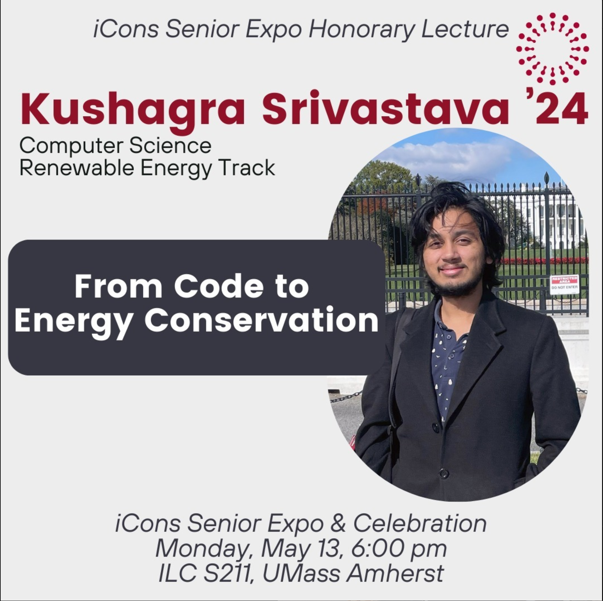

# iCons

All iCons research projects, including digital products.

This is a repository to hold all Research Work I have done under the <b>Integrated Concentration in Science (iCons)</b> Program along with the College of Natural Sciences at University of Massachusetts, Amherst.

## Innovation Portal + Formal List of Projects 

All of these projects can be found in the <a href="https://icons.cns.umass.edu/innovation-portal/search">Official UMass iCons Innovation Portal</a>. The ```Official UMass Entry``` <b>link under each project in this page is the actual published link of the project</b>, and should be used primarily to refer to the same.

<a href="https://icons.cns.umass.edu/innovation-portal/search?keywords=kushagra">Filtered list from the Innovation Portal, showcasing my projects</a>


* iCons 4: Communication Design Project, noted on the bottom of this page as the endeavor itself was short.
* [U.S. Census: The Opportunity Project (ASSERT)](./assert)
* [iCons 3: The Cost of Control](./costOfControl)
* [iCons 2: Museum of Science](./iConsMoS)
* [iCons 2: Case Study 1](./flowBatteries)
* [iCons 1: Case Study 2 (Team 6 Hydrogen Viewer)](./hydrogenBatteries)
* iCons 1: Case Study 1 (Team 4 COVID Meta Analysis) 

No product for this one so just mentioned here (was my first ever research analysis project).

A presentation conducting a meta analysis to determine which countries had the best response to COVID-19 between March - May 2020.

<a href="https://icons.cns.umass.edu/innovation-portal/2126-analyzing-covid-19-response-trends-across-different-countries">Official UMass Entry (iCons Innovation Portal)</a>.


-Kush

## iCons 4

For the spring semester of iCons 4, I am working on bringing my Honors Thesis to a larger audience, as well as reflecting on and giving feedback to the iCons program as a whole. I have spoken at MassURC, and will be speaking at the iCons Senior Expo as an Honorary Lecturer. 

The endeavor in itself is very low-key, but I love seeing my (and everyone else's) work come to a culmination. 

[Thesis Website Created for iCons 4](https://tra86.skushagra.com), which then became the overall website for the project. 

For the Senior Expo for iCons, I was invited to give a short speech regarding what my project was. 



For more context, the [Honors Thesis](./tra86) page may be useful. iCons 4 was mainly concerned with getting this thesis out to a bigger audience. I was deeply honored to be giving a talk on my thesis, along with 3 other iCons scholars. 

I will be uploading that talk as soon as I get my hands on it :)