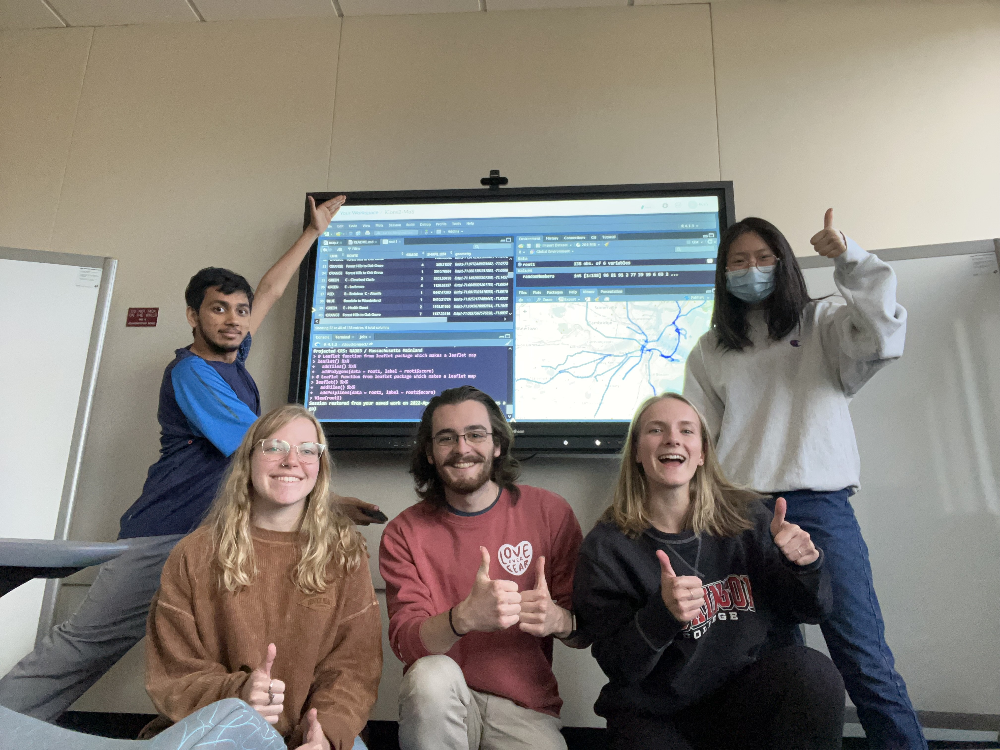

# Boston T Accessibility


UMass iCons 2 + Museum of Science, Boston

A group project to map the Boston T and judge it's accessibility. The project uses two repositories:

* ```suobset/iCons2-MoS``` for R data, GIS data, manipulation, creation, and literally almost everything
* "iCons2-MoS" subfolder of this current parent repository, only to export ```suobset/iCons2-MoS``` as a webpage and host it on GitHub Pages. Alternatively, <a href="https://github.com/suobset/iCons/iCons2-MoS">Click Here</a>.
* <a href="https://www.umass.edu/news/article/umass-icons-students-partner-museum-science-boston-tackle-climate-justice">Featured in UMass Amherst News</a>

<a href="https://icons.cns.umass.edu/innovation-portal/2124-mapping-transportation-accessibility-in-boston">Official UMass Entry (iCons Innovation Portal)</a>



L to R: Kush Srivastava, Gabby Walczak, Jack Minella, Cleo Hein, Yi Ding


<a href="https://suobset.github.io/iCons/iCons2-MoS/index.html">Here is the Website with the Map and scores</a>


<a href="https://github.com/suobset/iCons2-MoS">Repository with R code and GIS data for this project</a>