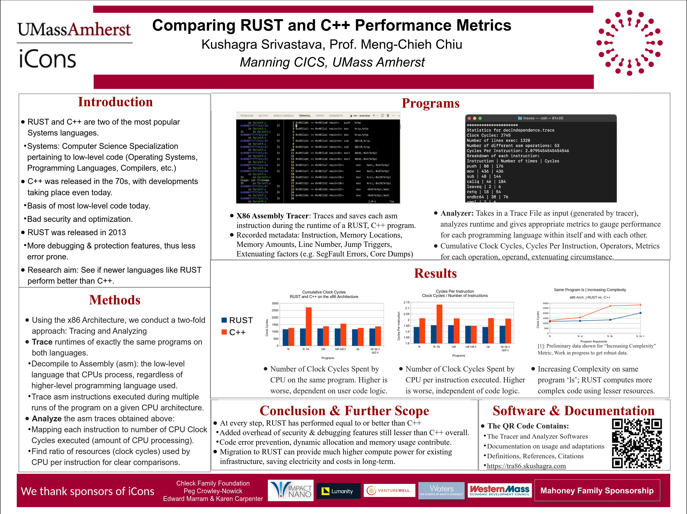

# tra86: CICS Honors Thesis

Disclaimer: this page is currently incomplete until my thesis gets published. More details soon. 

Currently working with Prof. Joe Chiu and Prof. Tim Richards from UMass CICS on my Honors Thesis. I have put a short poster on the project hypothesis below, but obviously not all data is recorded because this is an ongoing project. Moreover, the poster is about 6 months old and a lot has changed in the project (focused on Clang, Cargo, and LLVM). 

Regardless, the poster still gives a good idea of what to expect, without giving compromising details, and thus I'll leave it here. Also, there is a [git repository](https://github.com/cics-syslab/RUST-tracing-tool) which stays private for the forseeable future :)

As part of my thesis on comparing RUST and C++ Performance Metrics, I developed a whole range of scripts that would take a C++/RUST Project, Compile to Assembly, Assemble to Object File with Debugging Symbols, Link Header Files, Pass to GDB, and Trace Asm Calls as the program executes. After the tracing, it passes the trace output to another script for analyzing CPU performance.

Currently, this is only C++/RUST based and on the x86 platform. I am expanding this, since I believe that this could be extended for comparisons between any programming languages (or most). I also plan to create a UI for the whole thing allowing others to be able to use and contribute towards this project. 

Check out [this webpage](https://tra86.skushagra.com/) for further details. 

#### Tra86: The LLVM Compiler Performance Tracer

As part of my thesis on comparing RUST and C++ Performance Metrics, I developed a whole range of scripts that would take a C++/RUST Project, Compile to Assembly, Assemble to Object File with Debugging Symbols, Link Header Files, Pass to GDB, and Trace Asm Calls as the program executes. After the tracing, it passes the trace output to another script for analyzing CPU performance. 

Currently, this is only C++/RUST based and on the x86 platform. I am expanding this, since I believe that this could be extended for comparisons between any programming languages (or most). I also plan to create a UI for the whole thing allowing others to be able to use and contribute towards this project. 

More details to be noted in my thesis, and at [https://tra86.skushagra.com](https://tra86.skushagra.com). Genuinely super excited to get this out in the world, this is my magnum opus currently.

## CICS SysLab

As part of conducting the Honors Thesis research in an interactive way, and facilitating more Systems research on campus, I am also a member of the newly created CICS SysLab (website soon) by Prof. Joe Chiu and Prof. Tim Richards. Here's the first meeting, held Spring 2023:

