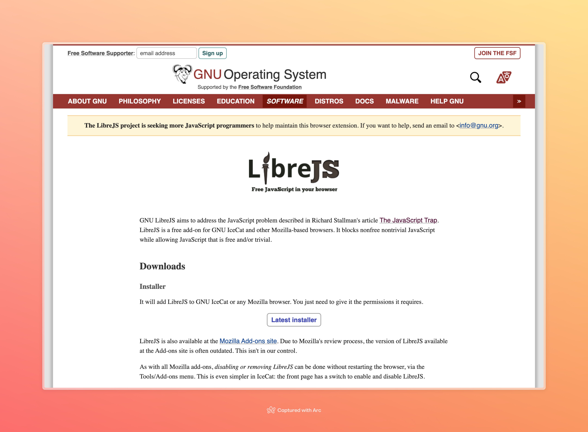

# This Website is Best Viewed on Any Browser.

> "Anyone who slaps a 'this page is best viewed with Browser X' label on a Web page appears to be yearning for the bad old days, before the Web, when you had very little chance of reading a document written on another computer, another word processor, or another network."
> 
> Tim Berners-Lee, July 1996

## Introduction

This website can be viewed on any browser. While this includes the typical: such as Firefox, Safari, Chrome, Edge, Arc, Opera, yet another Chromium-based browser...I also mean to say that these pages can be rendered by browsers such as [Lynx](https://lynx.invisible-island.net/), a CLI Browser that renders text only. 


Pictured: Lynx, running the about page of this website

## But, why?? Tl;Dr on some historical context

The mid-90s saw a great increase in Internet Explorer's Monopolistic Practices into coercing users to use their platform, as opposed to competing platforms like Netscape Navigator or Safari. This was done by the release of Microsoft Frontpage: a WSIGWYG editor (think Wix or Wordpress in today's terms) that made making websites easy and accessible to the masses, at the expense of having them rendered only in Internet Explorer.

As a result, people started placing buttons that mentioned how a specific website was "Best Viewed with Browser X". While some of it could be attributed to tribalism (liking a specific browser), it significantly degraded the experience of the Internet, and almost killed it off as a fully free platform.

I mean, I am prone to the tribalism too. Just look at the amount of 88x31s I have which are product based :/

The ```Any Browser Campaign``` has an excellent writeup on it. Albeit outdated, the ethos of the argument still stands today. In order to create and ensure a free web for all, it is crucial to ensure that compatibility is retained across all Web Browsers, and all Operating Systems. [Read this](https://www.anybrowser.org/campaign/) for more information.

I believe that for any software or platform to be totally free (as in freedom), it should run on any hardware you please, including closed ones.

## Is Lynx Compatible Good Enough??

Obviously, the asnwer is no. Lynx compatible is a first good step, but my elief is rooted in any browser, and any computer. To get here, we need to tackle the problem of "Free Software, in the context of JavaScript".

According to [The JavaScript Trap](https://www.gnu.org/philosophy/javascript-trap.html), a lot of websites tend to inject non-free JS into someone's computer for various purposes, such as tracking for advertisements or fingerprinting.

To combat this, the Free Software Foundation has a Firefox extension: [LibreJS](https://www.gnu.org/software/librejs/index.html). Essentially, LibreJS blocks all non-free JavaScript. However, this means that many websites, such as Google, cease to function due to the limitation.



This current version  of Docusaurus that I am hosting is different than Meta's out-of-the-box version in 2 ways:

* It has been stripped of non-free JS in the static site generation, and is LibreJS compatible. The source code still may have non-free JS or dependencies, this is out of my control. However, the website you see does not have any non-free JS.
* It is licensed under AGPLv3, while the original was licensed under MIT. However, I reserve the rights on my content, for the time being.