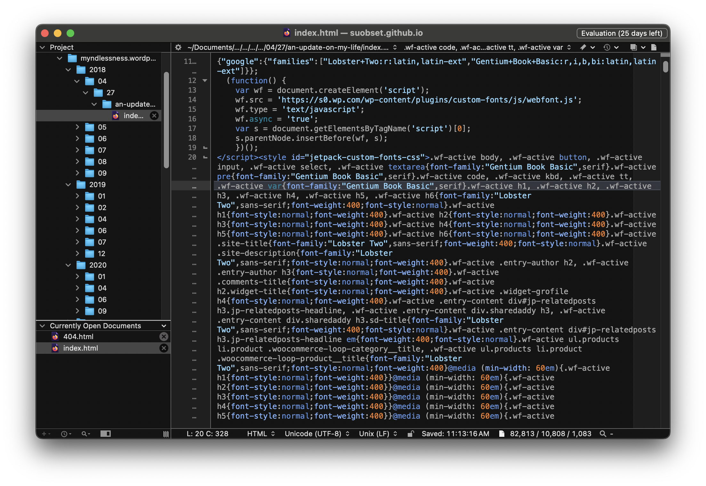
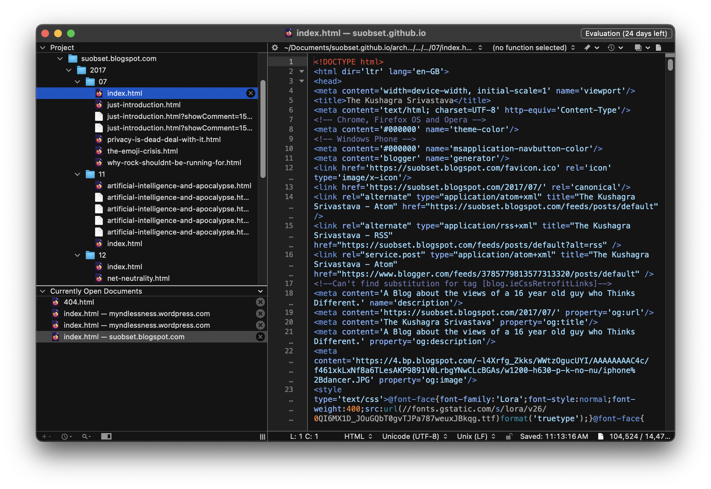

# The Minded Mindlessness + The Kushagra Srivastava Archives

This page contains, essentially, a table of contents for two of my earliest blogs: Minded Mindlessness, and The Kushagra Srivastava. The former was written on Wordpress, and the latter was written on Blogspot. In taking these backups, I used the ```wget``` tool to recursively download all the webpages, and hosted them myself on a GitHub Repository. 

However, since I used ```wget``` for both of them, the issue that arises is that all the links in each HTML is a hardlink to the corresponding Wordpress URL, and not a softlink. Currently, the Wordpress/Blogspot links still exist, but they would cease to do so after I close the main blogs. 

I have the files in the GH repo, just the links are super hardlinked, and it is genuinely a pain to change them to softlinks given each HTML file was auto-generated and not meant for human intervention. Hence, I am creating a table of contents for each down here. 

## Disclaimer

Before we begin, here are a few points:

* These are archives, from 2017-2020. I technically did not own this domain then, and links on each page are hardlinks to other posts. 
	* If you surf the blogs directly, the links are 100% broken. It is recommended to refer to this table of contents page.
* The views here do not reflect who I am. I was 16-18 years of age at this point. I have had more experience since, and will continue to have more experiences. 
* I am archiving these as mainly a time capsule. I am still  proud of who I was, and how much I have grown. While these are not active or represent me, they are an amazing time capsule to visit. 
	* Most, if not all, is cringe.
	* Period specific references included.
	* **I am not who I was when I wrote these** :)

## Minded Mindlessness

Minded Mindlessness was a blog that I co-wrote with Ria Chandra from 2018 through 2020, though the peak years for the same were between 2018 and part of 2019. It can be seen in the dir structures below: 



As can be seen on the left sidebar, the whole setup is in the form of ```Year -> Month -> Date -> Post -> Contents```, which gives a fairly good idea of when and for how long this project was active. 

However, this is only the archive of things I have written or done. While Ria and I are on good terms, I do not want to publish what was written by her, mainly because I do not have her consent and do not know if she necessarily wants to get her past-self's writings out.

### Root

[https://suobset.github.io/archive/myndlessness.wordpress.com/](https://suobset.github.io/archive/myndlessness.wordpress.com/)

At some point, it seems to have been edited to a draft of a different website. I was unaware of the same, but all the titled and everything should be different (theoretically). Regardless, it was two people who had ownership...and I honestly do not care at this point since this is just a means to archive everything I have done/written on the Internet. It's a time capsule, nothing more.  

### 2020

* 06 January: [Before 30](https://suobset.github.io/archive/myndlessness.wordpress.com/2020/01/06/before-30/)
* 29 April: [Hello, World (Maybe)](https://suobset.github.io/archive/myndlessness.wordpress.com/2020/04/29/hello-world-maybe/)
* 21 June: [24 Hours](https://suobset.github.io/archive/myndlessness.wordpress.com/2020/06/21/24-hours/)
* 11 September: [Untitled](https://suobset.github.io/archive/myndlessness.wordpress.com/2020/09/11/291/)


### 2019

* 10 January: [2018, Reviewed](https://suobset.github.io/archive/myndlessness.wordpress.com/2019/01/10/2018-reviewed/)
* 5 February: [I need to talk](https://suobset.github.io/archive/myndlessness.wordpress.com/2019/01/10/2018-reviewed/)
* 10 July: [Life: A Series](https://suobset.github.io/archive/myndlessness.wordpress.com/2019/07/10/life-a-series/)
* 31 July: [How Beautiful the world truly is](https://suobset.github.io/archive/myndlessness.wordpress.com/2019/07/31/how-beautiful-the-world-truly-is/)

### 2018

* 27 April: [An Update On My Life](https://suobset.github.io/archive/myndlessness.wordpress.com/2018/04/27/an-update-on-my-life/index.html)
* 1 June: [A Letter to Future Me](https://suobset.github.io/archive/myndlessness.wordpress.com/2018/06/01/a-letter-to-future-me/)
* 25 June: [Second Update On My Life](https://suobset.github.io/archive/myndlessness.wordpress.com/2018/06/25/second-update-on-my-life/)
* 4 July: [1 Year of Blogging](https://suobset.github.io/archive/myndlessness.wordpress.com/2018/07/04/1-year-of-blogging/)
* 8 July: [This is a Very Important Public Notice](https://suobset.github.io/archive/myndlessness.wordpress.com/2018/07/08/this-is-a-very-important-public-notice/)
* 22 July: [Talking Music: Episode 1](https://suobset.github.io/archive/myndlessness.wordpress.com/2018/07/22/talking-music-episode-1/)
* 20 August: [Curtains Curtailed](https://suobset.github.io/archive/myndlessness.wordpress.com/2018/08/20/curtains-curtailed/)
* 18 September: [A "Thoughtful" Experiment](https://suobset.github.io/archive/myndlessness.wordpress.com/2018/09/18/a-thoughtful-experiment/)

## The Kushagra Srivastava

This was an independent blog I wrote before "Minded Mindlessness", during the year 2017. The classification of directories is in the format ```Year -> Month -> Post```



### Root

[https://suobset.github.io/archive/suobset.blogspot.com/](https://suobset.github.io/archive/suobset.blogspot.com/)

Nothing fancy here. Since I was and have been the only owner, the site is exactly as it was left behind. Fun :)

### 2017

* July: [All](https://suobset.github.io/archive/suobset.blogspot.com/2017/07/)
* 12 July: [Just an Introduction](https://suobset.github.io/archive/suobset.blogspot.com/2017/07/just-introduction.html)
* 13 July: [Why The Rock Shouldn't Be Running For President](https://suobset.github.io/archive/suobset.blogspot.com/2017/07/why-rock-shouldnt-be-running-for.html)
* 16 July: [The Emoji Crisis](https://suobset.github.io/archive/suobset.blogspot.com/2017/07/the-emoji-crisis.html)
* 27 July: [Privacy is dead, deal with it](https://suobset.github.io/archive/suobset.blogspot.com/2017/07/privacy-is-dead-deal-with-it.html)
* November: [All](https://suobset.github.io/archive/suobset.blogspot.com/2017/11/)
* 10 November: [Artificial Intelligence and Machine Learning...](https://suobset.github.io/archive/suobset.blogspot.com/2017/11/artificial-intelligence-and-apocalypse.html)
* December: [All](https://suobset.github.io/archive/suobset.blogspot.com/2017/12/)
* 17 December: [Net Neutrality](https://suobset.github.io/archive/suobset.blogspot.com/2017/12/net-neutrality.html)

## Final Words

And that does it. This is everything that I have written and created on the Internet prior to this domain, and the rest being under the [Site Archive](../archive) that led you here in the first place. I hope this is not too cringe; again, this was 16 year old me. My views do not represent who I am today, I have had the time to grow and experience more. However, I am also comfortable with my past self and think that these are time capsules that should be archived well. 

I hope you enjoyed your stay. 